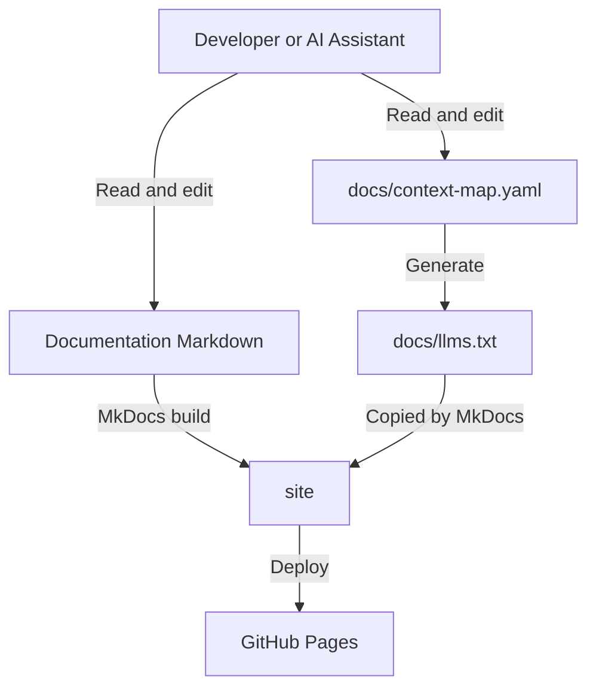

# YourHealthResearch.org Application Context

This repository contains functional, architectural, governance, data-model,
support, and analytics documentation for YourHealthResearch.org.

## Project model



The committed sources of truth are:

```text
docs/context-map.yaml
docs/**/*.md
```

Generated files are:

```text
docs/llms.txt
site/
```

Generated files are ignored by Git and may be removed at any time.

Repository-aware AI assistants should begin with:

```text
docs/context-map.yaml
```

The published site exposes the generated LLM routing index at:

```text
/llms.txt
```

## Development tools

The project uses:

- uv for Python, `.venv`, dependency resolution, and `uv.lock`
- MkDocs Material for documentation generation
- Make for consistent local and CI tasks
- pre-commit for commit-time and push-time checks
- pip-audit for Python dependency vulnerability scanning

The project environment is stored in:

```text
.venv/
```

Developers normally do not need to activate it. Make targets use `uv run`
automatically.

## Install uv

Choose one installation method.

### Using mise

If mise is already installed:

```bash
mise use --global uv@latest
```

### Using Homebrew

```bash
brew install uv
```

Verify the installation:

```bash
uv --version
```

You do not need both mise and Homebrew to manage uv.

## First-time setup

After cloning the repository, run:

```bash
make setup
```

`make setup`:

1. Creates `uv.lock` if it does not exist.
2. Creates or updates `.venv`.
3. Installs locked dependencies.
4. Installs pre-commit and pre-push hooks.

Run `make setup` again after `make distclean` or when Git hooks need to be
reinstalled.

## Daily workflow

Create a documentation branch:

```bash
git switch -c documentation/my-change
```

Start the local site:

```bash
make serve
```

Edit files under `docs/`.

Before committing:

```bash
make check
```

Commit and push:

```bash
git add .
git commit -m "Document my change"
git push -u origin documentation/my-change
```

Installed Git hooks provide:

- Lightweight checks before commit
- A complete documentation check before push

GitHub Actions runs the same validation before deployment.

## Common commands

| Command | Purpose |
|---|---|
| `make help` | List available tasks |
| `make setup` | Create the environment and install Git hooks |
| `make sync` | Synchronize `.venv` from `uv.lock` |
| `make serve` | Run the local MkDocs server |
| `make generate` | Generate `docs/llms.txt` |
| `make validate` | Validate context routing and generated LLM links |
| `make build` | Validate and build the strict MkDocs site |
| `make check` | Run the complete validation workflow |
| `make audit` | Audit Python dependencies for known vulnerabilities |
| `make outdated` | Show outdated Python dependencies |
| `make upgrade` | Upgrade Python dependencies within declared constraints |
| `make hooks` | Install pre-commit and pre-push Git hooks |
| `make upgrade-hooks` | Upgrade remote pre-commit hook revisions and validate them |
| `make clean` | Remove generated files and caches |
| `make distclean` | Also remove `.venv` |

## Dependency management

Dependencies are declared in:

```text
pyproject.toml
```

Exact resolved versions are stored in:

```text
uv.lock
```

Both files are committed.

Do not manually edit `uv.lock`.

### View outdated dependencies

Run:

```bash
make outdated
```

This reports packages for which newer releases are available.

An available version may still be excluded by the compatibility constraints in
`pyproject.toml`.

### Upgrade dependencies

Run:

```bash
make upgrade
```

This:

1. Resolves the latest versions permitted by `pyproject.toml`.
2. Updates `uv.lock`.
3. Synchronizes `.venv`.
4. Runs the complete project checks.

`make upgrade` does not automatically cross declared major-version boundaries.

For example:

```toml
"mkdocs>=1.6,<2.0"
```

continues to exclude MkDocs 2.x.

Review the result:

```bash
git status --short
git diff -- pyproject.toml
git diff --stat uv.lock
```

If the upgrade is valid:

```bash
git add pyproject.toml uv.lock
git commit -m "Upgrade documentation dependencies"
```

Usually, a routine upgrade changes only `uv.lock`.

### Adopt a new major dependency version

Major-version upgrades require an intentional constraint change.

For example:

```bash
uv add 'some-package>=2,<3'
make check
```

Review release notes and compatibility before committing the change.

Do not remove the MkDocs `<2.0` constraint unless the documentation stack is
intentionally migrated.

## Pre-commit hook maintenance

The hook configuration is:

```text
.pre-commit-config.yaml
```

It is not GitHub-specific. The pre-commit tool installs local hook launchers
under:

```text
.git/hooks/
```

### Install hooks

Hooks are installed by:

```bash
make setup
```

They can also be installed or refreshed independently:

```bash
make hooks
```

### Upgrade hooks

Run:

```bash
make upgrade-hooks
```

This:

1. Synchronizes the uv environment.
2. Updates remote hook revisions in `.pre-commit-config.yaml`.
3. Runs all configured hooks against applicable files.
4. Runs the complete documentation checks when configured by the Make target.

It updates remote hook repositories such as:

```yaml
repo: https://github.com/pre-commit/pre-commit-hooks
```

It does not update local repository hooks implemented by scripts under
`scripts/`.

Review the result:

```bash
git status --short
git diff -- .pre-commit-config.yaml
```

If valid:

```bash
git add .pre-commit-config.yaml
git commit -m "Upgrade pre-commit hooks"
```

If hooks modify other files, review and stage those changes as appropriate.

## Dependency-security auditing

Run:

```bash
make audit
```

When a vulnerability is reported:

1. Review the advisory and affected versions.
2. Upgrade or pin an unaffected compatible release.
3. Update `uv.lock`.
4. Run `make check`.
5. Document accepted risk when required by institutional policy.

Do not suppress an advisory solely because the documentation site still builds.

## Validation workflow

The canonical validation command is:

```bash
make check
```

It runs the configured sequence, including:

1. Synchronizing the uv environment.
2. Validating `docs/context-map.yaml`.
3. Generating `docs/llms.txt`.
4. Validating generated LLM links.
5. Building the site with `mkdocs build --strict`.
6. Auditing Python dependencies when configured as a blocking check.
7. Checking Git whitespace errors.

Developers and CI use the same Make target.

## Generated files

`docs/llms.txt` is generated from:

```text
docs/context-map.yaml
```

It is an intermediate file that MkDocs copies to:

```text
site/llms.txt
```

The generated website publishes it as:

```text
/llms.txt
```

Do not manually edit `docs/llms.txt`.

Remove generated files with:

```bash
make clean
```

## Full environment reset

Remove generated files and `.venv`:

```bash
make distclean
```

Recreate everything:

```bash
make setup
make check
```

## Python-version behavior

The preferred project Python version is declared in:

```text
.python-version
```

uv honors this file when selecting the project interpreter.

The supported Python range is also declared in:

```text
pyproject.toml
```

Verify the project interpreter:

```bash
uv run python -c "import sys; print(sys.executable)"
```

The result should point inside:

```text
<repository>/.venv/
```

## VS Code

Select the project interpreter:

```text
<repository>/.venv/bin/python
```

Use **Python: Select Interpreter** from the VS Code command palette.

## Documentation routing

Repository-aware assistants should:

1. Read `docs/context-map.yaml`.
2. Select the canonical primary page for the topic.
3. Load related pages only when needed.
4. Consult `docs/09-decisions/` before inferring undocumented behavior.
5. Use `docs/01-overview/business-rules.md` for cross-cutting rules or conflict
   resolution.

Documentation statuses are:

| Status | Meaning |
|---|---|
| `authoritative` | Confirmed current behavior |
| `recommended` | Proposed controls or improvements |
| `mixed` | Confirmed context plus clearly identified proposals |
| `open` | Unresolved behavior |

Recommended, proposed, mixed-page proposals, and open content must not be
presented as implemented behavior.

## Documentation editing conventions

When changing application documentation:

1. Update the canonical topic page.
2. Update `docs/01-overview/business-rules.md` for cross-cutting changes.
3. Update `docs/context-map.yaml` when routing changes.
4. Update `docs/09-decisions/` when an open question is added or resolved.
5. Update diagrams and data-model pages when relationships change.
6. Prefer concise summaries and links over duplicated explanations.
7. Run `make check` before committing or pushing.

## Publishing

The GitHub Actions workflow is:

```text
.github/workflows/deploy-docs.yml
```

On pushes to `main`, it:

1. Installs uv.
2. Restores the locked project environment.
3. Runs the canonical CI validation.
4. Builds `site/`.
5. Uploads the GitHub Pages artifact.
6. Deploys the documentation site.
