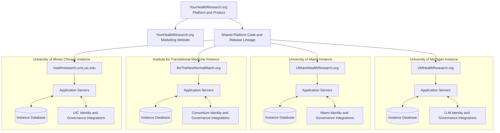

# Multi-Institution Deployment

YourHealthResearch.org is the platform and product name.

`YourHealthResearch.org` is also a public marketing website containing static content directed
toward organizations that may adopt the platform.

Each adopting organization operates a separately branded application instance.

## Instance isolation

Each branded instance has its own:

- Application name and public URL
- Branding and participant-facing content
- Application servers
- Database
- Supporting IT infrastructure
- SAML configuration
- Institutional imported data
- Governance mappings
- Lookup and seed data
- Email configuration
- Job configuration

The instances use the same platform design and application lineage, but they do not operate as
tenants within one shared application database.

## Current examples

| Adopting organization                                                             | Branded instance              |
| --------------------------------------------------------------------------------- | ----------------------------- |
| Michigan Institute for Clinical and Health Research at the University of Michigan | `UMHealthResearch.org`        |
| Clinical and Translational Science Institute at the University of Miami           | `UMiamiHealthResearch.org`    |
| Institute for Translational Medicine                                              | `BeTheNewNormalMatch.org`     |
| University of Illinois Chicago                                                    | `healthresearch.ccts.uic.edu` |

The Institute for Translational Medicine is a consortium involving:

- Rush University
- Northwestern University
- Loyola University Chicago
- University of Chicago

The consortium is led by the University of Chicago.

## Deployment model

## Data isolation

Institutional data must not cross instance databases unless an explicitly approved integration
exists.

A matching `study_num`, username, participant email, or internal identifier in two instances does
not:

- Establish that the records represent the same application entity
- Grant cross-instance access
- Create a cross-instance study membership
- Permit cross-instance matching
- Permit cross-instance participant communication

## Structural compatibility

The database schemas and application capabilities are intended to remain structurally compatible
across branded instances.

The following may differ:

- Application version during a staged deployment
- Configuration
- Reference and lookup values
- Branding
- Institutional roles
- Import mechanism
- Job schedules
- Email templates
- Participant and study data

Technical documentation must identify deployment-specific behavior rather than assuming that one
institution's configuration applies to every instance.

## Ingestion differences

### University of Michigan

The University of Michigan instance receives eResearch-derived institutional study data.

### Other institutions

Other institutions may upload institutionally governed study data using an authenticated incremental
CSV process.

Both approaches populate equivalent imported-governance structures, but their transport, scheduling,
and reconciliation implementations differ.

## Related pages

- [System Context](system-context.md)
- [Import Pipeline](../03-institutional-governance/import-pipeline.md)
- [Data Ownership](data-ownership.md)
