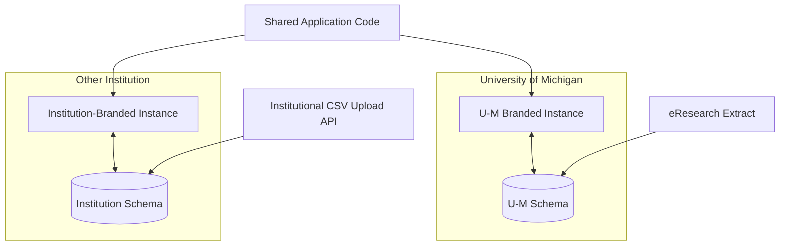

# Multi-Institution Deployment

Each institution receives:

- A separately branded application instance
- A separate database schema
- Institution-specific SAML configuration
- Institution-specific imported data
- Institution-specific governance mappings
- Institution-specific email and URL configuration

The schemas are structurally identical, but their records and configuration differ.

## Data isolation

Institutional data must not cross schemas unless an explicitly approved integration exists.

A matching `study_num`, username, or email in two institutions does not authorize cross-instance access.

## Ingestion differences

### University of Michigan

The eResearch team supplies an extract derived from the eResearch database.

### Other institutions

An authorized institutional process uploads CSV data through an application API.

Both methods populate equivalent `IMPORTED_*` tables and enforce the same reconciliation business rules.

The implementations differ:

- U-M reconciliation uses a scheduled database workflow and Oracle package.
- CSV-based reconciliation uses Java application code.

## Related pages

- [Import pipeline](../03-institutional-governance/import-pipeline.md)
- [Data ownership](data-ownership.md)
