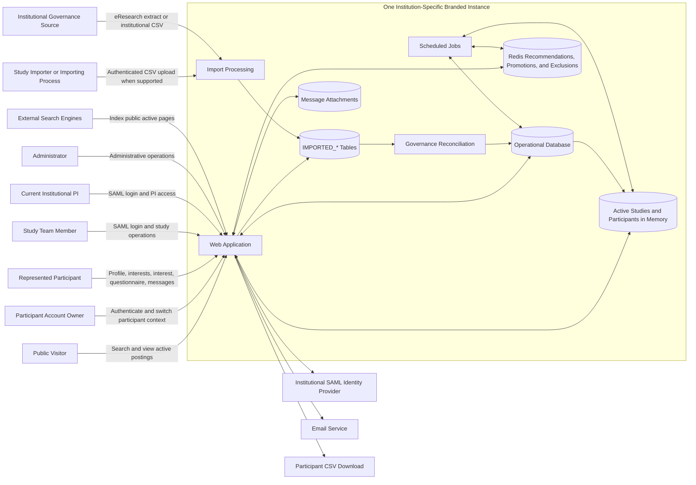

# System Context

YourHealthResearch.org is the platform and product name.

Each adopting organization operates a separately branded application instance
with its own servers, database, supporting infrastructure, configuration, and
institutional integrations.

## External systems

### Institutional identity provider

Authenticates:

- Study team members
- PIs
- Administrators
- Study importers

Each branded instance uses institution-specific identity configuration.

### Institutional governance source

Supplies:

- Study existence
- Institutional roles
- Current PI identity
- Publishability

The implementation may use an eResearch-derived feed or an authenticated
incremental CSV import.

### Email service

Supports:

- Participant activation
- Study-team invitations
- Import errors
- PI notifications
- Upcoming-deactivation warnings
- Study-event notifications
- Participant promotion notifications
- Message notifications
- Loved-one age-out notices

### External search engines

Public active-study pages may be indexed by external search engines. Indexing
strength and timing are not guaranteed.

## Operational database

The relational database is the authoritative persistent source for:

- Users and accounts
- Participant profiles
- Study postings
- Study properties
- Eligibility criteria
- Expressions of interest
- Questionnaires and responses
- Messages
- Notifications
- Audit records
- Imported governance information

## In-memory matching entities

To reduce matching latency, the application keeps active studies and active
participants in memory.

When matching is triggered, the application evaluates the relevant in-memory
entities rather than loading all candidate entities from the database for each
calculation.

When a study or participant changes:

1. The database record is updated.
2. The corresponding in-memory representation is updated.
3. Applicable match recomputation is initiated.
4. Redis recommendations and exclusions are updated asynchronously as needed.

Temporal participant-profile updates must update both the persistent profile and
the corresponding in-memory representation.

Inactive studies and deactivated participants must not remain in active
in-memory matching collections.

Scheduled synchronization processing reconciles in-memory state with database
state and handles time-driven transitions such as:

- Study activation or deactivation boundaries
- Child loved-one age-out
- Participant deactivation
- Other scheduled account or study transitions

## Redis match layer

Redis stores derived directional data, including:

- Studies recommended to participants
- Participants recommended to studies
- Study-team-promoted studies
- Participant-side exclusions
- Study-side exclusions
- Match, promotion, and exclusion timestamps

Redis is not the authoritative source for participant profiles, study
properties, or eligibility definitions.

## Generated exports

Participant-data CSV exports are generated for authorized requests and streamed
to the browser.

The application does not retain them as relational export records or
server-side export files.

## Explicit non-integration

YourHealthResearch.org does not integrate with an electronic health record
system.

It does not retrieve participant profile or clinical data from an EHR.

## Internal boundaries

The application distinguishes:

- Platform from branded instance
- Account owner from represented participant
- Imported governance data from operational data
- Relational data from in-memory matching entities
- In-memory matching entities from Redis recommendations
- Active recruitment from archive organization
- Study-interest matching from eligibility matching
- Matching from expressed interest
- Ask if interested from direct messaging
- Event creation from scheduled email dispatch
- Historical relationships from current profile and conversation visibility
- Generated exports from application-retained data

## Related pages

- [Multi-Institution Deployment](multi-institution-deployment.md)
- [Architecture Overview](index.md)
- [Matching and Visibility](../06-recruitment/matching-and-visibility.md)
- [Redis Match and Exclusion Model](../07-data-model/redis-match-model.md)
