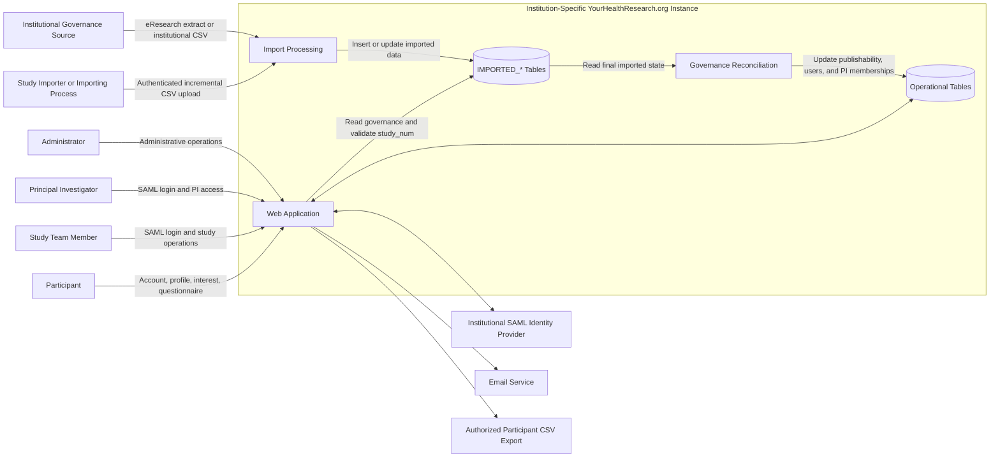

# System Context

## External systems and actors

### Institutional identity provider

Authenticates institutional users through SAML, including:

- Study team members
- PIs
- Administrators
- Study importers

### Institutional governance source

Supplies authoritative information about:

- Studies
- Institutional study roles
- The current PI
- Recruitment governance
- Publishability

At U-M, this information originates from eResearch.

### Study importer or importing process

For CSV-based institutions, an authorized study importer or automated process uploads incremental institutional data using an expiring JSON Web Token.

### Email service

Sends:

- Participant account-activation links
- Study-team invitation links
- PI posting notifications
- Import-error reports
- Delayed study-status notifications
- Other configured notices

### Participant CSV export

Authorized users may generate and download permitted interested-participant and questionnaire data.

The application streams the export to the browser and does not retain a server-side export file.

## Internal boundaries

The application must distinguish:

- Imported data from operational data
- Import processing from reconciliation
- Authentication from authorization
- Institutional roles from application-wide roles
- Application-wide roles from study-association roles
- Active recruitment from access to historical interested-participant data
- Historical relationships from current participant-profile visibility
