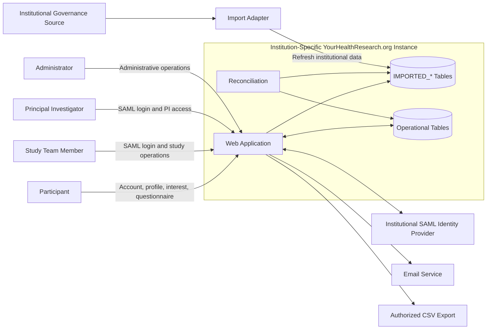

# System Context

## External systems

### Institutional identity provider

Authenticates study team members and PIs through SAML.

### Institutional governance source

Supplies authoritative study, role, PI, and recruitment-governance information.

At U-M, this information originates from eResearch.

### Email service

Sends study-team invitations, PI notifications, and other configured notices.

### CSV export

Provides authorized study teams with permitted interested-participant and questionnaire data.

## Internal boundaries

The application must distinguish:

- Imported data from operational data
- Authentication from authorization
- Institutional roles from application roles
- Historical relationships from current data visibility
