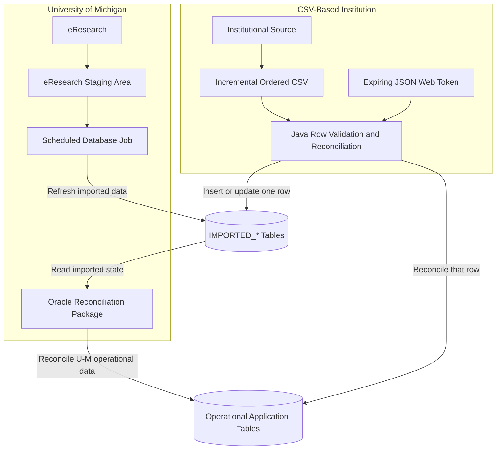

# Import Pipeline

Import processing differs between the University of Michigan and other institutional deployments.

## Common behavior

Both ingestion paths ultimately update:

- `IMPORTED_STUDY`
- `IMPORTED_STUDY_TEAM_MEMBER`
- `IMPORTED_TEAM_MEMBER`

Both paths reconcile imported data with operational application data.

Imports are incremental. Missing rows remain unchanged.

## University of Michigan path

At U-M:

1. eResearch contains the institutional study data.
1. Data is placed in an eResearch staging area.
1. A scheduled database job moves data into the `IMPORTED_*` tables.
1. The scheduled job invokes an Oracle package.
1. The Oracle package reconciles imported data with operational application tables.

## Other-institution CSV path

For CSV-based institutions:

1. An institution prepares a CSV containing incremental study updates.
1. The institution authenticates using a JSON Web Token.
1. The Java web application validates the token and CSV structure.
1. Rows are processed in file order.
1. Each row is handled independently of other rows.
1. A successfully processed row inserts or updates applicable imported data.
1. Java application code reconciles the row's imported state with operational application data.
1. The U-M Oracle synchronization package is not used for this path.



## CSV authentication

The CSV API is authenticated using JSON Web Tokens.

Token timing is governed by:

```text
STUDY_IMPORT_TOKEN_GRACE_PERIOD
```

The token is provisioned for a study importer or importing process and expires according to
application configuration.

## Row independence and ordering

Each CSV row is processed independently and in file order.

If multiple rows affect the same study, each successfully processed row may modify imported and
operational data before the next row is processed.

For example:

```text
Row 1: Study A PUBLISHABLE = 0
Row 2: Study A PUBLISHABLE = 1
```

After both rows succeed, the final publishability value is:

```text
1
```

The later successful modification overwrites the earlier value for the same property.

The same last-successful-update behavior applies to values such as:

- Publishability
- Current PI
- Other imported fields updated by reconciliation

This is not a preprocessing step that reduces the file to one row per study. Intermediate rows are
processed and may cause intermediate operational transitions.

## Validation and anomaly reporting

If a CSV row contains an anomaly:

- Application code detects the anomaly.
- Details are recorded in application logs.
- An email is sent to the responsible study importer, normally the person or process owner for whom
  the JWT was provisioned.

Because rows are handled independently, one invalid row does not redefine the meaning of later rows.
The exact transaction boundary and continuation behavior for every validation or infrastructure
failure must be documented separately from the normal row-order rule.

## Multiple rows for one study

A CSV may contain several updates for the same `study_num`.

The effective final state is determined by successful row processing in file order:

```text
Earlier successful value
→ Later successful value for the same field
→ Later value dominates
```

For example:

```text
ACTIVE
→ INACTIVE
→ ACTIVE
```

can occur during one file when sequential rows change publishability or another state-driving field.

Documentation and monitoring must not assume that only a precomputed final row was reconciled.

## Rollback

The application does not support rolling back an applied import batch.

Corrections require a later valid incremental update.

## Related pages

- [Imported Institutional Data](imported-data.md)
- [Governance Reconciliation](reconciliation.md)
- [Publishability](publishability.md)
