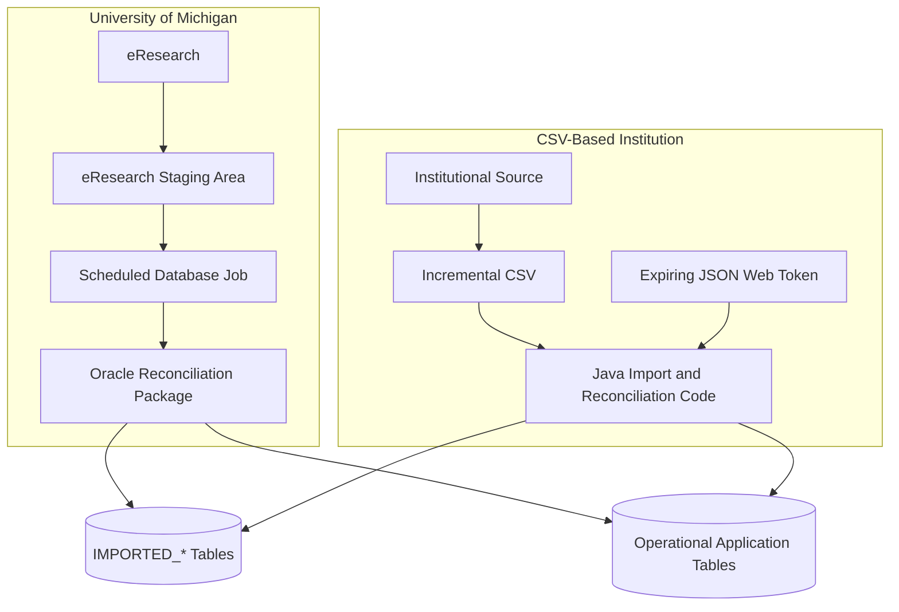

# Import Pipeline

Import processing differs between U-M and other institutional deployments.

## Common behavior

Both ingestion paths ultimately update:

- `IMPORTED_STUDY`
- `IMPORTED_STUDY_TEAM_MEMBER`
- `IMPORTED_TEAM_MEMBER`

Both paths then reconcile imported data with operational application data.

Imports are incremental. Missing rows remain unchanged.

## University of Michigan path

At U-M:

1. eResearch contains the institutional study data.
2. Data is placed in an eResearch staging area.
3. A scheduled database job moves data into the `IMPORTED_*` tables.
4. The scheduled job invokes an Oracle package.
5. The Oracle package reconciles imported data with operational application tables.

## Other-institution CSV path

For CSV-based institutions:

1. An institution prepares a CSV containing incremental study updates.
2. The institution authenticates using a JSON Web Token.
3. The Java web application validates the token and CSV.
4. Valid data is applied to the `IMPORTED_*` tables.
5. Java application code performs reconciliation.
6. The U-M Oracle synchronization package is not used for this path.



## CSV authentication

The CSV API is authenticated using JSON Web Tokens.
Token timing is governed by:
```text
STUDY_IMPORT_TOKEN_GRACE_PERIOD
```
The token is provisioned for a study importer or importing process and expires according to application configuration.

## Validation and anomaly reporting

If the CSV contains anomalies:

* Application code detects them.
* Details are recorded in application logs.
* An email is sent to the responsible study importer, normally the person or process owner for whom the JWT was provisioned.

Whether one invalid row rejects only that row or the complete batch remains an unresolved transactional detail.

## Multiple rows for a study

A CSV may contain several historical updates for the same study_num.
The importer determines the latest applicable row and applies only that final state to operational reconciliation.
This avoids transitions such as:
```text
ACTIVE
→ INACTIVE
→ ACTIVE
```
occurring merely because one import contains the study's historical updates.

## Rollback
The application does not support rolling back an applied import batch.