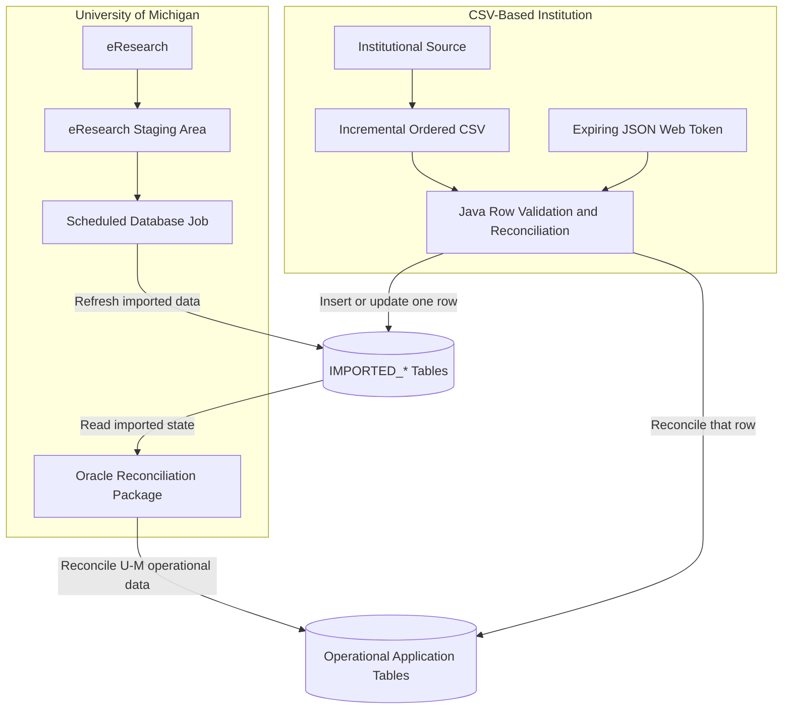

# Import Pipeline

Import processing differs between the University of Michigan and other institutional deployments.

## Common behavior

Both ingestion paths ultimately update:

- `IMPORTED_STUDY`
- `IMPORTED_STUDY_TEAM_MEMBER`
- `IMPORTED_TEAM_MEMBER`

Both paths reconcile imported data with operational application data.

Imports are incremental. Missing rows remain unchanged.

## University of Michigan path

At U-M:

1. eResearch contains the institutional study data.
1. Data is placed in an eResearch staging area.
1. A scheduled database job moves data into the `IMPORTED_*` tables.
1. The scheduled job invokes an Oracle package.
1. The Oracle package reconciles imported data with operational application tables.

## Other-institution CSV path

For CSV-based institutions:

1. An institution prepares a CSV containing incremental study updates.
1. The institution authenticates using a JSON Web Token.
1. The Java web application validates the token and CSV structure.
1. Rows are processed in file order.
1. Each row is handled independently of other rows.
1. A successfully processed row inserts or updates applicable imported data.
1. Java application code reconciles the row's imported state with operational application data.
1. The U-M Oracle synchronization package is not used for this path.


```mermaid
flowchart TD
    subgraph UM["University of Michigan"]
        ER[eResearch]
        STAGE[eResearch Staging Area]
        DBJOB[Scheduled Database Job]
        ORACLE[Oracle Reconciliation Package]

        ER --> STAGE
        STAGE --> DBJOB
    end

    subgraph OTHER["CSV-Based Institution"]
        SOURCE[Institutional Source]
        CSV[Incremental Ordered CSV]
        JWT[Expiring JSON Web Token]
        JAVA[Java Row Validation and Reconciliation]

        SOURCE --> CSV
        CSV --> JAVA
        JWT --> JAVA
    end

    DBJOB -->|Refresh imported data| IMPORTED[(IMPORTED_* Tables)]
    IMPORTED -->|Read imported state| ORACLE
    ORACLE -->|Reconcile U-M operational data| APPDATA[(Operational Application Tables)]

    JAVA -->|Insert or update one row| IMPORTED
    JAVA -->|Reconcile that row| APPDATA
```

## CSV authentication

The automated CSV endpoint accepts a bearer JSON Web Token and is exempt from the ordinary cross-site request forgery check. The token authenticates an existing application user; current database roles still determine authorization. URL security requires `STAFF`, and the upload method requires `STUDY_IMPORTER` or `ADMIN`.

An administrator or existing study importer can generate a token. Claims include the current user's numeric ID and username, issuer `YourHealthResearch`, audience `You`, not-before, issued-at, and expiration. The header contains the stored signing-record ID as `kid`.

`STUDY_IMPORT_TOKEN_GRACE_PERIOD` is the lifetime in hours, not an additional post-expiration grace period. The installation seed is `17520` hours, approximately two years; each deployment's effective value may differ.

The token uses a random per-user HMAC key generated through the library's `HS512` implementation. The Base64-encoded key is stored in `JSON_WEB_TOKEN_INFORMATION`. Generating another token replaces that user's stored key and creation time while retaining the signing-record ID, immediately invalidating earlier tokens signed with the old key.

Validation resolves the key from `kid`, verifies the signature, requires issuer `YourHealthResearch`, and applies expiration, not-before, and parser time validation with 180 seconds of allowed clock skew. Generation adds audience `You`, but the reviewed parser does not explicitly require that audience. The validated subject selects the user, and current database roles populate the security context.

A valid JWT login creates an application security context, records a successful login audit with source address and session ID, and updates login time. The same token can be reused until expiration, key rotation, signing-record deletion, or loss of an authorization role. There is no one-use nonce or per-use token record.

CSV-upload JWTs are distinct from study-importer invitation tokens. Invitation tokens grant the `STUDY_IMPORTER` role when redeemed and use `STUDY_IMPORTER_INVITATION_TOKEN_GRACE_PERIOD`, seeded at 24 hours.

## Upload artifacts and run correlation

The CSV upload path creates several records and files, but no single end-to-end import-run identifier.

Before reading the CSV, the application moves it into the configured work directory under
`study-intake/logs`. The processed CSV filename contains the original base name plus the current epoch
millisecond value. A text result log is written with the same timestamp-derived base name and a
`.log` extension.

After processing returns, the controller writes one `CSV_FILE_UPLOAD_LOG` row containing:

- Its own generated database ID
- The processed filename base
- The authenticated application user ID
- The upload-audit time
- Counts of studies created and updated
- `SUCCESS` or `NEEDS ATTENTION`

Recorded row errors create `CSV_FILE_UPLOAD_DETAILS_LOG` rows linked to that upload-log ID. The detail
table stores the erroneous row text and description, but not the CSV row number retained in the
in-memory `ImportError`.

Operational reconciliation actions may create `IMPORTED_STUDY_SYNC_LOG` rows with action time, table,
column, operation, entity ID, and old and new values. Those rows do not contain the upload-log ID,
processed filename, CSV row number, transaction-batch number, request ID, or token ID.

Consequently, filename and timestamp proximity may help an investigation, but the application does
not provide one durable identifier linking file receipt, every row result, reconciliation actions,
memory or matching work, notifications, and final completion.

The upload audit is written only after `processFile(...)` returns. A failure before the audit call may
leave a processed CSV or text log without a corresponding `CSV_FILE_UPLOAD_LOG` row. The automated
upload endpoint returns its `ImportResult` but does not send the interactive import-result email.

## Row independence and ordering

CSV rows are read and processed in file order, but row independence does not mean that each row has
its own database transaction.

The current Java importer uses explicit batch transactions:

- The default transaction batch size is 500 processed rows.
- The same entity manager and transaction are used across the current batch.
- A valid row stages inserts or updates to `IMPORTED_STUDY`, `IMPORTED_TEAM_MEMBER`, and
  `IMPORTED_STUDY_TEAM_MEMBER`.
- Reconciliation with an existing operational study runs before the batch commits and uses the same
  entity manager and database transaction.
- The importer flushes and commits after each full batch and once at end of file.
- A successful commit makes the database work for all successful rows in that batch durable
  together.

Therefore, one row is processed before the next row, but as many as 500 rows normally share one
database commit boundary.

If multiple rows affect the same study, each successfully processed row may modify imported and
operational data before the next row is processed.

For example:

```text
Row 1: Study A PUBLISHABLE = 0
Row 2: Study A PUBLISHABLE = 1
```

After both rows succeed, the final publishability value is:

```text
1
```

The later successful modification overwrites the earlier value for the same property.

The same last-successful-update behavior applies to values such as:

- Publishability
- Current PI
- Other imported fields updated by reconciliation

This is not a preprocessing step that reduces the file to one row per study. Intermediate rows are
processed and may cause intermediate operational transitions.

## Failure and continuation behavior

Failure handling depends on where and how the failure occurs.

| Failure                                                                                          | Recorded result                                         | Later-row behavior                                                   | Database effect                                        |
| ------------------------------------------------------------------------------------------------ | ------------------------------------------------------- | -------------------------------------------------------------------- | ------------------------------------------------------ |
| Bean-validation failure, including invalid publishability or missing required PI identity fields | Row error                                               | Processing continues                                                 | No persistence is intentionally attempted for that row |
| CSV tokenization failure                                                                         | Row error                                               | Reader skips the malformed row and continues when reading can resume | No row persistence                                     |
| Invalid or incomplete header                                                                     | Import error                                            | File processing stops before row commits                             | Current transaction is rolled back during cleanup      |
| Caught persistence exception while processing a row                                              | Row error                                               | Processing continues in the same batch transaction                   | Rollback of the row is not guaranteed                  |
| Batch flush or commit failure                                                                    | Every row tracked in the current batch is marked failed | The failed batch is not restarted                                    | The current batch is rolled back when still active     |
| Uncaught runtime exception                                                                       | No general per-row conversion is guaranteed             | File processing stops                                                | Cleanup rolls back the current batch when still active |
| Import-result email failure after processing                                                     | Outside the row loop                                    | Does not alter completed import processing                           | Does not roll back committed batches                   |

A caught persistence exception is a known implementation concern. The importer catches the exception
and continues without explicitly rolling back the transaction, marking it rollback-only, clearing the
persistence context, or starting a new transaction. If earlier entity operations for that row were
already staged, source inspection alone does not prove that they are removed before a later batch
commit. A provider may instead mark the transaction rollback-only, causing the later batch commit to
fail. Operators must not interpret a per-row error as proof that no database effect from that row was
possible.

## Validation and anomaly reporting

If a CSV row contains an anomaly:

- Application code detects the anomaly.
- Details are included in the in-memory result and written to the processed text log when processing
  reaches that step.
- After processing returns, error details are written to `CSV_FILE_UPLOAD_DETAILS_LOG`.
- The interactive upload path emails the result to the logged-in importer.
- The automated JSON Web Token upload path returns the result but does not send this import-result
  email.

Because rows are handled independently, one invalid row does not redefine the meaning of later rows.
The exact transaction boundary and continuation behavior for every validation or infrastructure
failure must be documented separately from the normal row-order rule.

## Multiple rows for one study

A CSV may contain several updates for the same `study_num`.

The effective final state is determined by successful row processing in file order:

```text
Earlier successful value
→ Later successful value for the same field
→ Later value dominates
```

For example:

```text
ACTIVE
→ INACTIVE
→ ACTIVE
```

can occur during one file when sequential rows change publishability or another state-driving field.

Documentation and monitoring must not assume that only a precomputed final row was reconciled.

## Rollback and correction

The application has no supported whole-file or applied-import rollback operation.

Transaction rollback is limited to the current uncommitted batch. A flush or commit failure rolls
back that batch when its transaction is still active, but earlier committed batches remain applied.
An uncaught failure likewise rolls back only the current uncommitted batch during cleanup.

Database rollback cannot reverse process-local active-study changes or asynchronous matching work
already started before commit. Corrections to committed or externally visible effects require a
later valid incremental update and, when necessary, explicit memory or matching recovery.

The application has no resume cursor or command that restarts an archived file at the first
uncommitted row. Recovery uses a new CSV submission. Operators may submit a corrective subset or
resubmit the whole file, but either choice creates a new processed-file artifact and, when processing
returns normally, a new upload audit.

Reprocessing is not globally idempotent. Imported rows are located by their keys and inserted or
merged, and unchanged operational values normally avoid corresponding reconciliation changes.
However, replay can still produce new upload records, result files, error records, interval effects,
reconciliation logs for actions that run, process-local reloads, matching submissions, and
notification consequences. Verify the current imported, operational, memory, and Redis state before
choosing the correction file.

## Related pages

- [Imported Institutional Data](imported-data.md)
- [Governance Reconciliation](reconciliation.md)
- [Publishability](publishability.md)
