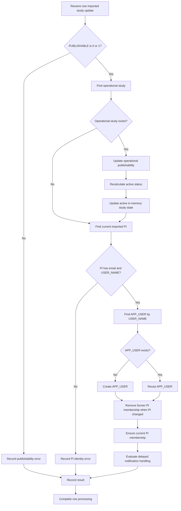

# Governance Reconciliation

Reconciliation aligns imported institutional data with operational application data.

The U-M and CSV-based ingestion paths use different implementations, but both enforce the same
governance outcomes.

## Reconciliation responsibilities

Reconciliation is responsible for:

1. Applying imported study updates.
1. Validating publishability.
1. Updating operational study publishability.
1. Recalculating active status.
1. Updating active in-memory study data.
1. Identifying the current imported PI.
1. Finding or creating the current PI's `APP_USER`.
1. Ensuring that the current PI has a `PRINCIPAL_INVESTIGATOR` membership.
1. Removing the former PI's operational PI membership when the imported PI changes.
1. Evaluating delayed lifecycle notifications.
1. Recording or reporting processing errors.

## University of Michigan reconciliation

At U-M:

1. eResearch provides the institutionally governed source data.
1. Data is placed in an eResearch staging area.
1. A scheduled database job moves data into the `IMPORTED_*` tables.
1. The scheduled job invokes an Oracle package.
1. The Oracle package reconciles imported data with operational application tables.

## CSV-based institutional reconciliation

For institutions using the CSV API:

1. A `STUDY_IMPORTER` or automated importing process submits an incremental CSV.
1. The request is authenticated using a JSON Web Token.
1. Java application code validates the token and CSV structure.
1. Rows are processed independently and in file order.
1. Each valid row is inserted into or used to update the `IMPORTED_*` tables.
1. Java application code reconciles that row with operational data.
1. A later row may overwrite a value changed by an earlier row.
1. The U-M Oracle reconciliation package is not used.

## Reconciliation flow



## Incremental-update behavior

Institutional imports are incremental.

When an imported record is present:

- The corresponding imported row is inserted or updated.
- Applicable operational data is reconciled.

When an imported record is absent:

- The existing imported row remains unchanged.
- The operational study remains unchanged.
- Publishability remains unchanged.
- PI information remains unchanged.

Absence from a new file is not interpreted as deletion.

## CSV row-order behavior

A CSV may contain multiple updates for one `study_num`.

Rows are processed independently and in file order.

Example:

```text
Row 1: PUBLISHABLE = 0
Row 2: PUBLISHABLE = 1
Row 3: PI changed
```

Each successful row is reconciled before the next row.

A later update dominates an earlier update when both modify the same field.

Intermediate transitions may therefore occur:

```text
ACTIVE
→ INACTIVE
→ ACTIVE
```

The final state after successful processing reflects the last successful update for each affected
field.

## Publishability reconciliation

`PUBLISHABLE` must be:

```text
0
```

or:

```text
1
```

A null, missing, or invalid value is an application error.

For an existing operational study:

```text
STUDY.PUBLISHABLE = imported PUBLISHABLE value from the current row
```

Active status is then recalculated using:

- Publishability
- Activation date
- Deactivation date
- Current date/time

When publishability returns from `0` to `1`, the study automatically becomes active if the current
date/time remains within the configured range.

The in-memory active-study collection is updated to reflect the recalculated state.

## PI reconciliation

Each valid imported study has one current institutional PI.

The imported PI record must include:

- Email
- `USER_NAME`

`IMPORTED_TEAM_MEMBER.USER_NAME` must correspond to the value supplied by the institutional IdP in
the SAML ePPN attribute.

If either email or `USER_NAME` is missing, reconciliation reports an application error.

## New PI application user

If no corresponding `APP_USER` exists:

1. Create an `APP_USER`.
1. Copy the imported identity information.
1. Associate the user with the study as `PRINCIPAL_INVESTIGATOR`.

Imported values used for a new PI user include:

- Institutional `USER_NAME`
- First name
- Middle name, when present
- Last name
- Email

The identity mapping is:

```text
IMPORTED_TEAM_MEMBER.USER_NAME
=
APP_USER.USER_NAME
=
SAML ePPN attribute value
```

When the PI later authenticates, the SAML ePPN value resolves to the previously created `APP_USER`.

## Existing PI application user

If a corresponding `APP_USER` already exists:

- Reuse the existing application user.
- Ensure that the PI has a `PRINCIPAL_INVESTIGATOR` membership.
- Do not copy later imported name or email changes into the existing `APP_USER` under the current
  implementation.

## PI-change behavior

When the current imported PI changes:

1. Reconciliation identifies the former operational PI membership.
1. Reconciliation removes the former PI's operational `PRINCIPAL_INVESTIGATOR` membership for the
   study.
1. Reconciliation finds or creates an `APP_USER` for the new PI.
1. Reconciliation associates the new PI with the study as `PRINCIPAL_INVESTIGATOR`.
1. The new PI becomes the non-removable current PI in ordinary application workflows.

The former PI does not retain PI study access merely because they previously held that role.

If the former PI also has a separately established ordinary `STUDY_TEAM_MEMBER` relationship, that
distinct relationship must be evaluated according to its own source and lifecycle.

## Status-change notification delay

Active-status notifications are handled asynchronously.

A daily process evaluates status changes and configured Other Announcements recipients.

The current PI receives lifecycle notifications when applicable.

Short-lived transitions may be suppressed by the one-day stabilization rule.

Example:

```text
ACTIVE → INACTIVE → ACTIVE within one day
```

Result:

```text
No stable-state PI notification
```

If the changed state remains beyond the stabilization period:

```text
Notify the PI
```

This delay affects notification delivery. It does not prevent the underlying intermediate
operational transitions from occurring.

## Idempotency

Repeated processing of the same imported state should not:

- Create duplicate application users
- Create duplicate memberships
- Produce conflicting current PI memberships
- Produce conflicting publishability values
- Produce conflicting active statuses
- Send duplicate notifications for the same stable transition

## Error handling

Reconciliation errors may include:

- Invalid publishability
- Missing PI
- PI missing email
- PI missing `USER_NAME`
- Imported `USER_NAME` that cannot be reconciled with the institutional identity
- Failure to create an `APP_USER`
- Failure to remove a former PI membership
- Failure to create a current PI membership
- Failure to update the operational study
- Failure to synchronize in-memory state
- Failure to schedule or send a notification

CSV-related errors are written to logs and reported by email to the responsible study importer.

## Rollback

The application does not provide an import-batch rollback function.

Corrections require a later incremental update containing the corrected state.

## Related pages

- [Imported Institutional Data](imported-data.md)
- [Imported Schema](../07-data-model/imported-schema.md)
- [Import Pipeline](import-pipeline.md)
- [Publishability](publishability.md)
- [Institutional Users](../04-users-and-access/institutional-users.md)
- [Study Membership](../04-users-and-access/study-membership.md)
- [Open Questions](../09-decisions/open-questions.md)
