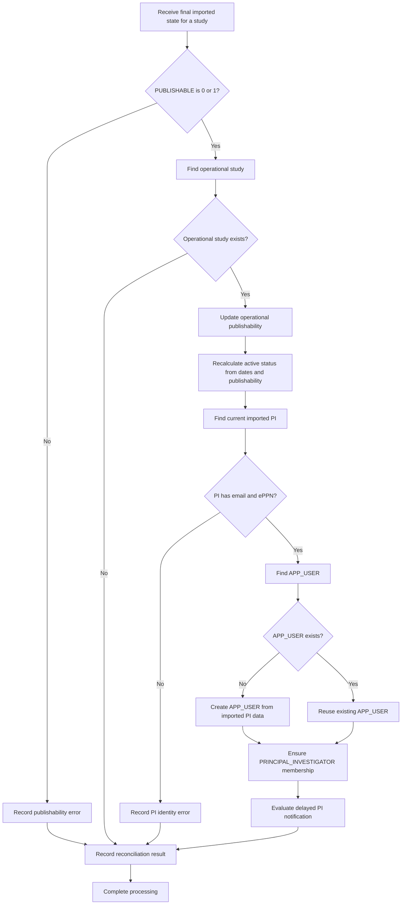

# Governance Reconciliation

Reconciliation aligns imported institutional data with operational application data.

The U-M and CSV-based ingestion paths use different implementations, but both apply imported study-governance information to application-managed studies, users, and study memberships.

## Reconciliation responsibilities

Reconciliation is responsible for:

1. Applying imported study updates.
2. Validating publishability.
3. Updating the operational study's publishability.
4. Recalculating active status.
5. Identifying the study's current imported PI.
6. Finding or creating the PI's `APP_USER`.
7. Ensuring that the current PI has a `PRINCIPAL_INVESTIGATOR` membership.
8. Evaluating whether a delayed PI status-change notification is required.
9. Recording or reporting processing errors.

## University of Michigan reconciliation

At U-M:

1. eResearch provides the institutionally governed source data.
2. Data is moved into an eResearch staging area.
3. A scheduled database job moves data into the `IMPORTED_*` tables.
4. The scheduled job invokes an Oracle package.
5. The Oracle package reconciles imported data with operational application tables.

## CSV-based institutional reconciliation

For institutions using the CSV API:

1. A `STUDY_IMPORTER` or automated importing process submits an incremental CSV.
2. The request is authenticated using a JSON Web Token.
3. Java application code validates the token and CSV.
4. Valid imported data is applied to the `IMPORTED_*` tables.
5. Java application code reconciles imported and operational data.
6. The U-M Oracle reconciliation package is not used for this path.

## Reconciliation flow



## Incremental-update behavior

Institutional imports are incremental.

When an imported record is present:

- The corresponding imported row is inserted or updated.
- Applicable operational data is reconciled.

When an imported record is absent:

- The existing imported row remains unchanged.
- The operational study remains unchanged.
- Publishability remains unchanged.
- PI information remains unchanged.

Absence from a new file is not interpreted as deletion.

## Multiple updates for the same study

A CSV may contain multiple updates for one `study_num`.

Only the latest applicable update is reconciled with operational application data.

This prevents intermediate historical rows from causing temporary changes such as:

```text
ACTIVE
→ INACTIVE
→ ACTIVE
```

Only the final imported state should affect:

- Operational publishability
- Operational active status
- Current imported PI processing
- Delayed status notifications

## Publishability reconciliation

`PUBLISHABLE` must be:

```text
0
```

or:

```text
1
```

A null, missing, or invalid value is an application error.

For an existing operational study:

```text
STUDY.PUBLISHABLE = final imported PUBLISHABLE value
```

The application then recalculates active status using:

- Publishability
- Activation date
- Deactivation date
- Current date

When publishability returns from `0` to `1`, the study automatically becomes active if the current date remains inside the configured date range.

## PI reconciliation

Each valid imported study has one current institutional PI.

The imported PI record must include:

- Email
- ePPN or the required institutional identity identifier

If either value is missing, reconciliation reports an application error.

## New PI application user

If no corresponding `APP_USER` exists:

1. Create an `APP_USER`.
2. Copy the imported PI identity information.
3. Associate the user with the study as `PRINCIPAL_INVESTIGATOR`.

Imported values used for a new PI user include:

- ePPN
- First name
- Middle name, when present
- Last name
- Email

## Existing PI application user

If a corresponding `APP_USER` already exists:

- Reuse the existing application user.
- Ensure the PI has a `PRINCIPAL_INVESTIGATOR` membership for the study.
- Do not copy later imported name or email changes into the existing `APP_USER` under the current implementation.

## PI-change behavior

When the current imported PI changes:

1. Reconciliation finds or creates an `APP_USER` for the new PI.
2. Reconciliation associates the new PI with the study as `PRINCIPAL_INVESTIGATOR`.
3. The former PI's existing operational membership is not automatically removed.

Therefore, the imported data can identify one current PI while the operational study retains both:

- The newly imported current PI
- A former PI with an existing operational `PRINCIPAL_INVESTIGATOR` membership

The former PI can therefore continue to have study access unless the operational membership is removed by another process.

This is documented current behavior and a known access-governance concern.

## Status-change notification delay

Active-status notifications are delayed to avoid sending messages for temporary transitions.

Example:

```text
ACTIVE → INACTIVE → ACTIVE within one day
```

Result:

```text
No notification
```

If the changed state remains for more than one day:

```text
Notify the PI
```

The application should evaluate the final stable state rather than notifying for every intermediate transition.

## Idempotency

Repeated processing of the same final imported state should not:

- Create duplicate application users
- Create duplicate memberships
- Produce conflicting publishability values
- Produce conflicting active statuses
- Send duplicate notifications for the same stable transition

## Error handling

Reconciliation errors may include:

- Invalid publishability
- Missing PI
- PI missing email
- PI missing ePPN
- Failure to create an `APP_USER`
- Failure to create a PI membership
- Failure to update the operational study
- Failure to schedule or send a notification

CSV-related errors are written to logs and reported by email to the responsible study importer.

## Rollback

The application does not provide an import-batch rollback function.

Corrections require a later incremental update that supplies the corrected final state.

## Related pages

- [Imported institutional data](imported-data.md)
- [Import pipeline](import-pipeline.md)
- [Publishability](publishability.md)
- [Institutional users](../04-users-and-access/institutional-users.md)
- [Study membership](../04-users-and-access/study-membership.md)
- [Open questions](../09-decisions/open-questions.md)