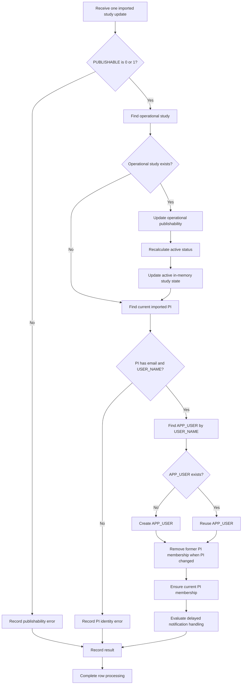

# Governance Reconciliation

Reconciliation aligns imported institutional data with operational application data.

The U-M and CSV-based ingestion paths use different implementations, but both enforce the same
governance outcomes.

## Reconciliation responsibilities

Reconciliation is responsible for:

1. Applying imported study updates.
1. Validating publishability.
1. Updating operational study publishability.
1. Recalculating active status.
1. Updating active in-memory study data.
1. Identifying the current imported PI.
1. Finding or creating the current PI's `APP_USER`.
1. Ensuring that the current PI has a `PRINCIPAL_INVESTIGATOR` membership.
1. Removing the former PI's operational PI membership when the imported PI changes.
1. Evaluating delayed lifecycle notifications.
1. Recording or reporting processing errors.

## University of Michigan reconciliation

At U-M:

1. eResearch provides the institutionally governed source data.
1. Data is placed in an eResearch staging area.
1. A scheduled database job moves data into the `IMPORTED_*` tables.
1. The scheduled job invokes an Oracle package.
1. The Oracle package reconciles imported data with operational application tables.

## CSV-based institutional reconciliation

For institutions using the CSV API:

1. A `STUDY_IMPORTER` or automated importing process submits an incremental CSV.
1. The request is authenticated using a JSON Web Token.
1. Java application code validates the token and CSV structure.
1. Rows are processed independently and in file order.
1. Each valid row is inserted into or used to update the `IMPORTED_*` tables.
1. Java application code reconciles that row with operational data.
1. A later row may overwrite a value changed by an earlier row.
1. The U-M Oracle reconciliation package is not used.

## Reconciliation flow


```mermaid
flowchart TD
    START[Receive one imported study update]
    PUBVALID{PUBLISHABLE is 0 or 1?}
    PUBERROR[Record publishability error]
    FINDSTUDY[Find operational study]
    STUDYEXISTS{Operational study exists?}
    UPDATEPUB[Update operational publishability]
    CALCSTATUS[Recalculate active status]
    SYNCMEMORY[Update active in-memory study state]
    FINDPI[Find current imported PI]
    PICOMPLETE{PI has email and USER_NAME?}
    PIERROR[Record PI identity error]
    FINDUSER[Find APP_USER by USER_NAME]
    USEREXISTS{APP_USER exists?}
    CREATEUSER[Create APP_USER]
    REUSEUSER[Reuse APP_USER]
    REMOVEFORMER[Remove former PI membership when PI changed]
    ENSUREMEMBER[Ensure current PI membership]
    NOTIFY[Evaluate delayed notification handling]
    AUDIT[Record result]
    END[Complete row processing]

    START --> PUBVALID
    PUBVALID -- No --> PUBERROR
    PUBVALID -- Yes --> FINDSTUDY

    FINDSTUDY --> STUDYEXISTS
    STUDYEXISTS -- No --> FINDPI
    STUDYEXISTS -- Yes --> UPDATEPUB

    UPDATEPUB --> CALCSTATUS
    CALCSTATUS --> SYNCMEMORY
    SYNCMEMORY --> FINDPI
    FINDPI --> PICOMPLETE

    PICOMPLETE -- No --> PIERROR
    PICOMPLETE -- Yes --> FINDUSER

    FINDUSER --> USEREXISTS
    USEREXISTS -- No --> CREATEUSER
    USEREXISTS -- Yes --> REUSEUSER

    CREATEUSER --> REMOVEFORMER
    REUSEUSER --> REMOVEFORMER
    REMOVEFORMER --> ENSUREMEMBER
    ENSUREMEMBER --> NOTIFY
    NOTIFY --> AUDIT

    PUBERROR --> AUDIT
    PIERROR --> AUDIT
    AUDIT --> END
```

## Incremental-update behavior

Institutional imports are incremental.

When an imported record is present:

- The corresponding imported row is inserted or updated.
- Applicable operational data is reconciled.

When an imported record is absent:

- The existing imported row remains unchanged.
- The operational study remains unchanged.
- Publishability remains unchanged.
- PI information remains unchanged.

Absence from a new file is not interpreted as deletion.

## CSV row-order behavior

A CSV may contain multiple updates for one `study_num`.

Rows are processed independently and in file order.

Example:

```text
Row 1: PUBLISHABLE = 0
Row 2: PUBLISHABLE = 1
Row 3: PI changed
```

Each valid row is reconciled before the next row, but the default implementation commits database
work in batches of up to 500 processed rows rather than one transaction per row.

A later update dominates an earlier update when both modify the same field. Rows for the same study
within one batch observe the shared persistence context and transaction before that batch commits.

Intermediate transitions may therefore occur:

```text
ACTIVE
→ INACTIVE
→ ACTIVE
```

The final state after successful processing reflects the last successful update for each affected
field.

## Publishability reconciliation

`PUBLISHABLE` must be:

```text
0
```

or:

```text
1
```

A null, missing, or invalid value is an application error.

For an existing operational study:

```text
STUDY.PUBLISHABLE = imported PUBLISHABLE value from the current row
```

Active status is then determined from:

- Publishability
- Posting activation date
- Posting deactivation date
- Current calendar date

When imported publishability changes from `0` to `1`, reconciliation sets the posting activation date
to the current time and retains the configured posting deactivation date. If the resulting range is
present in `V_ACTIVE_STUDY`, the study becomes matching-active.

When imported publishability changes from `1` to `0`, reconciliation closes the current recorded
interval at the current time without replacing the study's configured posting deactivation date.

The local active-study store is then updated, and matching or deactivation cleanup is initiated when
effective status changes.

## PI reconciliation

Each valid imported study has one current institutional PI.

The imported PI record must include:

- Email
- `USER_NAME`

`IMPORTED_TEAM_MEMBER.USER_NAME` must correspond to the value supplied by the institutional IdP in
the SAML ePPN attribute.

If either email or `USER_NAME` is missing, reconciliation reports an application error.

## New PI application user

If no corresponding `APP_USER` exists:

1. Create an `APP_USER`.
1. Copy the imported identity information.
1. Associate the user with the study as `PRINCIPAL_INVESTIGATOR`.

Imported values used for a new PI user include:

- Institutional `USER_NAME`
- First name
- Middle name, when present
- Last name
- Email

The identity mapping is:

```text
IMPORTED_TEAM_MEMBER.USER_NAME
=
APP_USER.USER_NAME
=
SAML ePPN attribute value
```

When the PI later authenticates, the SAML ePPN value resolves to the previously created `APP_USER`.

## Existing PI application user

If a corresponding `APP_USER` already exists:

- Reuse the existing application user.
- Ensure that the PI has a `PRINCIPAL_INVESTIGATOR` membership.
- Compare the imported first name, middle name, last name, and email with the operational user.
- Update changed identity values and write an `IMPORTED_STUDY_SYNC_LOG` entry for the old and new
  values.

## PI-change behavior

When the current imported PI changes, the Java CSV reconciliation path uses one operational
membership row for the current PI:

1. Find or create the incoming PI's `APP_USER`.
1. If the incoming PI already has an ordinary membership for the study, delete that row and remove it
   from the in-memory study collection.
1. Flush the deletion.
1. Reuse the former PI membership row by replacing its user with the incoming PI.
1. Write a membership-update synchronization log and flush.
1. Update the study's `piUserId` property and write its synchronization log.
1. Update changed PI name or email values.
1. Refresh the handling process's active-study entry.

The database unique constraint on `(STUDY_ID, USER_ID)` means an ordinary membership and a PI
membership cannot coexist for the same study and user. Reconciliation therefore does not preserve
the incoming PI's prior ordinary membership as a separate row. It deletes that row before converting
the former PI row to point to the incoming PI.

The former PI row is reused, so the former PI is removed entirely from that study. Reconciliation
does not downgrade the former PI to an ordinary member. Historical access does not survive through a
second membership row.

### PI replacement transaction and failure boundaries

The incoming-membership deletion, PI-row replacement, `piUserId` update, identity updates, and
associated synchronization logs use the current CSV import batch transaction. Explicit flushes
enforce deletion before replacement and surface database errors before later steps.

If an unexpected runtime exception escapes reconciliation, import processing stops and cleanup
attempts to roll back the current uncommitted batch. If batch flush or commit fails, the current batch
is rolled back when its transaction remains active. A later retry can reapply the authoritative PI
state.

A caught `PersistenceException` remains a known concern. The importer records the row error and
continues without explicitly rolling back the row, clearing the persistence context, or starting a
replacement transaction. Operators therefore cannot infer from the row error alone whether every
staged membership or log operation was removed or whether the batch will later fail as rollback-only.

A PI-only change refreshes the handling process's active-study entry before database commit but does
not directly invoke matching. Relational rollback does not restore the earlier process-local study
object. Cross-server propagation limits continue to apply.

## Status-change notification delay

Active-status notifications are handled asynchronously.

A daily process evaluates status changes and configured Other Announcements recipients.

Applicable lifecycle notifications use the current Other Announcements recipient set, which includes the current PI and may include other configured recipients.

The daily lifecycle query may suppress superseded transitions within its previous-calendar-day evaluation window.

Example:

```text
ACTIVE → INACTIVE → ACTIVE within one day
```

Result:

```text
No deactivation announcement for the superseded transition
```

If the changed state remains beyond the stabilization period:

```text
Notify the PI
```

This delay affects notification delivery. It does not prevent the underlying intermediate
operational transitions from occurring.

## Import correlation and replay

`IMPORTED_STUDY_SYNC_LOG` is an action-oriented reconciliation log, not an import-run ledger. It
records the affected table and column, operation, synchronization time, entity identifier, and old and
new values. It has no foreign key or correlation field for `CSV_FILE_UPLOAD_LOG`, processed filename,
CSV row number, transaction batch, request, or authentication token.

A replayed row finds existing imported entities by their primary keys and merges replacement values.
Reconciliation compares the incoming PI, PI attributes, and publishability with current operational
state before performing many changes. Replaying identical stable state therefore usually avoids those
operational mutations.

This does not make the complete workflow idempotent. Upload audit rows and processed artifacts are
new for each completed submission. A row that again causes a lifecycle or PI transition can append
new reconciliation and interval history. Memory and matching work may have escaped an earlier
database rollback, and notification selection follows its own timing and deduplication rules.

## Idempotency

Repeated processing of the same imported state should not:

- Create duplicate application users
- Create duplicate memberships
- Produce conflicting current PI memberships
- Produce conflicting publishability values
- Produce conflicting active statuses
- Send duplicate notifications for the same stable transition

## Error handling

Reconciliation errors may include:

- Invalid publishability
- Missing PI
- PI missing email
- PI missing `USER_NAME`
- Imported `USER_NAME` that cannot be reconciled with the institutional identity
- Failure to create an `APP_USER`
- Failure to remove a former PI membership
- Failure to create a current PI membership
- Failure to update the operational study
- Failure to synchronize in-memory state
- Failure to schedule or send a notification

CSV-related errors are written to import results and logs and, for the interactive upload path, the
result is emailed to the logged-in importer after processing.

Validation and CSV-tokenization errors normally allow later rows to continue. A caught persistence
exception also allows iteration to continue, but the implementation does not isolate that row in a
separate transaction. Flush or commit failure rolls back the current batch and ends normal database
processing for that batch. An uncaught runtime exception stops the import and rolls back the current
uncommitted batch during cleanup.

Process-local memory changes and asynchronous matching submission occur inside reconciliation before
the database batch commits. They are not transactionally coupled to database rollback.

## Rollback

The application does not provide an import-batch rollback function.

Corrections require a later incremental update containing the corrected state.

## Related pages

- [Imported Institutional Data](imported-data.md)
- [Imported Schema](../07-data-model/imported-schema.md)
- [Import Pipeline](import-pipeline.md)
- [Publishability](publishability.md)
- [Institutional Users](../04-users-and-access/institutional-users.md)
- [Study Membership](../04-users-and-access/study-membership.md)
- [Open Questions](../09-decisions/open-questions.md)
