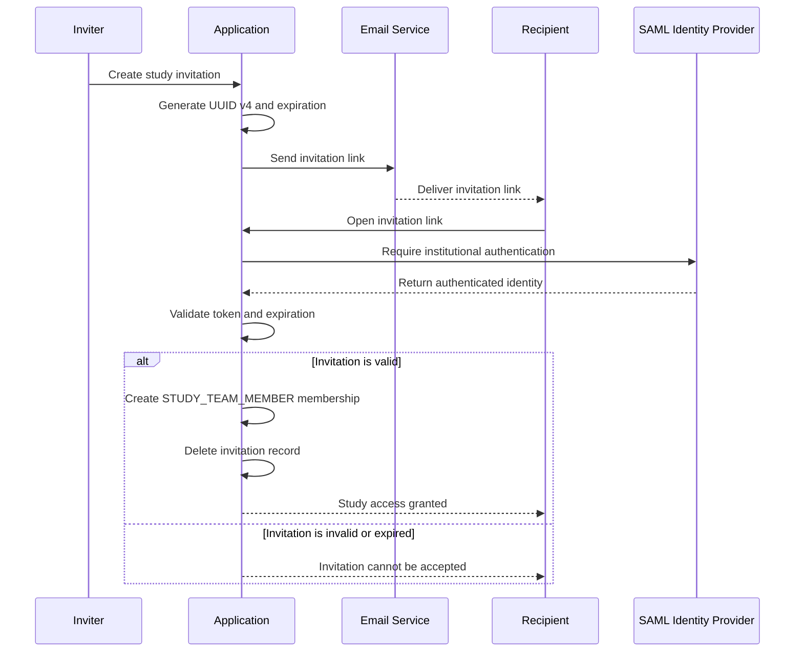

# Study-Team Invitations

Any study team member associated with a study may invite another person who has a valid
institutional SAML account.

After accepting the invitation, the user receives the study role:

```text
STUDY_TEAM_MEMBER
```

## Invitation workflow

1. An associated study team member creates an invitation.
1. The application generates a cryptographically secure UUID v4 token.
1. The application associates the invitation with the study.
1. The application stores the token and its expiration information.
1. The application emails a unique invitation link.
1. The recipient opens the link.
1. The recipient authenticates through institutional SAML.
1. The application validates the token and expiration.
1. The application creates the `STUDY_TEAM_MEMBER` membership.
1. The application deletes the invitation record after successful membership creation.



## Expiration

Invitation expiration is controlled by an application setting.

An expired invitation cannot be accepted.

The application should validate expiration after SAML authentication and before membership creation.

## Revocation

An unused invitation is revoked by deleting its invitation record from the database.

After invitation-record deletion, the invitation link can no longer create study access.

## One-time use

The invitation record is deleted after successful membership creation.

The same invitation cannot be reused after its invitation record has been deleted.

## Link opening versus invitation acceptance

Opening the URL alone should not consume the invitation.

The invitation should be consumed only after:

- Successful institutional authentication
- Successful token validation
- Successful membership creation

This avoids accidental consumption by automated email-security systems that inspect links before the
recipient opens them.

## Atomic redemption

Membership creation and invitation-record deletion occur as one atomic operation.

Conceptually:

```text
Begin transaction
    Validate invitation
    Verify expiration
    Create STUDY_TEAM_MEMBER membership
    Delete invitation record
Commit transaction
```

This prevents simultaneous requests from using the same invitation more than once.

## Invitation recipient policy

Any SAML-authenticated institutional user who possesses a valid invitation link may accept it. The
authenticated identity does not need to match the invitation email recipient.

Invitation links are therefore transferable.

## Resending

An inviter may resend an unused invitation. Resending uses the existing token; it does not create a
new invitation or invalidate the original link.

## Removal after acceptance

An accepted invitation creates an ordinary `STUDY_TEAM_MEMBER` membership.

Any associated study team member may later remove that ordinary membership.

Removing the membership does not deactivate or delete the institutional account.

## Proportionate security controls

The confirmed invitation controls are:

- Random GUID token
- Configurable expiration
- Institutional SAML authentication
- Revocation by invitation-record deletion
- Invitation-record deletion after successful membership creation

The application does not separately audit invitation creation or acceptance. Possible optional
controls include:

- Storing a token hash instead of the raw token
- Retaining consumed or revoked invitation history

These optional controls should not be described as current requirements unless implemented.

## Related pages

- [Study membership](study-membership.md)
- [Institutional users](institutional-users.md)
