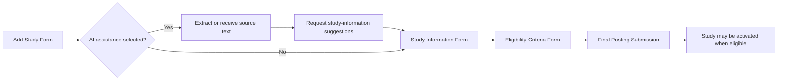
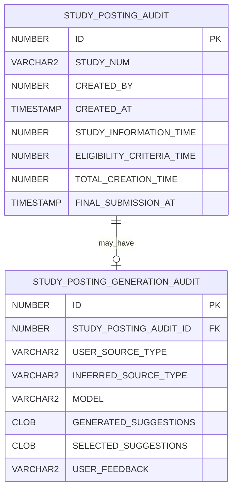

# AI-Assisted Study Posting Authoring

YourHealthResearch.org provides optional AI assistance during study-posting creation.

The current AI-assisted implementation applies to the **study-information portion** of posting creation. It does not currently generate or author the structured inclusion and exclusion criteria used by the matching engine.

Potential expansion into eligibility-criteria authoring is a proposed enhancement.

## Scope of the current feature

The current feature assists with extracting study-information field values from source material supplied by a study team member.

The source may be:

- Pasted free text
- A PDF document
- A Microsoft Word document

The application extracts text from uploaded documents and sends the relevant source text to an OpenAI API model with instructions to identify values for supported study-information fields.

The user remains responsible for:

- Reviewing suggestions
- Selecting suggestions
- Editing the study posting
- Authoring eligibility criteria
- Finalizing the study posting
- Activating the study

AI output is advisory. It is not automatically authoritative application data.

## Source-type classification

The user identifies the source type.

Supported source categories include:

```text
Study Protocol
Informed Consent
Other
```

The LLM is also instructed to infer the source type.

The audit data records both:

- The source type selected by the user
- The source type inferred by the LLM

This permits later comparison of user-supplied and model-inferred source classifications.

## Study-creation workflow

The relevant workflow has three stages:

1. Add Study
2. Study Information
3. Study Eligibility Criteria



## Add Study form

The Add Study form begins the study-posting workflow.

When AI assistance is selected, the user supplies:

- Pasted source text, or
- A PDF or Word document

The application:

1. Extracts text when necessary.
2. Builds an LLM prompt.
3. Sends the source text and prompt to the OpenAI API.
4. Requests suggestions for supported study-information fields.
5. Records generation metadata and suggestions.

For some text fields, the LLM is instructed to produce multiple alternatives.

For the longest supported text field, the LLM is instructed to produce one suggestion.

The exact field list and number of suggestions per field should be maintained in implementation-specific configuration or documentation rather than inferred from this page.

## Initial audit requests

Submitting the Add Study form creates a general posting-attempt audit record.

The current endpoint is:

```http
POST /backend/secure/staff/study-posting-audit
```

The request payload includes:

```text
studyNum
```

This record is created for posting-creation attempts, whether or not AI assistance is used.

When AI assistance is used, a separate request records the generation attempt:

```http
POST /backend/secure/staff/study-posting-suggestions
```

The AI-generation audit includes:

- LLM suggestions
- Request metadata
- User-supplied source type
- LLM-inferred source type
- Other supported generation metadata

The physical schema and exact payload fields should be documented from the implementation.

## Study Information form

If AI assistance was selected and suggestions were generated, the Study Information form displays those suggestions above the applicable fields.

Suggestions are displayed in collapsible panels.

The user may:

- Select an LLM suggestion
- Ignore all suggestions
- Enter a different value
- Modify a selected suggestion before saving, if the form permits ordinary editing

The saved study-information values remain the authoritative application values.

## Captured study-information telemetry

When the Study Information form is submitted, the application records information that can later be used to compare:

1. Values suggested by the LLM
2. Suggestions selected by the user
3. Final values saved to the study posting

The application also captures user feedback about the AI-assisted feature.

The feedback endpoint is:

```http
PATCH /backend/secure/staff/study-posting-suggestions/{studyPostingAuditId}/feedback
```

The application records time spent on the Study Information form using:

```http
PATCH /backend/secure/staff/study-posting-audit/{studyPostingAuditId}/time-spent
```

Timing begins when the user arrives on the Study Information form after submitting the Add Study form and ends when the Study Information form is submitted.

## Eligibility-criteria stage

The Study Eligibility Criteria form is the final authoring stage.

The current AI feature does not generate structured eligibility criteria.

Study team members manually author:

- Criteria groups or arms
- Inclusion criteria
- Exclusion criteria
- Structured criterion expressions
- Participant-facing OTHER text

See:

- [Eligibility-Criteria Authoring](../06-recruitment/eligibility-criteria-authoring.md)
- [Criteria Data Model](../07-data-model/criteria-data-model.md)

## Final submission

When the eligibility form is submitted, study-posting creation is finalized.

The current final-submission endpoint follows this form:

```http
PATCH /backend/secure/staff/study-posting-audit/{studyPostingAuditId}/final-submission
```

Final submission updates audit data so that later analysis can compare:

- LLM-generated suggestions
- Suggestions selected by the user
- Final saved study-information values
- User feedback
- Time spent on study information
- Time spent on eligibility authoring
- Total study-posting creation time

Final submission does not itself guarantee that the study is actively recruiting.

Study activation remains governed by:

- Publishability
- Activation and deactivation dates
- Other study-lifecycle requirements

See [Study Lifecycle](study-lifecycle.md).

## Audit entities

### `STUDY_POSTING_AUDIT`

Conceptually records the overall posting-creation attempt.

Potentially relevant attributes include:

```text
ID
STUDY_NUM
CREATED_BY
CREATED_AT
STUDY_INFORMATION_TIME
ELIGIBILITY_CRITERIA_TIME
TOTAL_CREATION_TIME
FINAL_SUBMISSION_AT
STATUS
```

Exact physical columns must be verified.

### `STUDY_POSTING_GENERATION_AUDIT`

Conceptually records the AI-assisted generation attempt.

Potentially relevant attributes include:

```text
ID
STUDY_POSTING_AUDIT_ID
REQUESTED_AT
USER_SOURCE_TYPE
INFERRED_SOURCE_TYPE
MODEL
PROMPT_OR_PROMPT_VERSION
SOURCE_METADATA
GENERATED_SUGGESTIONS
SELECTED_SUGGESTIONS
USER_FEEDBACK
GENERATION_STATUS
ERROR_INFORMATION
```

Exact physical columns must be verified.

## Audit relationship



The actual relationship may permit multiple generation attempts per posting attempt. That cardinality must be confirmed from the physical model.

## Evaluation questions supported by telemetry

The audit data can help answer questions such as:

- How frequently is AI assistance selected?
- How frequently does generation succeed?
- Which fields receive useful suggestions?
- Which suggestions are selected?
- How often are selected suggestions changed before final save?
- Do users report that the feature is helpful?
- Does AI assistance reduce Study Information form time?
- Does it reduce overall posting-creation time?
- Does usefulness differ by source type?
- Does usefulness differ by document format?
- Does inferred source type agree with user-selected source type?
- Do users abandon posting creation after requesting suggestions?
- Does the feature shift effort from study information to eligibility authoring?

## Limitations of observational comparisons

A simple comparison between AI-assisted and non-AI-assisted posting times does not prove that AI caused a time difference.

Potential confounders include:

- Study complexity
- Source-document length
- Source-document quality
- User experience
- Number of posting sessions
- Eligibility-criteria complexity
- Number of interruptions
- Study type
- Number of study locations or conditions
- Failed or repeated generation attempts

Eligibility-complexity measures can help control for differences between studies.

See [Authoring Telemetry and Complexity Analysis](../08-operations/authoring-telemetry-and-complexity.md).

## Expansion to eligibility criteria

Potential AI-assisted eligibility authoring could:

- Extract candidate inclusion criteria from source documents
- Extract candidate exclusion criteria
- Map source statements to criterion variables
- Propose relational operators
- Propose scalar or lookup values
- Propose criteria groups or arms
- Identify unsupported free-text criteria
- Explain uncertainty or missing mappings

Any expansion must preserve human review.

The system must not silently convert AI output into active matching logic without explicit study-team confirmation.

## Related pages

- [Posting Creation](posting-creation.md)
- [Study Property Model](../07-data-model/study-property-model.md)
- [Eligibility-Criteria Authoring](../06-recruitment/eligibility-criteria-authoring.md)
- [Criteria Data Model](../07-data-model/criteria-data-model.md)
- [Authoring Telemetry and Complexity Analysis](../08-operations/authoring-telemetry-and-complexity.md)
- [Authoring and Analytics Open Questions](../09-decisions/authoring-analytics-open-questions.md)
