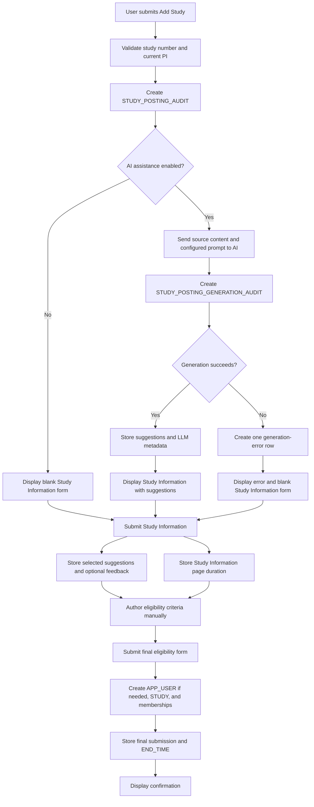

# AI-Assisted Study Posting Authoring

YourHealthResearch.org provides optional AI assistance during study-posting creation.

The current AI feature assists only with the Study Information form.

It does not currently generate:

- Participant types
- Eligibility groups or arms
- Inclusion criteria
- Exclusion criteria
- Screening-questionnaire questions

AI output is advisory.

The study team remains responsible for reviewing, editing, and submitting the final posting.

## Posting-creation steps

Study-posting creation has three main UI steps:

1. Add Study
2. Study Information
3. Inclusion/Exclusion Criteria

Beginning Add Study creates a posting-attempt audit record.

The operational study is not created until successful final eligibility submission.

## Manual and AI paths

### Manual path

When the user declines AI assistance:

1. Add Study creates `STUDY_POSTING_AUDIT`.
2. No `STUDY_POSTING_GENERATION_AUDIT` is created.
3. The Study Information form is displayed without suggestions.
4. The user enters and submits Study Information manually.
5. The application captures the Study Information page duration.
6. The user manually authors eligibility criteria.
7. Successful final submission creates the operational posting.

### AI-assisted path

When the user enables AI assistance:

1. Add Study creates `STUDY_POSTING_AUDIT`.
2. The application sends source content and the configured prompt to the AI service.
3. The application creates one `STUDY_POSTING_GENERATION_AUDIT`.
4. The generation row stores the generated suggestions and response metadata when generation succeeds.
5. The Study Information form displays the suggestions.
6. The user may select, ignore, or edit suggestions.
7. Study Information submission captures:
   - Selected suggestions
   - Optional feedback
   - Study Information page duration
8. The user manually authors eligibility criteria.
9. Successful final submission stores final Study Information values and creates the operational posting.

## AI-generation error path

If the AI request fails:

1. The posting attempt retains its `STUDY_POSTING_AUDIT`.
2. The attempt retains its `STUDY_POSTING_GENERATION_AUDIT`.
3. One `STUDY_POSTING_GENERATION_AUDIT_ERROR` is associated with the generation row.
4. The application displays the Study Information page without suggestions.
5. The application displays an AI-generation error message.
6. The user may continue entering Study Information manually within that same posting attempt.
7. The attempt may still be completed successfully.

If the user returns to Add Study and tries again, the application creates a new posting-attempt audit row.

It does not create another generation row under the original attempt.

## Workflow



For a manual attempt, the feedback request has no generation row to update.

For an AI-assisted attempt, the selected-suggestion and feedback information belongs to the generation row.

## Generation cardinality

The confirmed cardinality is:

```text
One STUDY_POSTING_AUDIT
→ zero or one STUDY_POSTING_GENERATION_AUDIT

One STUDY_POSTING_GENERATION_AUDIT
→ zero or one STUDY_POSTING_GENERATION_AUDIT_ERROR
```

A manual attempt has no generation row.

An AI-assisted attempt has one generation row.

A failed generation has one associated error row.

A retry that starts again from Add Study creates a new posting-attempt row.

## One-time AI decision

AI assistance is optional.

The current UI permits AI assistance only at the beginning of the posting workflow.

If the user declines AI assistance, it cannot be enabled from a later posting step within that attempt.

The application makes at most one AI generation request for one posting attempt.

## Semantic source type

The user identifies what kind of source content is being supplied.

Configured choices include:

```text
Study Protocol
Informed Consent
Other
```

The selected value is stored through a `LOOKUP_VALUE` reference.

If Other is selected, accompanying free text may be stored.

The AI is separately instructed to infer the semantic source type from the supplied content.

This permits comparison of:

- User-selected semantic source
- AI-inferred semantic source

## Source-input method

`STUDY_POSTING_GENERATION_AUDIT.SOURCE_TYPE` records how the content was supplied.

Current production values are:

| Value | Meaning |
|---|---|
| `PDF_FILE` | Source content came from a PDF upload |
| `DOCX_FILE` | Source content came from a Word document upload |
| `RAW_TXT` | Source content was supplied to generation as raw text |

Source-input method is separate from semantic source type.

For example:

```text
SOURCE_TYPE = PDF_FILE
Semantic source = Study Protocol
```

## Source-content handling

Source content may originate from:

- Text entered or pasted into the form
- PDF upload
- Word document upload
- Text extracted from an uploaded file and placed into the form

The content sent to the AI service is not copied into the generation-audit table.

Instead, the generation audit stores metadata such as:

- Input method
- Character count
- User-selected semantic source
- AI-inferred semantic source

## Prompt configuration

The AI prompt is stored in:

```text
APPLICATION_SETTING
```

The prompt may change as product requirements change.

The configured prompt may request a particular number of suggestions for a field.

A prompt-requested count is not a database cardinality constraint.

The following must remain distinct:

```text
Prompt-requested suggestion count
AI-returned suggestion count
Successfully parsed suggestion count
Stored suggestion count
Displayed suggestion count
Selected suggestion count
```

Analyses must count actual stored suggestions rather than assume that every response contains exactly the number requested by the prompt.

## Initial posting-attempt audit

Submitting Add Study creates the general attempt record.

Endpoint:

```http
POST /backend/secure/staff/study-posting-audit
```

Example payload:

```json
{
  "studyNum": "HUM00171893"
}
```

The response supplies the posting-audit identifier used by later requests.

## AI suggestion request

When AI assistance is enabled, the frontend submits source content and metadata.

Endpoint:

```http
POST /backend/secure/staff/study-posting-suggestions
```

Example payload:

```json
{
  "studyPostingAuditId": 2627,
  "studyContent": "Source text submitted to the AI model",
  "srcFileType": "PDF_FILE",
  "studyContentSourceLVId": 450000
}
```

This request creates the generation audit associated with the posting attempt.

## Generation response capture

The application sends source context and the configured prompt to the AI service.

The generation audit captures:

- Source method
- Source character count
- Semantic source selected by the user
- Semantic source inferred by the AI
- AI latency
- Raw response metadata
- Field suggestions
- User-selected suggestions
- Optional feedback

If generation fails, the application creates one associated generation-error row.

## Study Information suggestions

Suggestions are displayed above applicable Study Information fields.

The user may:

- Expand or hide suggestion panels
- Select one or more suggested lookup values
- Select a suggested text value
- Ignore suggestions
- Enter a manual value
- Edit a value after selecting a suggestion

The final saved form values remain authoritative.

## Suggestion cardinality

The configured prompt currently requests multiple alternatives for fields such as:

- Title
- Purpose
- About the study
- Compensation wording

The requested cardinality may change when the prompt changes.

The application audit records actual returned and selected values.

Documentation and analytics must not describe prompt-requested cardinality as a guaranteed stored cardinality.

## Selection versus final value

Selecting a suggestion does not make it final.

Example:

1. AI suggests locations A, B, and C.
2. The user selects A, B, and C.
3. The form is populated with A, B, and C.
4. The user removes C and adds F.
5. The final submitted locations are A, B, and F.

The audit therefore preserves:

```text
AI suggestion
→ User-selected suggestion
→ Final submitted value
```

For free text, the user may select a suggestion and then edit the populated text before submission.

## Selection and feedback capture

When Study Information is submitted, selected suggestions and optional feedback are captured for the AI-assisted attempt.

Endpoint:

```http
PATCH /backend/secure/staff/study-posting-suggestions/{studyPostingAuditId}/feedback
```

Simplified payload:

```json
{
  "selectedSuggestions": {
    "title": ["Selected title suggestion"],
    "purpose": ["Selected purpose suggestion"],
    "description": ["Selected description suggestion"],
    "offersCompensation": false,
    "compensation": {
      "genericCompensation": [],
      "specificCompensation": []
    },
    "topics": [285042],
    "locations": [420000],
    "department": [410062],
    "about": ["Selected about suggestion"],
    "contact": {
      "name": "Study contact",
      "email": "contact@example.org",
      "phone": null,
      "website": null
    }
  },
  "userFeedbackComments": "Optional free-text feedback"
}
```

Feedback is optional.

Selected suggestions are captured at Study Information submission rather than inferred from the final posting.

## Study Information timing

The frontend records time spent on the Study Information page.

Endpoint:

```http
PATCH /backend/secure/staff/study-posting-audit/{studyPostingAuditId}/time-spent
```

Example payload:

```json
{
  "timeSpentOnStudyInfoPageMs": 2090037
}
```

This client-reported duration is stored separately from total attempt duration derived from server timestamps.

## Eligibility-criteria step

After Study Information submission, the eligibility-authoring page is displayed.

AI assistance is not available on this page.

Study teams manually create:

- Participant types
- Criteria groups or arms
- Inclusion criteria
- Exclusion criteria

Each group is edited by supplying its inclusion and exclusion criteria together.

See [Eligibility-Criteria Authoring](../06-recruitment/eligibility-criteria-authoring.md).

## Final submission

After eligibility criteria are successfully submitted:

- The operational study posting is created.
- The creator's `APP_USER` is created if needed.
- Creator and PI memberships are created or ensured.
- `STUDY_POSTING_AUDIT.END_TIME` is recorded.
- Final Study Information values are stored in `STUDY_POSTING_AUDIT.FINAL_SUBMISSION`.
- The PI is notified when applicable.
- A confirmation page is displayed.

Endpoint:

```http
PATCH /backend/secure/staff/study-posting-audit/{studyPostingAuditId}/final-submission
```

Simplified payload:

```json
{
  "title": "Final participant-facing title",
  "purpose": "Final purpose",
  "description": "Final What Is Involved description",
  "offersCompensation": true,
  "compensation": "Final compensation text",
  "contact": {
    "name": "Study contact",
    "email": "contact@example.org",
    "phone": "555-555-5555",
    "website": "https://example.org"
  },
  "about": "Final additional study information",
  "topics": [285042],
  "locations": [420000, 420002],
  "department": [410062]
}
```

## Audit ownership

Final values are stored in:

```text
STUDY_POSTING_AUDIT.FINAL_SUBMISSION
```

They are not stored in `STUDY_POSTING_GENERATION_AUDIT`.

The comparison chain is:

```text
STUDY_POSTING_GENERATION_AUDIT.LLM_SUGGESTIONS
STUDY_POSTING_GENERATION_AUDIT.SELECTED_SUGGESTIONS
STUDY_POSTING_AUDIT.FINAL_SUBMISSION
```

## Generation errors

AI errors are recorded in:

```text
STUDY_POSTING_GENERATION_AUDIT_ERROR
```

The error row includes:

- Generation-audit identifier
- Error timestamp
- Stack trace

An AI error does not necessarily mean the posting attempt was abandoned.

The user may continue manually and complete the same posting attempt.

Analyses should therefore keep separate:

```text
generation_error_flag
attempt_completed_flag
```

## Related pages

- [Study Posting Creation](posting-creation.md)
- [Study Information Authoring](study-information-authoring.md)
- [Eligibility-Criteria Authoring](../06-recruitment/eligibility-criteria-authoring.md)
- [Study-Posting Authoring Audit Model](../07-data-model/study-posting-authoring-audit-model.md)
- [Study Posting Authoring Telemetry](../08-operations/study-posting-authoring-telemetry.md)
- [Study Posting Authoring Timing Analysis](../08-operations/study-posting-authoring-timing-analysis.md)
- [Study Posting Authoring Analysis Dataset](../08-operations/study-posting-authoring-analysis-dataset.md)
- [AI-Assisted Study Posting Authoring Effectiveness](../08-operations/ai-assisted-study-posting-authoring-effectiveness.md)
