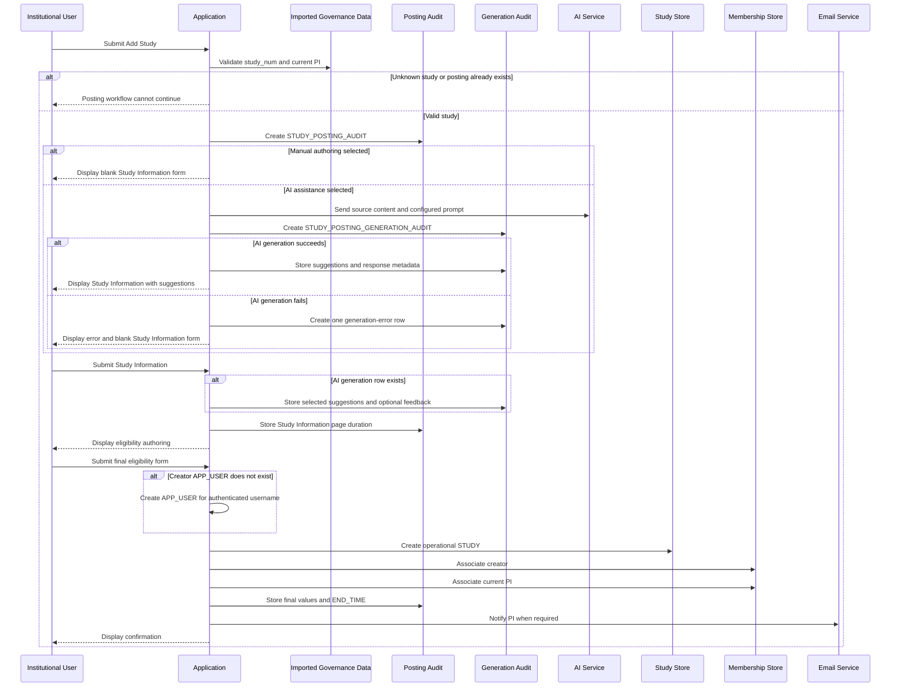

# Study Posting Creation

Study-posting creation is a multi-step workflow.

Beginning Add Study creates a posting-attempt audit record. It does not immediately create the final
operational study posting.

## Preconditions

A posting may be started only when:

1. The user is authenticated through institutional SAML.
1. The user has access to the study-team interface.
1. The entered `study_num` exists in `IMPORTED_STUDY.ID`.
1. No operational posting already exists for that `study_num`.
1. The imported study has a valid current PI identity.

The authenticated institutional user does not necessarily need an existing `APP_USER` before
beginning the posting attempt.

## First-time institutional posting author

An institutional user may authenticate successfully before an `APP_USER` exists.

This can occur when the person has never:

- Successfully created a study posting
- Been associated with a study
- Been created as a PI through reconciliation
- Otherwise received an application user

A login by such a user may be recorded in `LOGIN_AUDIT` with:

```text
USER_NAME = authenticated SAML username
USER_ID = 0
```

`USER_ID = 0` does not identify an `APP_USER` row.

If the person abandons the posting workflow or final submission fails, the posting attempt does not
by itself prove that an `APP_USER` or study membership was created.

When a first-time institutional author successfully completes posting creation:

1. The application creates the author's `APP_USER`.
1. The application creates the operational study.
1. The application creates the author's study membership.
1. A non-PI creator receives `STUDY_TEAM_MEMBER`.
1. A creator who is the current imported PI receives `PRINCIPAL_INVESTIGATOR`.

## Study verification

The Add Study form validates the entered study number against imported institutional data.

### Unknown study number

If the study number does not exist in `IMPORTED_STUDY`, the workflow cannot continue.

### Existing posting

If an operational posting already exists for the study number, a duplicate cannot be created.

### Valid study number

A valid study number allows the user to continue to:

1. Study Information
1. Inclusion/Exclusion Criteria

## Posting-attempt audit

Submitting Add Study creates:

```text
STUDY_POSTING_AUDIT
```

The row represents the posting attempt even if the user later abandons the workflow.

A posting-attempt row does not prove that:

- An operational study was created
- An `APP_USER` was created
- A study membership was created

## Manual authoring path

When AI assistance is not enabled:

1. Add Study submission creates `STUDY_POSTING_AUDIT`.
1. No `STUDY_POSTING_GENERATION_AUDIT` row is created.
1. The application displays a blank Study Information form.
1. The user submits Study Information.
1. The application records time spent on the Study Information page.
1. The user proceeds to eligibility authoring.
1. Successful final eligibility submission creates the operational posting.

## AI-assisted authoring path

When AI assistance is enabled:

1. Add Study submission creates `STUDY_POSTING_AUDIT`.
1. The application sends the source content and configured prompt to the AI service.
1. The application creates one `STUDY_POSTING_GENERATION_AUDIT` associated with the posting attempt.
1. If generation succeeds:
   - Generated suggestions are stored.
   - The Study Information page displays the suggestions.
1. If generation fails:
   - One `STUDY_POSTING_GENERATION_AUDIT_ERROR` is associated with the generation row.
   - The Study Information page is displayed without suggestions.
   - The user sees an AI-generation error message.
   - The user may continue entering Study Information manually within the same posting attempt.
1. When the user submits Study Information:
   - Selected suggestions are captured for an AI-assisted attempt.
   - Optional feedback is captured.
   - Time spent on the Study Information page is captured.
1. The user proceeds to eligibility authoring.
1. Successful final eligibility submission creates the operational posting.

Returning to Add Study and trying again creates a new `STUDY_POSTING_AUDIT` attempt.

The application does not create a second generation row under the original attempt.

## Complete authoring workflow



## AI-generation cardinality

For one posting attempt:

```text
STUDY_POSTING_AUDIT
→ zero or one STUDY_POSTING_GENERATION_AUDIT
→ zero or one STUDY_POSTING_GENERATION_AUDIT_ERROR
```

A manual posting attempt has no generation row.

An AI-assisted posting attempt has one generation row.

A failed generation has one error row associated with that generation row.

A retry begun by returning to Add Study creates a new posting-attempt row rather than another
generation row for the original attempt.

## Study Information submission

Submitting Study Information does not create the operational study.

For AI-assisted attempts, Study Information submission captures:

- Suggestions selected by the user
- Optional free-text feedback
- Client-reported Study Information page duration

The user may modify a populated value after selecting a suggestion.

The following therefore remain distinct:

```text
Generated suggestion
→ Selected suggestion
→ Final submitted value
```

## Final operational creation

The operational `STUDY` row is created only after final eligibility submission succeeds.

Successful final submission includes:

- Final Study Information values
- Participant-type selection
- Saved eligibility groups, when any exist
- Creation or reuse of the creator's `APP_USER`
- Creator membership
- Current PI membership
- Posting-attempt completion
- PI notification
- Confirmation display

If final submission fails, the operational posting is not created.

## Creator application user and membership

When the posting is successfully created:

- Reuse the creator's `APP_USER` when it already exists.
- Create the creator's `APP_USER` when it does not already exist.
- A non-PI creator receives `STUDY_TEAM_MEMBER`.
- A creator who is the current imported PI receives `PRINCIPAL_INVESTIGATOR`.
- Duplicate membership must not be created when the creator and current PI are the same person.

## Current-state analytical implication

A report that joins historical posting attempts to the current `APP_USER` table cannot determine
whether the application user existed at the time of each attempt.

Example:

1. A new user makes two unsuccessful attempts.
1. No `APP_USER` exists.
1. The user later creates a study successfully.
1. The application creates the `APP_USER`.
1. A later current-state join reports the user as existing for all three attempts.

Current `APP_USER` existence is therefore an extract-time sanity check, not a historical
first-time-user field.

## PI identity requirements

The imported PI must have:

- Email
- `USER_NAME` mapped to the institutional SAML ePPN attribute

If either is missing, posting creation fails.

## PI application-user creation

If no matching PI `APP_USER` exists:

1. Create the application user from imported identity data.
1. Associate the user with the study as `PRINCIPAL_INVESTIGATOR`.

If the PI user already exists:

- Reuse the existing user.
- Ensure that the PI membership exists.
- Do not overwrite existing name or email values through ordinary reconciliation behavior.

## PI notification

When the posting creator differs from the current PI, the PI is notified that a posting was created
for the study.

Whether a PI receives the same notification when creating their own posting remains unresolved.

## Initial status

A newly created posting is inactive.

The study team must explicitly activate it after completing the desired posting, questionnaire,
membership, template, attachment, and notification configuration.

## Posting persistence

Study postings cannot be deleted through ordinary application UIs.

They may be:

- Edited
- Activated
- Deactivated
- Archived
- Unarchived

## Related pages

- [Institutional Users](../04-users-and-access/institutional-users.md)
- [Imported Institutional Data](../03-institutional-governance/imported-data.md)
- [Study Information Authoring](study-information-authoring.md)
- [AI-Assisted Study Posting Authoring](ai-assisted-posting-authoring.md)
- [Eligibility-Criteria Authoring](../06-recruitment/eligibility-criteria-authoring.md)
- [Study Membership](../04-users-and-access/study-membership.md)
- [Study Lifecycle](study-lifecycle.md)
- [Study Posting Authoring Analysis Dataset](../08-operations/study-posting-authoring-analysis-dataset.md)
