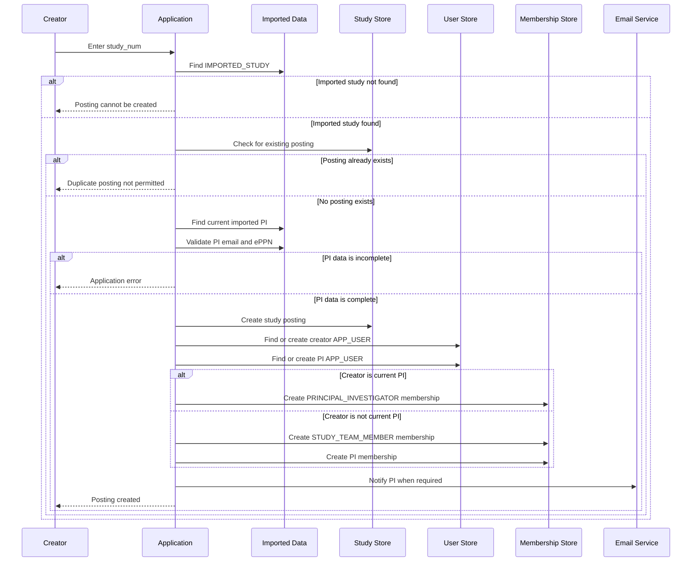

# Study Posting Creation

A study posting is the application-managed, participant-facing recruiting representation of an imported institutional study.

## Preconditions

A posting may be created only when:

1. The creator is authenticated through institutional SAML.
2. The creator has access to the institutional study-team portion of the application.
3. The creator enters a `study_num`.
4. The `study_num` exists in `IMPORTED_STUDY.ID`.
5. No operational study posting already exists for that `study_num`.
6. Required application validation succeeds.

If the study number is not present in `IMPORTED_STUDY`, the posting cannot be created.

If a posting already exists, a duplicate posting cannot be created.

## Uniqueness

Only one operational study posting may exist for a `study_num`.

This rule should be enforced by a database uniqueness constraint in addition to application validation.

Conceptually:

```text
UNIQUE (STUDY.STUDY_NUM)
```

This protects against concurrent requests that both attempt to create the same posting.

## Posting-creation workflow

1. Validate the entered `study_num`.
2. Confirm that no operational posting exists.
3. Find the study's current imported PI.
4. Validate the PI's required identity information.
5. Create the operational study.
6. Find or create the creator's `APP_USER`.
7. Determine whether the creator is the imported PI.
8. Associate the creator with the study.
9. Find or create the PI's `APP_USER`.
10. Associate the PI with the study as `PRINCIPAL_INVESTIGATOR`.
11. Notify the PI according to the posting-notification rule.
12. Record applicable audit information.



## Creator membership

If the creator is not the imported PI, the creator receives:

```text
STUDY_TEAM_MEMBER
```

If the creator is the imported PI, the creator receives:

```text
PRINCIPAL_INVESTIGATOR
```

The application must not create duplicate memberships when the creator and PI are the same person.

## PI identity requirements

The imported PI must have:

- Email
- ePPN or the required institutional identity identifier

If either is missing, posting creation produces an application error.

## PI application-user creation

If the PI does not have an `APP_USER`:

1. Create the application user.
2. Copy imported PI identity information.
3. Associate the user with the study as `PRINCIPAL_INVESTIGATOR`.

If the PI already has an `APP_USER`:

- Reuse the existing user.
- Do not overwrite the existing user's name or email with later imported changes under current behavior.
- Ensure that the PI membership exists.

## PI notification

When the posting creator differs from the PI, the PI is emailed to inform them that a posting was created for their study.

Whether a PI receives the same notification when personally creating the posting remains an open question.

## Posting persistence

Study postings cannot be deleted through application UIs.

They may be:

- Edited
- Activated
- Deactivated
- Reactivated

They cannot be deleted and recreated through normal application UI workflows.

## Posting URLs

Participant-facing study-posting URLs expose:

- The institutionally assigned `study_num`
- An internally assigned sequence-based identifier

The institutionally assigned study number is intentionally included to support recognizable and bookmarkable study URLs.

## Related pages

- [Imported institutional data](../03-institutional-governance/imported-data.md)
- [Institutional users](../04-users-and-access/institutional-users.md)
- [Study membership](../04-users-and-access/study-membership.md)
- [Study lifecycle](study-lifecycle.md)
- [Open questions](../09-decisions/open-questions.md)