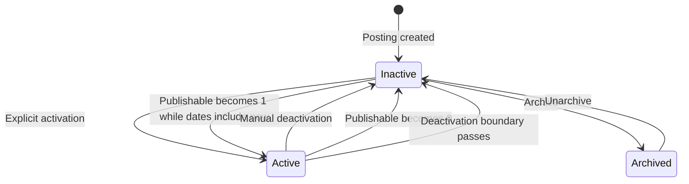

# Study Lifecycle

## Derived active status

There is no independent persisted active Boolean.

Matching-active membership is defined by `V_ACTIVE_STUDY`:

- `PUBLISHABLE = 1`
- Current calendar date on or after `POSTING_ACTIVATION_DATE`
- Current calendar date before `POSTING_DEACTIVATION_DATE`

The view truncates time-of-day. Its activation date is inclusive and its deactivation date is
exclusive.

`V_STUDY_STATUS` instead uses inclusive `BETWEEN`, so it may report `ACTIVE` on the deactivation date
when matching has already excluded the study. Pages must identify the governing view when that
difference matters.

## Initial and explicit activation

Initial activation requires study-team action.

Any associated study team member may activate the study when:

- `PUBLISHABLE = 1`
- The study is not archived
- Required posting content is complete
- A future deactivation boundary is supplied

Activation:

- Sets activation to the current date/time
- Saves the selected deactivation boundary
- Causes the derived state to become active
- Adds or updates the study in active in-memory matching data
- Creates a new active interval
- Initiates asynchronous lifecycle-notification handling
- Initiates applicable match recomputation

A study team member cannot activate the study or assign a new activation range while
`PUBLISHABLE = 0`.

## Manual deactivation

Any associated study member may select Deactivate Study.

Manual deactivation:

- Sets the deactivation boundary to the current date/time
- Makes the study inactive as current time moves beyond that boundary
- Prompts for total enrollment
- Removes the study from active in-memory matching data
- Closes the current active interval
- Initiates asynchronous lifecycle-notification handling

The enrollment question is displayed, but the user may indicate that the value is unknown.

Total enrollment is stored through `STUDY_PROPERTY_VALUE`.

There is no separate manual-deactivation Boolean.

## Date-based expiration

Effective matching membership is derived from `V_ACTIVE_STUDY`. The view uses calendar dates and
requires:

- Current date on or after the posting activation date
- Current date before the posting deactivation date
- `PUBLISHABLE = 1`

When the deactivation date is reached, the study disappears from `V_ACTIVE_STUDY`. The scheduled
`activeStudiesSynchronizationJob` then removes it from each process-local active-study store and
starts asynchronous system-recommendation cleanup.

Pure passage of time does not call `StudyActiveIntervalService.updateInterval(...)` in the reviewed
code. It therefore does not itself create or close a `STUDY_ACTIVE_INTERVAL` row.

After the deactivation boundary has passed, publishability returning to `1` cannot reactivate the
study unless a study member establishes a new activation range.

## Upcoming-deactivation warning

The current PI receives an email warning approximately one week before the configured deactivation
date.

This warning is separate from the notification generated after the study actually becomes inactive.

The warning gives the study team an opportunity to review recruitment and, when permitted, establish
an appropriate future deactivation date before expiration.

## Governance-driven inactivation

When `PUBLISHABLE` changes to `0`:

- The derived study state becomes inactive
- Recruitment stops
- Matching stops
- The study is removed from active in-memory matching data
- Participant information is hidden
- Existing conversations are hidden
- New exports are blocked
- Existing activation boundaries remain unchanged
- The current active interval closes
- Delayed lifecycle-notification handling begins

## Automatic reactivation

When imported `PUBLISHABLE` changes from `0` to `1`, reconciliation sets the posting activation date
to the current time and retains the configured posting deactivation date.

When the resulting range is matching-active:

- The study returns to active in-memory matching data.
- Applicable matching recomputation begins.
- A new active interval may be created.
- Delayed lifecycle-notification handling begins.

If the retained deactivation date has passed, the resulting range cannot remain matching-active.
A study member must establish a valid future range.

This imported-publishability behavior differs from merely reevaluating unchanged dates.

## Active intervals

`STUDY_ACTIVE_INTERVAL` stores configured active ranges used for lifecycle queries and notifications.

The interval service is called by two confirmed production paths:

- Direct study updates that change posting activation or deactivation dates
- Imported publishability transitions

Its behavior is:

- First activation creates an interval.
- Reactivation after a prior interval creates another interval.
- Changing the current interval end updates the most recent interval.
- Imported transition to active sets activation to the current time and records the resulting range.
- Imported transition from active to inactive closes the current range at the current time.

No scheduled job mutates intervals merely because time crosses a posting boundary. Interval rows
therefore represent ranges recorded when application or import code changes lifecycle-driving data;
they are not a complete event log proving when each application server observed a date-driven
transition.

## Lifecycle notifications

Lifecycle email is asynchronous.

A daily scheduled process evaluates:

- Activation and deactivation announcements
- Configured Other Announcements recipients
- Current PI notifications
- Upcoming-deactivation warnings
- Stabilization of recent active-status changes

A short-lived state change may be suppressed by the one-day stabilization rule.

Example:

```text
ACTIVE → INACTIVE → ACTIVE within one day
```

The operational state changes may still occur, and interval rows may be changed by direct or
import-driven updates, but a stable-state PI notification is not sent for the transient sequence.

If the changed state remains beyond the stabilization period, the applicable PI notification is
sent.

## Effects of date-based inactivity

When a study is inactive by date but remains publishable:

- It is not publicly discoverable
- Its valid direct URL displays a not-currently-recruiting message
- It is removed from active matching
- It is removed from active in-memory matching data
- New Ask if interested actions are blocked
- New expressions of interest are blocked
- Historical interested-participant data remains available for active participants
- Existing conversations remain visible
- New exports of otherwise visible historical interested-participant data remain permitted

The application does not retain a server-side historical export file.

## Questionnaire editing

A screening questionnaire may be edited only while the study is inactive.

See [Questionnaires and Exports](../06-recruitment/questionnaires-and-exports.md).

## Archive status

Archive status is independent of active status.

Only an inactive study may be archived.

See [Study Archiving](study-archiving.md).

## Lifecycle diagram



## Active-view date semantics

The database view used to populate active matching studies compares calendar
dates rather than exact timestamps.

In `V_ACTIVE_STUDY`:

- Activation date is inclusive.
- Deactivation date is exclusive.
- Time-of-day is ignored.
- `PUBLISHABLE` must be `1`.

Date-driven membership changes reach each process-local active-study store
through scheduled active-study synchronization. A direct study update may
update the local store and trigger matching or cleanup immediately.

## Status-view inconsistency

`V_STUDY_STATUS` uses an inclusive `BETWEEN` comparison, while
`V_ACTIVE_STUDY` excludes the deactivation date.

On the saved deactivation date, these views may disagree about whether a study
is active. Until this inconsistency is resolved, documentation must identify
which view governs the workflow being described.

Matching uses active entities loaded from `V_ACTIVE_STUDY`.

## Active-interval updates

The complete production call-site search for
`StudyActiveIntervalService.updateInterval(...)` finds only:

- `StudyServiceImpl`
- `StudyImportSynchronizerImpl`

The seeded schedule row named `updateActiveIntervalsJob` has no corresponding dynamic-job bean in the
reviewed Java source. Because application jobs are discovered from Spring beans implementing
`DynamicallyReschedulableJob`, the schedule row alone is not executable.

`BatchNotificationJob` queries existing interval rows to identify activation and deactivation
announcements. It does not update interval rows.

### Confirmed date-view inconsistency

`V_ACTIVE_STUDY` excludes the posting deactivation date, while `V_STUDY_STATUS` uses an inclusive
`BETWEEN` comparison. On the saved deactivation date, the two views may disagree.

Matching membership follows `V_ACTIVE_STUDY`. Choosing which view should be corrected remains a
product and technical decision.

## Related pages

- [Publishability](../03-institutional-governance/publishability.md)
- [Study Archiving](study-archiving.md)
- [Study Notifications](study-notifications.md)
- [Public Study Discovery](../06-recruitment/public-study-discovery.md)
- [Matching and Visibility](../06-recruitment/matching-and-visibility.md)
