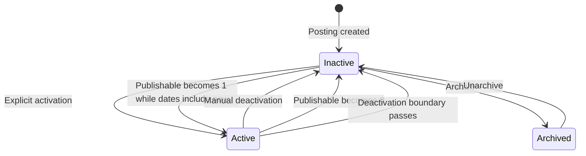

# Study Lifecycle

## Derived active status

There is no independent persisted active Boolean.

A study is active only when:

```text
PUBLISHABLE = 1
AND current date/time is on or after POSTING_ACTIVATION_DATE
AND current date/time is on or before POSTING_DEACTIVATION_DATE
```

The boundaries are inclusive at the instant they are stored.

If any condition is false, the study is inactive.

## Initial and explicit activation

Initial activation requires study-team action.

Any associated study team member may activate the study when:

- `PUBLISHABLE = 1`
- The study is not archived
- Required posting content is complete
- A future deactivation boundary is supplied

Activation:

- Sets activation to the current date/time
- Saves the selected deactivation boundary
- Causes the derived state to become active
- Adds or updates the study in active in-memory matching data
- Creates a new active interval
- Initiates asynchronous lifecycle-notification handling
- Initiates applicable match recomputation

A study team member cannot activate the study or assign a new activation range while
`PUBLISHABLE = 0`.

## Manual deactivation

Any associated study member may select Deactivate Study.

Manual deactivation:

- Sets the deactivation boundary to the current date/time
- Makes the study inactive as current time moves beyond that boundary
- Prompts for total enrollment
- Removes the study from active in-memory matching data
- Closes the current active interval
- Initiates asynchronous lifecycle-notification handling

The enrollment question is displayed, but the user may indicate that the value is unknown.

Total enrollment is stored through `STUDY_PROPERTY_VALUE`.

There is no separate manual-deactivation Boolean.

## Date-based expiration

The study becomes inactive when the current date/time is later than its deactivation boundary.

Scheduled processing detects time-based transitions, updates active intervals, removes expired
studies from active in-memory matching data, and initiates applicable notifications.

After the deactivation boundary has passed, publishability returning to `1` cannot reactivate the
study unless a study member explicitly sets a new activation range.

## Upcoming-deactivation warning

The current PI receives an email warning approximately one week before the configured deactivation
date.

This warning is separate from the notification generated after the study actually becomes inactive.

The warning gives the study team an opportunity to review recruitment and, when permitted, establish
an appropriate future deactivation date before expiration.

## Governance-driven inactivation

When `PUBLISHABLE` changes to `0`:

- The derived study state becomes inactive
- Recruitment stops
- Matching stops
- The study is removed from active in-memory matching data
- Participant information is hidden
- Existing conversations are hidden
- New exports are blocked
- Existing activation boundaries remain unchanged
- The current active interval closes
- Delayed lifecycle-notification handling begins

## Automatic reactivation

When `PUBLISHABLE` changes from `0` to `1`, the application recalculates active status.

Automatic reactivation occurs only if the unchanged activation range still contains the current
date/time.

When automatically reactivated:

- The study returns to active in-memory matching data.
- Applicable matching recomputation begins.
- A new active interval is created.
- Delayed lifecycle-notification handling begins.

If the deactivation boundary has passed, publishability alone cannot reactivate the study.

Manual deactivation therefore prevents future automatic reactivation unless the study team
explicitly establishes a new activation range.

## Active intervals

`STUDY_ACTIVE_INTERVAL` records periods during which the derived study state was active.

An interval is created or closed whenever the derived state changes because of:

- Explicit activation
- Manual deactivation
- Date-based expiration
- Publishability change
- Automatic reactivation

## Lifecycle notifications

Lifecycle email is asynchronous.

A daily scheduled process evaluates:

- Activation and deactivation announcements
- Configured Other Announcements recipients
- Current PI notifications
- Upcoming-deactivation warnings
- Stabilization of recent active-status changes

A short-lived state change may be suppressed by the one-day stabilization rule.

Example:

```text
ACTIVE → INACTIVE → ACTIVE within one day
```

The operational transitions and active intervals may still occur, but a stable-state PI notification
is not sent for the transient change.

If the changed state remains beyond the stabilization period, the applicable PI notification is
sent.

## Effects of date-based inactivity

When a study is inactive by date but remains publishable:

- It is not publicly discoverable
- Its valid direct URL displays a not-currently-recruiting message
- It is removed from active matching
- It is removed from active in-memory matching data
- New Ask if interested actions are blocked
- New expressions of interest are blocked
- Historical interested-participant data remains available for active participants
- Existing conversations remain visible
- New exports of otherwise visible historical interested-participant data remain permitted

The application does not retain a server-side historical export file.

## Questionnaire editing

A screening questionnaire may be edited only while the study is inactive.

See [Questionnaires and Exports](../06-recruitment/questionnaires-and-exports.md).

## Archive status

Archive status is independent of active status.

Only an inactive study may be archived.

See [Study Archiving](study-archiving.md).

## Lifecycle diagram



## Related pages

- [Publishability](../03-institutional-governance/publishability.md)
- [Study Archiving](study-archiving.md)
- [Study Notifications](study-notifications.md)
- [Public Study Discovery](../06-recruitment/public-study-discovery.md)
- [Matching and Visibility](../06-recruitment/matching-and-visibility.md)
