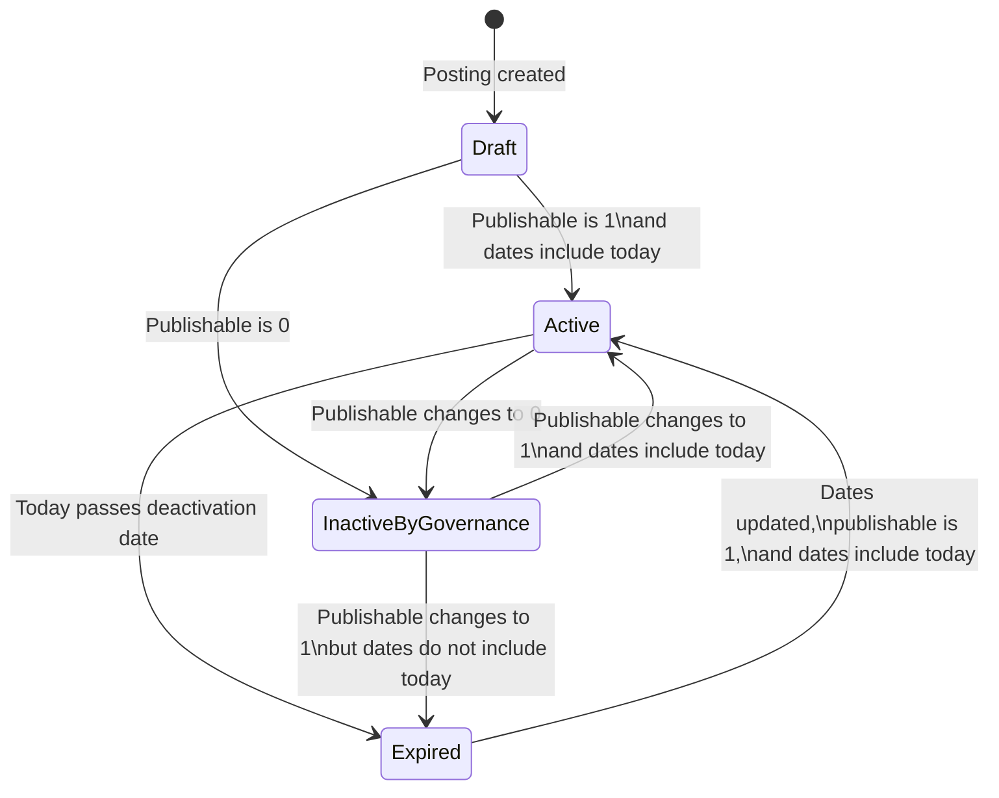

# Study Lifecycle

A study's active status is determined by:

- Institutionally controlled publishability
- Study activation date
- Study deactivation date
- Current date

## Active-status rule

Conceptually:

```text
Study is active =
    PUBLISHABLE = 1
    AND today falls within the activation and deactivation dates
```

Both date boundaries are inclusive.

## Draft posting

A newly created posting may be prepared and edited before it is active.

A posting cannot actively recruit unless its active-status conditions are satisfied.

Whether `PUBLISHABLE = 1` is required to create a draft, rather than only to activate it, remains an open question.

## Activation

A study can be active when:

- It references an imported study
- `PUBLISHABLE = 1`
- An activation date is set
- A deactivation date is set
- The current date falls within the configured range
- Required participant-facing content is complete

## Date-based expiration

When the current date moves beyond the deactivation date:

- The study becomes inactive.
- The study is removed from active matching.
- The study no longer actively recruits.
- New recruitment interactions are blocked.

## Date-based reactivation

An expired study may be manually reactivated when:

- The study team updates the applicable dates
- `PUBLISHABLE = 1`
- Other activation requirements are satisfied

There is no separate manual-deactivation control. A study team makes a study
inactive by setting its deactivation date.

## Governance-driven inactivation

When `PUBLISHABLE` changes from `1` to `0`:

- The study becomes inactive.
- The study leaves active matching.
- Recruitment stops.
- Study-team access to participant data is restricted.
- Historical expressions of interest may remain.
- The local deactivation date is not changed.

## Automatic reactivation after publishability returns

When `PUBLISHABLE` changes from `0` to `1`:

1. The application recalculates active status.
2. If the current date still falls within the existing study dates, the study becomes active automatically.
3. The study team does not need to perform a separate reactivation action.

This current behavior may reactivate a study before the study team completes a locally required posting change.

## Lifecycle diagram



## Participant-facing inactive-study behavior

A participant may retain or use a direct URL for an inactive study.

When the participant accesses that URL, the application displays a message that the study is no longer recruiting.

The posting is not silently treated as actively available.

## Matching effects

When a study becomes inactive:

- It no longer participates in active matching.
- It is removed from current matched-study results.
- It is removed from current matched-participant results.
- New Ask if interested actions are blocked.
- New expressions of interest are blocked.

When the study becomes active again, its current matches are recomputed. They
appear as new matched participants or studies rather than being restored from
the prior active period.

## Interested-participant access while inactive

Study inactivity by date does not, by itself, remove access to historical interested participants.

The study team may access and export historical interested-participant data while `PUBLISHABLE = 1`, subject to participant-account visibility rules.

If an interested participant's account is deactivated:

- The historical interest relationship remains.
- The participant's profile information is hidden.
- The deactivated participant's data is not available for a new export.

When `PUBLISHABLE = 0`, the study team cannot access participant information,
including historical interested-participant data.

Historical retention and current profile visibility are separate concepts.

## Questionnaire editing

A study must be inactive before the study team can change its screening-questionnaire structure.

While the study is inactive, the team may:

- Add questions
- Delete questions
- Change question display order

Other changes to existing question content are not supported.

After making the questionnaire changes, the study may be reactivated if:

- `PUBLISHABLE = 1`
- The date range permits activation
- Other activation requirements are satisfied

## Study-posting deletion

Study postings cannot be deleted through application UIs.

A posting may be edited, activated, deactivated, or reactivated, but cannot be deleted and recreated through the UI.

## URL resolution

Participant-facing URLs contain:

- The institutionally assigned `study_num`
- The internally assigned sequence-based study identifier

The `study_num` is the authoritative institutional study identifier.

The application validates that the URL's internal identifier and `study_num` refer to the same operational study posting.

Results include:

- A valid identifier pair for an active study displays the posting.
- A valid identifier pair for an inactive study displays the not-recruiting message.
- An incorrect or mismatched internal identifier returns `404 Not Found`.
- An unknown `study_num` does not resolve to a posting.

## Delayed PI status notifications

Study active-status notifications are delayed to avoid sending messages for transient changes.

Example:

```text
ACTIVE → INACTIVE → ACTIVE within one day
```

Result:

```text
No PI notification
```

If the status remains changed for more than one day, the PI is notified.

## Known governance concern

Because the deactivation date is not changed when publishability becomes `0`, a later return to `1` may automatically reactivate the study.

A future design may need a distinct governance-hold state or explicit reactivation requirement.

## Related pages

- [Publishability](../03-institutional-governance/publishability.md)
- [Governance reconciliation](../03-institutional-governance/reconciliation.md)
- [Posting creation](posting-creation.md)
- [Matching and visibility](../06-recruitment/matching-and-visibility.md)
