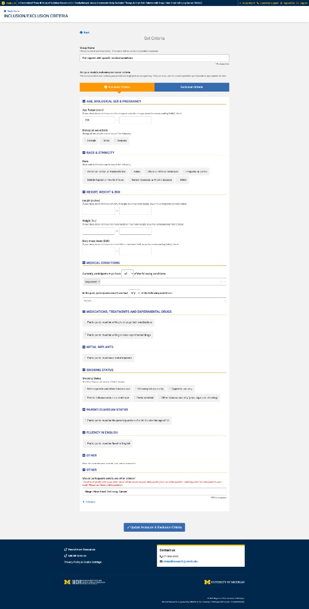
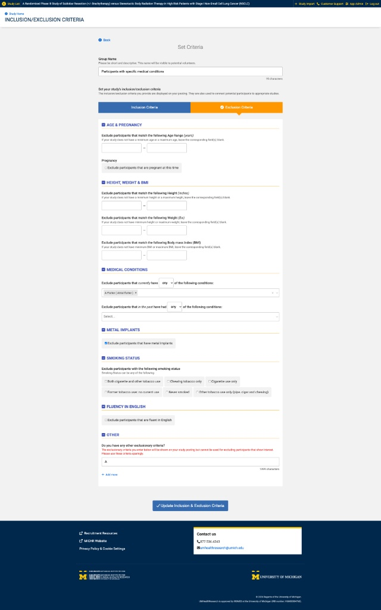
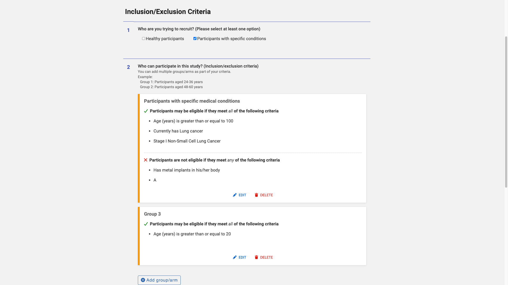
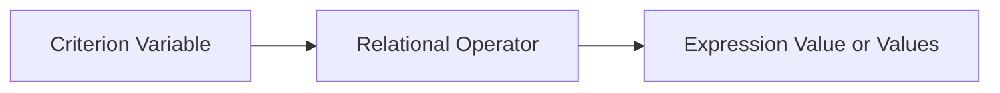
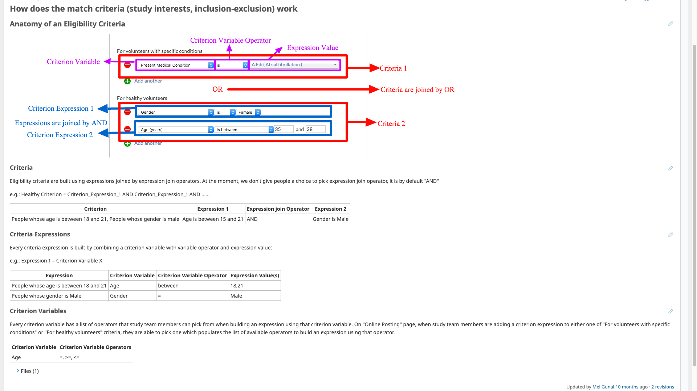

# Eligibility-Criteria Authoring

Study eligibility criteria determine which participants are exact, partial, or non-matches for a study.

Study team members author eligibility criteria during the final stage of study-posting creation.

The current AI-assisted posting feature does not author these criteria.

## Authoring goals

The eligibility UI allows study teams to describe:

- Who may be eligible
- Who must be excluded
- Whether the study recruits healthy participants
- Whether the study recruits participants with specific conditions
- Alternative participant groups or study arms
- Participant-facing criteria that cannot be evaluated by the matching engine

## Current UI screenshots

### Inclusion criteria



### Exclusion criteria



### Groups and arms summary



## Criteria groups or arms

A study may define multiple criteria groups or arms.

Examples include:

- Participants with specific medical conditions
- Healthy participants
- Participants aged 24–36
- Participants aged 48–60

Each group has:

- A name
- Display order
- Inclusion criteria
- Exclusion criteria

Groups are alternatives.

Conceptually:

```text
Participant is eligible for the study
if the participant qualifies for Group 1
OR Group 2
OR Group 3
```

The current UI summary states that a participant may qualify by satisfying one of the defined groups or arms.

## Inclusion criteria

The inclusion section describes conditions the participant must meet.

The current UI presents inclusion logic as:

> Participants may be eligible if they meet all of the following criteria.

Conceptually:

```text
Inclusion result for one group =
    Inclusion Expression 1
    AND Inclusion Expression 2
    AND ...
```

The UI does not allow the author to choose the expression connector.

The connector is fixed as `AND`.

## Exclusion criteria

The exclusion section describes conditions that disqualify the participant.

The current UI presents exclusion logic as:

> Participants are not eligible if they meet any of the following criteria.

Conceptually:

```text
Excluded from one group =
    Exclusion Condition 1
    OR Exclusion Condition 2
    OR ...
```

For matching and storage, structured exclusion conditions may be represented using negating operators such as:

```text
NOT_EQUAL
NOT_ANY_OF
NOT_ALL_OF
NOT_BETWEEN
```

This allows the normalized group-qualification expression to remain an `AND` of conditions that must be true for eligibility.

For example:

```text
Eligible for group =
    Age is at least 18
    AND does not have a metal implant
    AND is not currently pregnant
```

The exact operator mapping for every exclusion UI control should be verified against saved data.

## Group-level conceptual logic

A simplified conceptual model is:

```text
Group qualifies =
    all inclusion requirements are satisfied
    AND no exclusion condition applies

Study eligibility =
    Group 1 qualifies
    OR Group 2 qualifies
    OR ...
```

Three-valued matching introduces `MAYBE` when optional participant profile values are missing.

See [Matching and Visibility](matching-and-visibility.md).

## UI sections

The current eligibility form groups fields into sections such as:

- Age and pregnancy
- Race and ethnicity
- Height, weight, and BMI
- Medical conditions
- Medications, treatments, and experimental drugs
- Metal implants
- Smoking status
- Parent or guardian status
- Fluency in English
- Other

The exact sections shown may depend on:

- Inclusion versus exclusion mode
- Study configuration
- Participant type
- Supported criterion variables

## Criterion expression anatomy

A structured criterion expression contains:

1. Criterion variable
2. Relational operator
3. Expression value or values



Example:

```text
Variable: AGE
Operator: BETWEEN
Values: 18 and 65
```

Another example:

```text
Variable: PRESENT_MEDICAL_CONDITION
Operator: ANY_OF
Values: Lung Cancer, Asthma
```

## Generic expression model

The following screenshot illustrates the generic expression model and a more flexible criteria UI.

It is conceptual and should not be confused with every limitation of the current production authoring form.



## Current UI constraints

The current production UI simplifies authoring:

- Each criteria group is persisted with one clause.
- Expressions within that clause use `AND`.
- The user does not select the expression connector.
- The clause is terminal.
- Criteria groups are alternatives.
- Operator selection is exposed only where the UI requires it.
- Other operators are implied by the selected field and inclusion/exclusion mode.

The underlying data model is more flexible than the current UI.

It supports:

- Multiple clauses
- Expression connectors
- Clause connectors
- Ordered expressions

The production UI does not currently expose all of that flexibility.

## UI-to-variable mapping

The following table documents the current conceptual mapping.

Exact `criterion_variable.name` values should be verified against the reference data in each deployment.

| Criterion variable | UI interaction | Value representation |
|---|---|---|
| `AGE` | One or two numeric inputs | Scalar or encoded range |
| `HEIGHT` | One or two numeric inputs | Scalar or encoded range |
| `WEIGHT` | One or two numeric inputs | Scalar or encoded range |
| `BMI` | One or two numeric inputs | Scalar or encoded range |
| `GENDER` | Checkboxes | Lookup selections |
| `PREGNANT_AT_THE_TIME_OF_ENROLLMENT` | Checkbox or Boolean selection | Boolean lookup |
| `RACE` | Checkboxes | Lookup selections |
| `WILLING_TO_TAKE_EXPERIMENTAL_DRUGS` | Checkbox or Boolean selection | Boolean lookup |
| `WILLING_TO_CHANGE_MEDICATIONS` | Checkbox or Boolean selection | Boolean lookup |
| `HAS_METAL_IMPLANTS` | Checkbox or Boolean selection | Boolean lookup |
| `SMOKING_STATUS` | Checkboxes | Lookup selections |
| `PARENT_OR_GUARDIAN_OF_A_CHILD` | Checkbox or Boolean selection | Boolean lookup |
| `FLUENCY_IN_ENGLISH` | Checkbox or Boolean selection | Boolean lookup |
| `PRESENT_MEDICAL_CONDITION` | Typeahead multi-select plus operator | Medical-condition lookups |
| `PAST_MEDICAL_CONDITION` | Typeahead multi-select plus operator | Medical-condition lookups |
| `OTHER` | Free text | Scalar text |

## Numeric and range fields

Numeric variables may use:

- One endpoint
- Two endpoints
- A range operator
- A negated range operator

Examples include:

```text
AGE >= 18
AGE BETWEEN 18 AND 65
BMI <= 30
AGE NOT_BETWEEN 20 AND 30
```

A range may be stored in a single scalar value using an application-specific delimiter.

Example:

```text
18:65
```

The delimiter and parsing rules must be confirmed from the implementation before building analytics.

## Checkbox fields

Checkbox criteria represent one or more selected lookup values.

Examples include:

- Gender
- Race
- Smoking status
- Pregnancy
- Metal implants
- Fluency in English

The UI may infer the relational operator based on:

- Inclusion or exclusion mode
- Variable type
- Number of selected values

## Medical-condition fields

Present and past medical conditions use a typeahead multi-select.

The user may choose an operator such as:

```text
ANY_OF
ALL_OF
```

Exclusion mode may produce a negating operator such as:

```text
NOT_ANY_OF
NOT_ALL_OF
```

Selected conditions are stored as lookup values.

The source draft indicates a medical-condition vocabulary of approximately 588 options. This count should be treated as deployment- and time-specific rather than a permanent business rule.

## OTHER free text

`OTHER` allows study teams to enter participant-facing criteria that cannot be represented using the structured matching variables.

For inclusion text:

- `criterion_variable = OTHER`
- `relational_operator` may be null
- `saved_value` contains the participant-facing text

For exclusion text, the current model uses a prefix:

```text
$#exclusion#$
```

Example:

```text
$#exclusion#$Prior chemotherapy
```

The matching engine does not directly evaluate OTHER free text.

OTHER content is displayed to participants but does not contribute structured profile-based evidence to the eligibility result.

This distinction is important:

```text
Displayed criterion does not necessarily mean machine-evaluated criterion.
```

## Storage-neutral expression examples

| UI statement | Variable | Operator | Value representation |
|---|---|---|---|
| Age is at least 18 | `AGE` | `GREATER_THAN_OR_EQUAL` | `18` |
| Age is between 18 and 65 | `AGE` | `BETWEEN` | Encoded range |
| Gender is female | `GENDER` | `EQUAL` or generated set operator | Lookup |
| Has any listed condition | `PRESENT_MEDICAL_CONDITION` | `ANY_OF` | Multiple lookups |
| Has all listed conditions | `PRESENT_MEDICAL_CONDITION` | `ALL_OF` | Multiple lookups |
| Does not have any listed condition | `PRESENT_MEDICAL_CONDITION` | `NOT_ANY_OF` | Multiple lookups |
| Participant-facing unsupported condition | `OTHER` | Null | Free text |
| Participant-facing unsupported exclusion | `OTHER` | Null | Prefixed free text |

## Form completion

Submitting the eligibility form finalizes the study-posting creation workflow.

The study may then be activated when its lifecycle requirements are satisfied.

Final submission does not override:

- Institutional publishability
- Study activation date
- Study deactivation date
- Other activation requirements

## Potential authoring-effort signals

The UI structure suggests several measurable dimensions of authoring effort:

- Number of groups or arms
- Number of inclusion expressions
- Number of exclusion expressions
- Number of distinct criterion variables
- Number of lookup selections
- Number of medical-condition selections
- Number of range endpoints
- Number of negated operators
- Amount of OTHER free text
- Number of form edits
- Number of group additions and deletions
- Time spent on the form

These signals are inputs to a possible complexity measure, not proof of cognitive difficulty by themselves.

See [Authoring Telemetry and Complexity Analysis](../08-operations/authoring-telemetry-and-complexity.md).

## Related pages

- [Matching and Visibility](matching-and-visibility.md)
- [Criteria Data Model](../07-data-model/criteria-data-model.md)
- [Expressions of Interest](expressions-of-interest.md)
- [AI-Assisted Study Posting Authoring](../05-study-management/ai-assisted-posting-authoring.md)
- [Authoring Telemetry and Complexity Analysis](../08-operations/authoring-telemetry-and-complexity.md)
- [Authoring and Analytics Open Questions](../09-decisions/authoring-analytics-open-questions.md)
