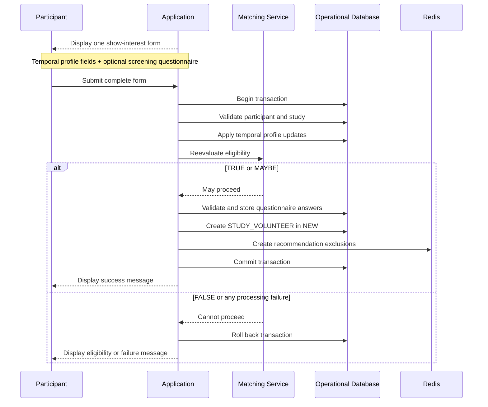

# Expressions of Interest

An expression of interest is a finalized participant action that creates a `STUDY_VOLUNTEER`
relationship.

A participant may express interest in a study only once.

## Preconditions

Before interest can be finalized:

- The participant account must be active
- The study must be active
- The participant must not have already expressed interest
- The final eligibility result must be `TRUE` or `MAYBE`
- Required screening questions must be answered when a questionnaire exists

## Single show-interest form

The participant completes one form.

The form contains:

1. Temporal profile updates at the top
1. Screening questions at the bottom, when configured

The temporal properties are:

- Past medical conditions
- Present medical conditions
- Parent or guardian of a child under 18

The application intentionally limits the health review to those three properties.

## Atomic backend transaction

The entire form is submitted in one request and processed in one backend transaction.

Processing includes:

1. Validate the active participant account.
1. Validate that the study remains active.
1. Validate that interest has not already been expressed.
1. Apply the submitted temporal profile updates.
1. Reevaluate eligibility using the updated profile.
1. Reject the transaction if eligibility is `FALSE`.
1. Validate required questionnaire answers, when applicable.
1. Store questionnaire answers.
1. Create the `STUDY_VOLUNTEER` interested-participant relationship.
1. Create the applicable Redis exclusions that remove the pair from ordinary recommendation flows.

If any step fails:

- Profile changes are rolled back
- Questionnaire answers are not stored
- `STUDY_VOLUNTEER` is not created
- No partial interest record remains

## Eligibility results

```text
TRUE  → may proceed
MAYBE → may proceed
FALSE → cannot proceed
```

The participant UI does not label the participant as exact, partial, eligible, or potentially
eligible.

A `FALSE` result displays an explanatory message that the participant does not meet the study's
eligibility criteria.

## Screening-questionnaire role

Screening answers:

- Are not used by the matching engine
- Do not change eligibility
- Do not resolve `MAYBE`
- Are stored for study-team review
- Are shown on the interested-participant profile
- Are included in CSV exports

## Study-status race condition

The study is checked again during form processing.

If the study is no longer active:

- The entire transaction fails
- No profile update is committed
- No questionnaire submission is stored
- No interest is created
- The participant sees a not-currently-recruiting message

## After interest

After successful interest:

- The participant starts in the `NEW` workflow list
- Study members may view the participant profile
- Study members may initiate messaging
- Later eligibility changes do not remove interest
- The participant cannot withdraw interest through the application

## Sequence diagram



## Related pages

- [Matching and Visibility](matching-and-visibility.md)
- [Questionnaires and Exports](questionnaires-and-exports.md)
- [Interested-Participant Management](interested-participant-management.md)
- [Messaging](messaging.md)
