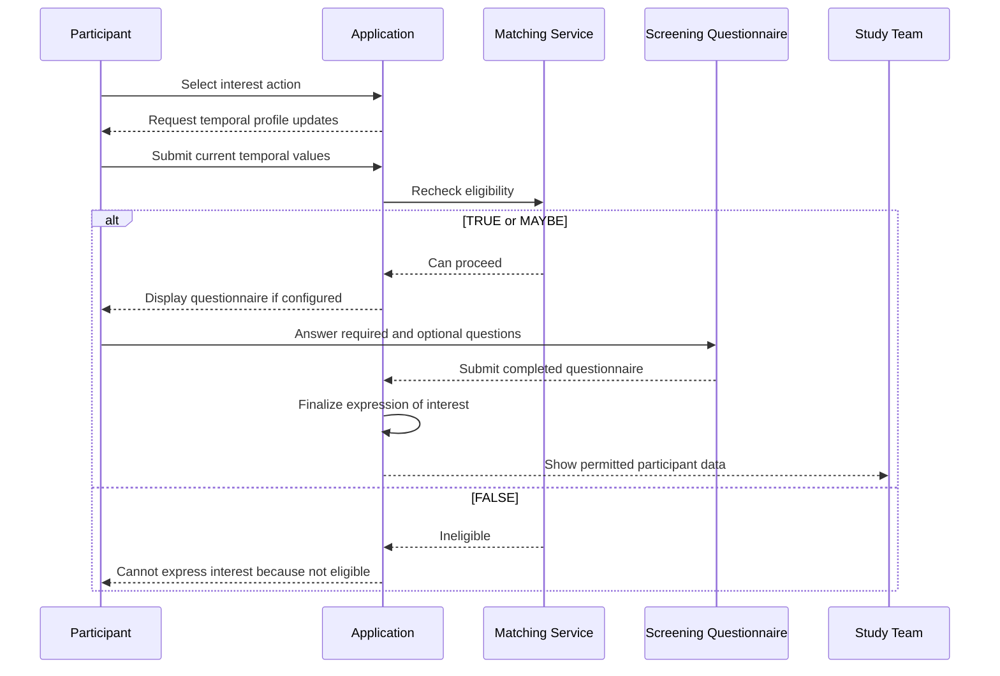

# Expressions of Interest

An expression of interest is an explicit participant action indicating interest in a study.

Participants cannot withdraw an expression of interest after it has been finalized.

## Preconditions

Before interest can be finalized:

- The participant account must be active.
- The study must be active.
- The study must have `PUBLISHABLE = 1`.
- The participant must provide current values for required temporal profile properties.
- The eligibility recheck must produce `TRUE` or `MAYBE`.
- The participant must complete the study's screening questionnaire when one is configured.

## Temporal profile refresh

When a participant selects the interest action, the application asks the participant to update profile information that may change over time.

The temporal properties include:

- Past medical conditions
- Present medical conditions
- Whether the participant is a parent or guardian of a child under 18

The parent-or-guardian property is collected as a Boolean radio-button response.

The eligibility recheck uses the refreshed profile information.

## Eligibility recheck

The application does not rely solely on an earlier stored match.

It reevaluates eligibility at the time the participant attempts to express interest.

If the eligibility recheck returns `FALSE`:

- The participant cannot complete the expression of interest.
- The application displays a message explaining that the participant cannot show interest because they are not eligible.

## Successful interest workflow

When the eligibility recheck returns `TRUE` or `MAYBE`:

1. The application presents the screening questionnaire, if configured.
2. The participant answers all required questions.
3. The participant may leave optional questions unanswered.
4. The participant submits the questionnaire.
5. The application creates and finalizes the expression of interest.
6. Permitted participant and questionnaire data becomes available to the authorized study team.

## Sequence diagram

## Questionnaire completion

Questionnaire completion is required to finalize the interest workflow when the study has a questionnaire.

Completion means:

- Every required question has an answer.
- Optional questions may be left unanswered.
- The participant submits the questionnaire.

An incomplete questionnaire cannot be saved or resumed.

## Interest-record timing

The application creates the interest record only after the questionnaire is
successfully completed. It does not create a pending interest record, and a
failed or abandoned questionnaire produces no interest record.

The temporal-profile update, questionnaire submission, and finalized interest
are committed in one transaction. If the eligibility recheck or any later step
fails, none of those changes are saved.

## Participant withdrawal

Participants cannot withdraw a finalized expression of interest through the application.

There is no administrative correction process for an accidental expression of
interest. Such requests may be raised with support but are not handled by an
application workflow.

## Study status at submission

The application rechecks study status when the participant submits the
interest workflow. If the study became inactive or non-publishable during
questionnaire completion, the application does not finalize interest and
displays a message that the study is no longer recruiting.

## Eligibility changes after interest

After interest is finalized:

- Later participant-profile changes do not remove the interest.
- Later study eligibility-criteria changes do not remove the interest.
- The application does not reevaluate the completed interest relationship.
- The participant remains in the interested-participant history even if they would now be ineligible.

## Deactivation after interest

If the participant account becomes deactivated:

- The historical interest remains.
- The participant profile is hidden from the study team.
- New interactions are blocked.

If the study becomes inactive or non-publishable:

- The historical interest remains.
- Participant profile information is hidden from the study team.
- New recruitment interactions are blocked.

Historical relationship retention and current data visibility are separate.

## Relationship to Ask if interested

Ask if interested does not create an expression of interest.

It only promotes the study in the participant interface.

The participant must still:

- Select the interest action
- Refresh temporal profile values
- Pass the eligibility recheck
- Complete the questionnaire workflow

## Related pages

- [Matching and visibility](matching-and-visibility.md)
- [Ask if interested](ask-if-interested.md)
- [Questionnaires and exports](questionnaires-and-exports.md)
- [Study lifecycle](../05-study-management/study-lifecycle.md)