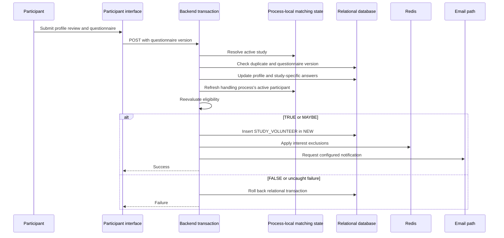

# Expressions of Interest

An expression of interest is the participant's finalized action that creates one durable
`STUDY_VOLUNTEER` relationship between the participant account and the study.

The relational unique constraint on `(USER_ID, STUDY_ID)` enforces at most one relationship for the
same participant-study pair.

## Expected participant behavior

Before interest can be finalized:

- The participant account must be active.
- The study must still be in the process-local active-study store.
- The participant must not already have expressed interest.
- The final eligibility result must be `TRUE` or `MAYBE`.
- Required screening questions must be answered when a questionnaire exists.
- The submitted questionnaire version must match the current version.

The participant completes one form containing:

1. Temporal profile updates
1. Fixed profile-backed questions
1. Study-specific screening questions, when configured

A successful submission redirects to the interest-success page. An inactive study, duplicate
interest, stale questionnaire, or `FALSE` eligibility result follows a distinct failure path.

## Physical relationship and initial state

`STUDY_VOLUNTEER` contains:

| Column                    | Meaning                                           |
| ------------------------- | ------------------------------------------------- |
| `ID`                      | Sequence-generated primary key                    |
| `USER_ID`                 | Participant account; foreign key to `APP_USER.ID` |
| `STUDY_ID`                | Study; foreign key to `STUDY.ID`                  |
| `SHOWED_INTEREST_DATE`    | Interest timestamp                                |
| `STATUS`                  | Current interested-participant workflow state     |
| `STATUS_LAST_UPDATE_DATE` | Most recent workflow-state update                 |

Both parent foreign keys cascade on account or study deletion. The initial application state is
`NEW`. The database default is also `NEW`, but the service sets the value explicitly.

Indexes exist on `USER_ID`, `STUDY_ID`, `STATUS`, and `(STATUS, USER_ID, STUDY_ID)`. Oracle also has a
bitmap index on `STATUS`.

## Current implementation transaction

The submission endpoint and called services use the required Spring transaction. The path:

1. Resolves the study from process-local active-study memory.
1. Rejects an inactive study or an existing `STUDY_VOLUNTEER` row.
1. Checks the questionnaire version.
1. Updates fixed temporal profile values.
1. Updates profile-backed questionnaire values.
1. Refreshes that participant in the handling process's active-user store.
1. Reevaluates eligibility from the updated profile.
1. Stores study-specific answers.
1. Creates `STUDY_VOLUNTEER` in `NEW`.
1. Creates the matching exclusions used after interest.
1. Requests the configured new-interested-participant email notification.
1. Removes a prior participant-side `NOT_INTERESTED` exclusion.

A relational exception that escapes this path rolls back relational profile, answer, and
`STUDY_VOLUNTEER` changes. Process-local active-user updates, Redis effects, and email handoff are not
one atomic resource transaction with the database.

## Known implementation concern: duplicate-submit handling

The controller catches `DataIntegrityViolationException` around answer and interest creation, logs it,
continues to remove the prior dismissal exclusion, and returns success. The database unique constraint
still prevents a second `STUDY_VOLUNTEER` row.

This is current implementation behavior, not the desired atomicity rule. Depending on when the
constraint violation is detected and how the transaction is marked, the request may still end in an
unexpected rollback, or it may report success after only some non-relational effects were attempted.
Operators and maintainers must not interpret the caught exception as proof that every intended step
committed.

## Redis and process-local effects

Interest creation calls the recommendation service to exclude the pair from ordinary recommendation
flows. The exact Redis exclusion records belong to the Redis model.

Profile changes refresh only the handling process's active-user entry. There is no confirmed
cross-server propagation for that source entity. Relational state remains authoritative.

## After successful interest

- The participant appears in the study's `NEW` interested-participant list.
- Authorized study members receive full profile access for that study even if the participant's
  general visibility remains restricted.
- Study members may initiate messaging.
- The participant sees the study in participant-side interest history.
- Later matching changes do not delete the relationship.
- The current participant interface provides no withdrawal operation.

The interested-participant query and export paths include only active participant profiles. Account
deactivation hides the row from those current interfaces without deleting the underlying
`STUDY_VOLUNTEER` record.

## Deletion and retention

Ordinary deactivation retains `STUDY_VOLUNTEER`, answers, and messages but removes them from
active-profile query paths.

Administrator hard deletion explicitly deletes messages first, then each `STUDY_VOLUNTEER` row.
Hibernate removes its label assignments. Account foreign keys also cascade interested-participant and
questionnaire-answer rows if reached through database deletion.

No archival flag exists on `STUDY_VOLUNTEER`. Retention duration for an interested-participant
relationship is an institutional policy question rather than a value enforced by this schema.

## Sequence diagram

```mermaid
sequenceDiagram
    participant P as Participant
    participant UI as Participant interface
    participant A as Backend transaction
    participant M as Process-local matching state
    participant DB as Relational database
    participant R as Redis
    participant E as Email path

    P->>UI: Submit profile review and questionnaire
    UI->>A: POST with questionnaire version
    A->>M: Resolve active study
    A->>DB: Check duplicate and questionnaire version
    A->>DB: Update profile and study-specific answers
    A->>M: Refresh handling process's active participant
    A->>A: Reevaluate eligibility
    alt TRUE or MAYBE
        A->>DB: Insert STUDY_VOLUNTEER in NEW
        A->>R: Apply interest exclusions
        A->>E: Request configured notification
        A-->>UI: Success
    else FALSE or uncaught failure
        A->>DB: Roll back relational transaction
        A-->>UI: Failure
    end
```

## Related pages

- [Matching and Visibility](matching-and-visibility.md)
- [Questionnaires and Exports](questionnaires-and-exports.md)
- [Interested-Participant Management](interested-participant-management.md)
- [Messaging](messaging.md)
- [Redis Match and Exclusion Model](../07-data-model/redis-match-model.md)
