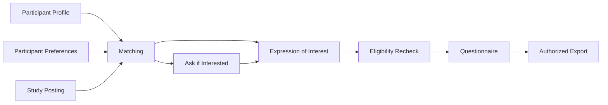

# Recruitment Overview

The recruitment workflow combines:

1. Participant profile information
2. Participant study preferences
3. Study attributes
4. Inclusion and exclusion criteria
5. Participant visibility settings
6. Study-team promotion
7. Participant expressions of interest
8. Screening questionnaires
9. Authorized exports

## Workflow summary

Read:

- [Matching and visibility](matching-and-visibility.md)
- [Ask if interested](ask-if-interested.md)
- [Expressions of interest](expressions-of-interest.md)
- [Questionnaires and exports](questionnaires-and-exports.md)
