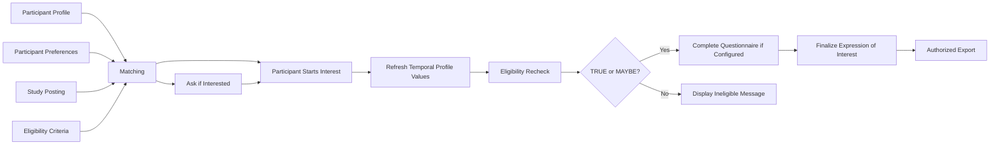

# Recruitment Overview

The recruitment workflow combines:

1. Participant profile information
2. Participant study preferences
3. Study properties
4. Eligibility criteria
5. Participant visibility settings
6. Study-team promotion
7. Participant initiation of interest
8. Temporal-profile refresh
9. Eligibility recheck
10. Screening-questionnaire completion
11. Finalized expression of interest
12. Authorized exports

## Workflow summary

## Read next

- [Eligibility-criteria authoring](eligibility-criteria-authoring.md)
- [Matching and visibility](matching-and-visibility.md)
- [Ask if interested](ask-if-interested.md)
- [Expressions of interest](expressions-of-interest.md)
- [Questionnaires and exports](questionnaires-and-exports.md)

## Related data and analytics

- [Criteria data model](../07-data-model/criteria-data-model.md)
- [Study posting authoring telemetry](../08-operations/study-posting-authoring-telemetry.md)
- [Eligibility complexity analysis](../08-operations/ai-assisted-study-posting-authoring-effectiveness.md)
- [AI effectiveness analysis](../08-operations/ai-assisted-study-posting-authoring-effectiveness.md)
