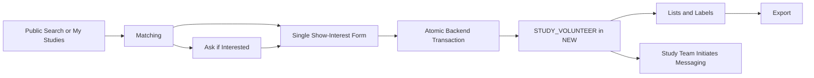

# Recruitment Overview

The recruitment lifecycle includes:

1. Public study discovery
1. Participant profile and study-interest matching
1. Study-team promotion through Ask if interested
1. Participant expression of interest
1. Temporal profile refresh
1. Eligibility recheck
1. Screening-questionnaire capture
1. Interested-participant workflow management
1. Study-team-initiated messaging
1. Labels, notifications, and exports

## Pages

- [Public Study Discovery](public-study-discovery.md)
- [Eligibility-Criteria Authoring](eligibility-criteria-authoring.md)
- [Matching and Visibility](matching-and-visibility.md)
- [Ask if Interested](ask-if-interested.md)
- [Expressions of Interest](expressions-of-interest.md)
- [Questionnaires and Exports](questionnaires-and-exports.md)
- [Interested-Participant Management](interested-participant-management.md)
- [Messaging](messaging.md)
