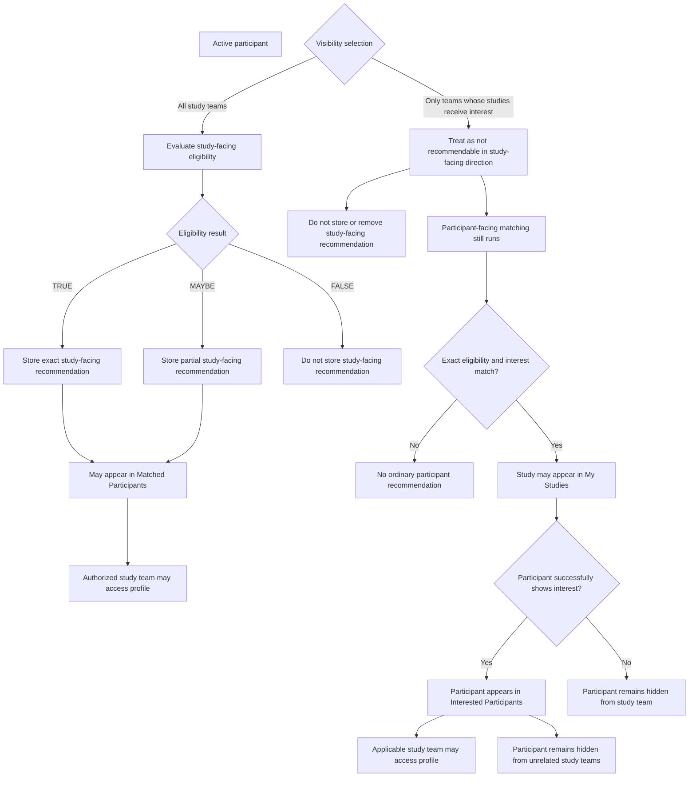

# Matching and Visibility

Matching has two independent dimensions:

1. Study-interest matching
1. Eligibility matching

## Matching runtime

To reduce calculation latency, the application maintains active studies and active participants in
memory.

When a match is triggered, the matching program evaluates the relevant in-memory entities instead of
repeatedly loading all candidate entities from the database.

The relational database remains the authoritative persistent source.

When participant or study data changes:

1. The database record is updated.
1. The in-memory representation is updated.
1. Applicable matching is triggered.
1. Redis recommendation data is updated asynchronously.

Temporal participant-profile changes must update the in-memory participant representation as well as
the database record.

Inactive studies and deactivated participants are removed from active in-memory matching
collections.

Scheduled synchronization jobs reconcile time-based and other state changes.

### Process-local stores

Each application server maintains its own active-participant and active-study
stores in process memory. The stores use concurrent maps and are populated
independently from database-backed active views during application startup.

Redis is not the active-entity store. It contains derived recommendations and
exclusions shared through the configured Redis service.

### Scheduled active-membership reconciliation

Scheduled synchronization reconciles membership in each server's local active
stores:

- Newly active entities absent from the local store are loaded and matched.
- Entities no longer present in the active database view are removed, and
  their system recommendations are cleared.
- Entities present in both the database active view and local store are left
  unchanged.

The scheduled synchronizers therefore reconcile active-set membership; they do
not refresh the complete state of entities that remain active.

Default seed schedules are:

- Active participants: daily at 5:05 a.m.
- Active studies: daily at 5:10 a.m.
- Full recommendation recomputation: Saturdays at 2:00 a.m.

These schedules are persisted application-job settings and may be changed.
Their effective time zone depends on scheduler configuration.

### Matching execution and failure handling

Entity-triggered matching runs asynchronously and uses fork/join processing.
Matching status is maintained in process memory for the application server
running the task.

A failed recomputation is recorded as an application error and triggers an
error notification. It is not automatically retried. The failure does not roll
back the database update that submitted the task. A later entity change or full
recommendation recomputation may calculate the pair again.

Full recommendation recomputation iterates the active studies and recomputes
both directions against active participants. A failure for one study is
recorded and does not prevent later studies from being processed.

## Interest matching

Interest matching compares participant study interests with study properties.

It determines whether an exact-matching study is recommended through My Studies.

Examples include:

- Topics and conditions
- Locations
- Compensation
- Healthy-participant preference

## Eligibility matching

Eligibility matching compares participant profile properties with study
eligibility criteria.

Results are:

```text
TRUE
MAYBE
FALSE
```

| Result  | Meaning                                                                                                                                                          |
| ------- | ---------------------------------------------------------------------------------------------------------------------------------------------------------------- |
| `TRUE`  | Exact match                                                                                                                                                      |
| `MAYBE` | The known participant information does not establish a mismatch, but one or more applicable expressions cannot be decided from the available profile properties. |
| `FALSE` | Not a match                                                                                                                                                      |

### When an expression returns `MAYBE`

An eligibility expression ordinarily returns `MAYBE` when the participant
property needed to evaluate it is missing or unset. The engine cannot conclude
that the expression is satisfied, but it also cannot conclude that it fails.

For example:

```text
Study criterion:
WILLING_TO_TAKE_EXPERIMENTAL_DRUGS EQUAL TRUE

Participant profile:
WILLING_TO_TAKE_EXPERIMENTAL_DRUGS is blank

Expression result:
MAYBE
```

### Missing and explicitly supplied values

A known value representing none is different from a missing value.

For present and past medical conditions:

- A missing or null property is unknown and ordinarily returns `MAYBE` when
  referenced.
- `NO_CONDITION` is explicitly supplied information.
- `NO_CONDITION` is evaluated normally and does not match named medical
  conditions such as asthma or diabetes.

For example:

```
Study expression:
PRESENT_MEDICAL_CONDITION ANY_OF [Asthma, Diabetes]

Participant property is missing:
MAYBE

Participant property is [NO_CONDITION]:
FALSE

Participant property is [Asthma]:
TRUE
```

### Missing values in negated expressions

Missing participant properties also ordinarily produce `MAYBE` for negated
operators. The engine does not treat an unknown property as proof that a
negated expression is satisfied.

For example:

```
Study qualification expression:
BMI NOT_BETWEEN 30:40

Participant BMI is 25:
TRUE

Participant BMI is 35:
FALSE

Participant BMI is missing because height or weight is missing:
MAYBE
```

Although this expression encodes exclusion authoring, its result describes
whether the participant satisfies the stored qualification expression.
`FALSE` means the known participant value triggers the exclusion. `MAYBE`
means the available participant information cannot determine whether the
exclusion applies.

### Calculated-property exception: pregnancy

Calculated properties may define property-specific missing-value behavior.

Pregnancy at enrollment is calculated from due date. When due date is missing,
the current calculation treats the participant as not pregnant rather than
treating pregnancy as unknown.

### No saved structured eligibility groups

If a study has no saved structured eligibility groups, structured eligibility
evaluates to `TRUE`.

### `OTHER` expressions

`OTHER` eligibility text is participant-facing display content only.

Study teams use it to describe inclusion or exclusion requirements that cannot
be represented accurately by the available structured eligibility fields. The
text may appear in the applicable eligibility section of the study posting.

The matching engine skips `OTHER` expressions during eligibility evaluation.
An `OTHER` expression does not produce `TRUE`, `MAYBE`, or `FALSE`.

An `OTHER`-only group authored through the current UI has no evaluated
structured expressions. Because current-UI expressions within a group use
`AND`, the empty structured expression set evaluates to `TRUE` and does not
restrict structured eligibility.

The persistence encoding that distinguishes inclusion `OTHER` text from
exclusion `OTHER` text is documented in
[Criterion Operator and Value Reference](../07-data-model/criterion-operator-reference.md).

## Three-valued logic

### `AND`

| `AND`   |  `TRUE` | `FALSE` | `MAYBE` |
| ------- | ------: | ------: | ------: |
| `TRUE`  |  `TRUE` | `FALSE` | `MAYBE` |
| `FALSE` | `FALSE` | `FALSE` | `FALSE` |
| `MAYBE` | `MAYBE` | `FALSE` | `MAYBE` |

### `OR`

| `OR`    | `TRUE` | `FALSE` | `MAYBE` |
| ------- | -----: | ------: | ------: |
| `TRUE`  | `TRUE` |  `TRUE` |  `TRUE` |
| `FALSE` | `TRUE` | `FALSE` | `MAYBE` |
| `MAYBE` | `TRUE` | `MAYBE` | `MAYBE` |

### `NOT`

| Input   | Result  |
| ------- | ------- |
| `TRUE`  | `FALSE` |
| `FALSE` | `TRUE`  |
| `MAYBE` | `MAYBE` |

### Eligibility aggregation example

Suppose one eligibility group contains these expressions:

1. Participant age must be at least 18.
1. Participant must be willing to take experimental drugs.
1. Participant must currently have asthma or diabetes.

For a participant whose known properties are:

- Age: 35
- Willingness to take experimental drugs: blank
- Present medical conditions: asthma

the expression results are:

- Age requirement: `TRUE`
- Willingness requirement: `MAYBE`
- Medical-condition requirement: `TRUE`

The expressions within the group use `AND`:

```
TRUE AND MAYBE AND TRUE = MAYBE
```

The group therefore produces a partial eligibility match.

If any required expression in that group were `FALSE`, the group would evaluate to `FALSE`:

```
TRUE AND MAYBE AND FALSE = FALSE
```

If another criteria group evaluated to `TRUE`, the study-level result would be `TRUE` because groups
are alternatives:

```
MAYBE OR TRUE = TRUE
```

## Participant-facing recommendations

Ordinary system recommendations require:

- Active participant
- Active study
- Exact eligibility match
- Study-interest match
- No participant-side exclusion

Partial matches are not shown in participant-facing matched-study lists.

## Directional matching and participant visibility

Participant-facing and study-facing recommendations are calculated separately.

A participant's visibility selection does not change the participant's
eligibility result and does not prevent participant-facing recommendations.
It does affect the final study-facing recommendation.

### Effect on participant-facing recommendations

A participant using either visibility option may receive a study in My Studies
when:

- The participant is active
- The study is active
- Eligibility is an exact match
- The participant's study interests match the study
- No participant-side exclusion suppresses the study

Restricted visibility does not prevent an otherwise qualifying study from
appearing in My Studies.

### Study-facing recommendations with discoverable visibility

A participant who selects visibility to all study teams may receive exact or
partial study-facing recommendations before expressing interest.

When the applicable study-facing requirements are satisfied:

- The exact or partial recommendation is stored in the applicable study-facing
  Redis recommendation set.
- The participant may appear in the study's Matched Participants list.
- Authorized study-team members may access the participant information
  available through that workflow.

### Study-facing behavior with restricted visibility

A participant who selects visibility only to study teams whose studies receive
interest is treated as not recommendable in the pre-interest study-facing
direction.

Before interest:

- No exact or partial study-facing Redis recommendation is retained.
- The participant does not appear in the study's Matched Participants list.
- Study-team members cannot access the participant through the
  matched-participant workflow.
- Participant-facing matching still runs.
- An otherwise qualifying study may appear in the participant's My Studies.

### Visibility after successful interest

When a restricted-visibility participant successfully expresses interest:

- The participant appears in the applicable study's Interested Participants
  list.
- Authorized members of that study team may access the participant information
  available through the interested-participant workflow.
- The participant remains hidden from unrelated study teams.

Access after interest results from the participant-study interest relationship;
it does not change the participant's visibility selection.



## Minimal owning accounts

An owning account created through signup for a loved one has an incomplete self profile and defaults
to hidden from study teams.

The loved-one account has its own profile and its own visibility selection.

## Reaching a study

A participant may reach a posting through:

- Public search
- My Studies
- Study-team promotion
- Direct or bookmarked URL
- Participant history

A participant may initiate interest from an accessible posting even when a partial match was not
displayed in My Studies.

Eligibility is reevaluated using the updated show-interest form values.

## Ask if interested

Ask if interested moves or emphasizes an existing participant-study match in the study-team-promoted
participant-facing bucket.

It:

- Updates the promotion timestamp
- Creates the applicable study-side exclusion
- Removes the participant from the ordinary study-side match presentation
- Does not create interest
- Does not create direct messaging

A scheduled job may email participants whose promoted matches are newer than their last login.

## Not Interested

A participant may dismiss a study from My Studies.

This creates:

```text
NOT_INTERESTED
```

in the participant-side Redis exclusion structure.

Dismissed studies may appear in participant history.

## Recalculation triggers

### Participant profile change

Annotated participant-update endpoints use a matching-trigger aspect after the
controller method exits. The aspect reloads the participant into the handling
server's process-local store and then submits asynchronous matching.

This advice is not registered as an after-commit callback. It can reload memory
and submit matching while the request transaction is still open. Database,
process-local memory, and Redis are not updated atomically, and a later database
rollback does not automatically compensate memory or Redis changes.

If a changed profile property is referenced by eligibility criteria, the
intended processing is:

- Update the database profile
- Update the in-memory participant representation
- Recompute the participant against active studies
- Update applicable participant-facing and study-facing match results

### Temporal profile change during show interest

- Update the database profile in the request transaction
- Update the corresponding in-memory participant representation
- Reevaluate eligibility before interest is finalized
- Submit asynchronous matching through the participant matching-trigger hook

The relational transaction controls the persisted profile, questionnaire
answers, and expression of interest. It does not make the process-local memory
replacement or asynchronous Redis recomputation part of that same atomic
commit.

### Participant study-interest change

- Recompute that participant's matched-study recommendations
- Do not recompute study-side eligibility matches solely because interests changed

### Study-property change

If a property is referenced by participant study interests:

- Update the in-memory study representation
- Recompute affected participant-facing recommendations

### Study eligibility change

- Update the in-memory study representation
- Recompute the study's participant matches
- Recompute participant-facing results for that study

### Participant or study deactivation

- Remove the entity from active in-memory matching data
- Remove or suppress active recommendations
- Prevent new matching actions

## Redis storage

Recommendations, promotions, and exclusions are stored in Redis.

Redis contains derived matching state. It does not replace the authoritative database or the active
in-memory entity representations used for calculation.

See [Redis Match and Exclusion Model](../07-data-model/redis-match-model.md).

## After interest

Successful interest creates exclusions that remove the participant-study pair from ordinary
recommendation flows.

Later eligibility changes do not remove the historical interest relationship.

## Related pages

- [Participants](../04-users-and-access/participants.md)
- [Public Study Discovery](public-study-discovery.md)
- [Eligibility-Criteria Authoring](eligibility-criteria-authoring.md)
- [Ask If Interested](ask-if-interested.md)
- [Expressions of Interest](expressions-of-interest.md)
- [Redis Match and Exclusion Model](../07-data-model/redis-match-model.md)
