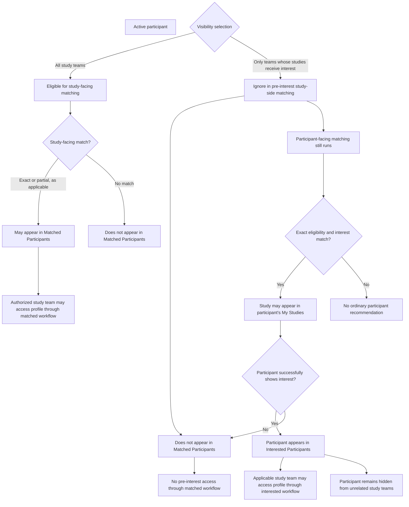

# Matching and Visibility

Matching has two independent dimensions:

1. Study-interest matching
1. Eligibility matching

## Matching runtime

To reduce calculation latency, the application maintains active studies and active participants in
memory.

When a match is triggered, the matching program evaluates the relevant in-memory entities instead of
repeatedly loading all candidate entities from the database.

The relational database remains the authoritative persistent source.

When participant or study data changes:

1. The database record is updated.
1. The in-memory representation is updated.
1. Applicable matching is triggered.
1. Redis recommendation data is updated asynchronously.

Temporal participant-profile changes must update the in-memory participant representation as well as
the database record.

Inactive studies and deactivated participants are removed from active in-memory matching
collections.

Scheduled synchronization jobs reconcile time-based and other state changes.

## Interest matching

Interest matching compares participant study interests with study properties.

It determines whether an exact-matching study is recommended through My Studies.

Examples include:

- Topics and conditions
- Locations
- Compensation
- Healthy-participant preference

## Eligibility matching

Eligibility matching compares participant profile properties with study eligibility criteria.

Results are:

```text
TRUE
MAYBE
FALSE
```

| Result  | Meaning                                                                                                                                                          |
| ------- | ---------------------------------------------------------------------------------------------------------------------------------------------------------------- |
| `TRUE`  | Exact match                                                                                                                                                      |
| `MAYBE` | The known participant information does not establish a mismatch, but one or more applicable expressions cannot be decided from the available profile properties. |
| `FALSE` | Not a match                                                                                                                                                      |

### When an expression returns `MAYBE`

An eligibility expression returns `MAYBE` when the participant property needed to evaluate the
expression is unknown, but the known participant information does not establish that the participant
fails the expression.

This commonly occurs when an optional participant-profile property referenced by the study's
eligibility criteria is blank.

For example:

```text
Study criterion:
WILLING_TO_TAKE_EXPERIMENTAL_DRUGS EQUAL TRUE
Participant profile:
WILLING_TO_TAKE_EXPERIMENTAL_DRUGS is blank
Expression result:
MAYBE
```

The blank value does not establish that the participant is willing to take experimental drugs, so
the result is not `TRUE`. It also does not establish that the participant is unwilling, so the
result is not `FALSE`.

Conceptually:

```text
Known value that satisfies the expression → TRUE
Known value that fails the expression → FALSE
Insufficient participant information to decide → MAYBE
```

### Missing and explicitly supplied values

When a participant property referenced by an eligibility expression is missing, the expression
returns `MAYBE`.

This applies to every missing optional participant-profile property. The matching engine cannot
conclude that the expression is satisfied, but it also cannot conclude that the expression fails.

Required fields are normally enforced by participant-profile validation and therefore should not be
missing during matching. Matching semantics are based on the available value, however: if a
referenced property is missing, its expression is `MAYBE` regardless of whether the field is
currently designated as required or optional by the user interface.

A known value that represents none is different from a missing value.

For present and past medical conditions:

- A missing or null property is unknown and returns `MAYBE` when referenced.
- `NO_CONDITION` is an explicitly supplied lookup value.
- `NO_CONDITION` is evaluated as known information and does not match named medical-condition lookup
  values such as asthma or diabetes.

For example:

```
Study expression:
PRESENT_MEDICAL_CONDITION ANY_OF [Asthma, Diabetes]

Participant property is missing:
MAYBE

Participant property is [NO_CONDITION]:
FALSE

Participant property is [Asthma]:
TRUE
```

### `OTHER` expressions

`OTHER` eligibility text is participant-facing display content only.

Study teams use it to describe inclusion or exclusion requirements that cannot be represented
accurately by the available structured eligibility fields. The text may appear in the applicable
eligibility section of the study posting.

Because the matching engine cannot interpret this free text as a structured participant-profile
predicate, it ignores `OTHER` expressions during eligibility evaluation. An `OTHER` expression does
not produce `TRUE`, `MAYBE`, or `FALSE` and does not affect aggregation of the structured expression
results.

The persistence encoding that distinguishes inclusion `OTHER` text from exclusion `OTHER` text is
documented in
[Criterion Operator and Value Reference](../07-data-model/criterion-operator-reference.md).

## Three-valued logic

### `AND`

| `AND`   |  `TRUE` | `FALSE` | `MAYBE` |
| ------- | ------: | ------: | ------: |
| `TRUE`  |  `TRUE` | `FALSE` | `MAYBE` |
| `FALSE` | `FALSE` | `FALSE` | `FALSE` |
| `MAYBE` | `MAYBE` | `FALSE` | `MAYBE` |

### `OR`

| `OR`    | `TRUE` | `FALSE` | `MAYBE` |
| ------- | -----: | ------: | ------: |
| `TRUE`  | `TRUE` |  `TRUE` |  `TRUE` |
| `FALSE` | `TRUE` | `FALSE` | `MAYBE` |
| `MAYBE` | `TRUE` | `MAYBE` | `MAYBE` |

### `NOT`

| Input   | Result  |
| ------- | ------- |
| `TRUE`  | `FALSE` |
| `FALSE` | `TRUE`  |
| `MAYBE` | `MAYBE` |

### Eligibility aggregation example

Suppose one eligibility group contains these expressions:

1. Participant age must be at least 18.
1. Participant must be willing to take experimental drugs.
1. Participant must currently have asthma or diabetes.

For a participant whose known properties are:

- Age: 35
- Willingness to take experimental drugs: blank
- Present medical conditions: asthma

the expression results are:

- Age requirement: `TRUE`
- Willingness requirement: `MAYBE`
- Medical-condition requirement: `TRUE`

The expressions within the group use `AND`:

```
TRUE AND MAYBE AND TRUE = MAYBE
```

The group therefore produces a partial eligibility match.

If any required expression in that group were `FALSE`, the group would evaluate to `FALSE`:

```
TRUE AND MAYBE AND FALSE = FALSE
```

If another criteria group evaluated to `TRUE`, the study-level result would be `TRUE` because groups
are alternatives:

```
MAYBE OR TRUE = TRUE
```

## Participant-facing recommendations

Ordinary system recommendations require:

- Active participant
- Active study
- Exact eligibility match
- Study-interest match
- No participant-side exclusion

Partial matches are not shown in participant-facing matched-study lists.

## Directional matching and participant visibility

Participant-facing and study-facing matching are directional.

A participant's visibility selection affects study-facing matching and access, but it does not
prevent the participant from receiving participant-facing study recommendations.

### Effect on participant-facing recommendations

A participant who selected either visibility option may receive a study in My Studies when:

- The participant is active
- The study is active
- Eligibility is an exact match
- The participant's study interests match the study
- No participant-side exclusion suppresses the study

Selecting restricted visibility does not prevent an otherwise qualifying study from appearing in the
participant's My Studies.

### Study-facing recommendations with discoverable visibility

When the participant selects:

```text
MY PROFILE IS VISIBLE TO
All study teams
```

the participant may participate in study-facing matching before expressing interest.

Study-facing matching may include:

- Exact eligibility matches
- Partial eligibility matches

When the applicable study-facing matching requirements are satisfied, the participant may appear in
the study's Matched Participants list. Authorized study-team members may access the participant
information made available through that list.

### Study-facing behavior with restricted visibility

When the participant selects:

```text
MY PROFILE IS VISIBLE TO
Only the study teams whose studies I show interest in
```

study-side matching ignores that participant before the participant expresses interest.

Before interest:

- The participant does not appear in the study's Matched Participants list.
- Study-team members cannot access the participant through the matched-participant workflow.
- The participant may still receive the study in My Studies when the participant-facing interest and
  eligibility requirements are satisfied.

### Visibility after successful interest

When a restricted-visibility participant successfully expresses interest in a study:

- The participant appears in that study's Interested Participants list.
- Authorized members of that study team may access the participant profile information available
  through the interested-participant workflow.
- The participant does not become discoverable to unrelated study teams.
- The visibility change applies only through the participant's interest relationship with the
  applicable study.

Expression of interest creates the applicable historical and operational relationship independently
of whether the participant was previously visible in study-facing matching.



## Minimal owning accounts

An owning account created through signup for a loved one has an incomplete self profile and defaults
to hidden from study teams.

The loved-one account has its own profile and its own visibility selection.

## Reaching a study

A participant may reach a posting through:

- Public search
- My Studies
- Study-team promotion
- Direct or bookmarked URL
- Participant history

A participant may initiate interest from an accessible posting even when a partial match was not
displayed in My Studies.

Eligibility is reevaluated using the updated show-interest form values.

## Ask if interested

Ask if interested moves or emphasizes an existing participant-study match in the study-team-promoted
participant-facing bucket.

It:

- Updates the promotion timestamp
- Creates the applicable study-side exclusion
- Removes the participant from the ordinary study-side match presentation
- Does not create interest
- Does not create direct messaging

A scheduled job may email participants whose promoted matches are newer than their last login.

## Not Interested

A participant may dismiss a study from My Studies.

This creates:

```text
NOT_INTERESTED
```

in the participant-side Redis exclusion structure.

Dismissed studies may appear in participant history.

## Recalculation triggers

### Participant profile change

If a changed profile property is referenced by eligibility criteria:

- Update the database profile
- Update the in-memory participant representation
- Recompute the participant against active studies
- Update applicable participant-facing and study-facing match results

### Temporal profile change during show interest

- Update the database profile in the transaction
- Update or prepare the corresponding in-memory participant representation
- Reevaluate eligibility before interest is finalized
- Commit the synchronized state only when the transaction succeeds

### Participant study-interest change

- Recompute that participant's matched-study recommendations
- Do not recompute study-side eligibility matches solely because interests changed

### Study-property change

If a property is referenced by participant study interests:

- Update the in-memory study representation
- Recompute affected participant-facing recommendations

### Study eligibility change

- Update the in-memory study representation
- Recompute the study's participant matches
- Recompute participant-facing results for that study

### Participant or study deactivation

- Remove the entity from active in-memory matching data
- Remove or suppress active recommendations
- Prevent new matching actions

## Redis storage

Recommendations, promotions, and exclusions are stored in Redis.

Redis contains derived matching state. It does not replace the authoritative database or the active
in-memory entity representations used for calculation.

See [Redis Match and Exclusion Model](../07-data-model/redis-match-model.md).

## After interest

Successful interest creates exclusions that remove the participant-study pair from ordinary
recommendation flows.

Later eligibility changes do not remove the historical interest relationship.

## Related pages

- [Participants](../04-users-and-access/participants.md)
- [Public Study Discovery](public-study-discovery.md)
- [Eligibility-Criteria Authoring](eligibility-criteria-authoring.md)
- [Ask If Interested](ask-if-interested.md)
- [Expressions of Interest](expressions-of-interest.md)
- [Redis Match and Exclusion Model](../07-data-model/redis-match-model.md)
