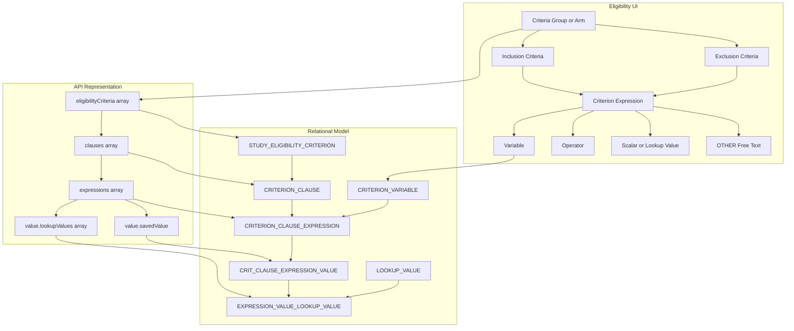

# Criteria Data Model

The application uses a hierarchical relational model for matching criteria.

The same clause, expression, variable, and value structures support:

1. Study eligibility criteria
1. Participant study-interest criteria

The criterion-root table differs between these use cases.

## Confirmed physical model

### Root entities

Study eligibility groups are stored in:

```text
STUDY_ELIGIBILITY_CRITERION
```

Participant study-interest criteria are stored in:

```text
FIND_STUDIES_CRITERION
```

### Shared hierarchy

```text
Criterion root
    → Clause
        → Expression
            → Expression value
                → Lookup values
```

### Core tables

| Table                           | Purpose                                         |
| ------------------------------- | ----------------------------------------------- |
| `STUDY`                         | Root operational study                          |
| `STUDY_ELIGIBILITY_CRITERION`   | Study criteria group or arm                     |
| `FIND_STUDIES_CRITERION`        | Participant study-interest criterion root       |
| `CRITERION_CLAUSE`              | Logical clause under either criterion-root type |
| `CRITERION_CLAUSE_EXPRESSION`   | One variable/operator/value expression          |
| `CRITERION_VARIABLE`            | Allowed generic criterion variable              |
| `CRIT_CLAUSE_EXPRESSION_VALUE`  | Scalar, range, date, or free-text value         |
| `EXPRESSION_VALUE_LOOKUP_VALUE` | Join from an expression value to lookup values  |
| `LOOKUP_VALUE`                  | Controlled vocabulary value                     |

## UI-to-relational mapping



## `STUDY_ELIGIBILITY_CRITERION`

Represents one criteria group or arm.

Relevant fields include:

```text
ID
STUDY_ID
NAME
LANGUAGE
ORDER_NUM
```

One study may have multiple groups.

Groups are conceptually alternatives.

## `CRITERION_CLAUSE`

Represents a logical clause under a criterion root.

Relevant fields include:

```text
ID
CRITERION_ID
EXPRESSION_LOGICAL_CONNECTOR
CLAUSE_LOGICAL_CONNECTOR
ORDER_NUM
```

For data authored through the current eligibility UI:

```text
One clause per group
EXPRESSION_LOGICAL_CONNECTOR = AND
CLAUSE_LOGICAL_CONNECTOR = TERMINAL
```

## Application-managed polymorphic parent

`CRITERION_CLAUSE.CRITERION_ID` may identify a row in either:

```text
STUDY_ELIGIBILITY_CRITERION
```

or:

```text
FIND_STUDIES_CRITERION
```

One ordinary relational foreign key cannot reference two possible parent tables.

The parent relationship is therefore governed by application logic.

Consequences include:

- Queries must begin from the correct criterion-root table.
- Analytics must not combine the two root types accidentally.
- Criterion IDs require root-type context.
- Orphan detection requires application-aware validation.

## `CRITERION_CLAUSE_EXPRESSION`

Represents one structured expression.

Relevant fields include:

```text
ID
CLAUSE_ID
CRITERION_VARIABLE_ID
RELATIONAL_OPERATOR
ORDER_NUM
```

Conceptually:

```text
Expression =
    Criterion variable
    + Relational operator
    + Expression value or values
```

## `CRITERION_VARIABLE`

`CRITERION_VARIABLE` defines variables available to the generic criteria-expression model.

The vocabulary supports:

- Study eligibility criteria
- Participant study-interest criteria
- Study-information-related criteria

The complete IDs and names are documented in
[Criterion Variable Reference](criterion-variable-reference.md).

A variable's presence in `CRITERION_VARIABLE` does not mean that it is exposed by the current
eligibility-authoring UI.

## `CRIT_CLAUSE_EXPRESSION_VALUE`

Stores scalar or free-text values.

Relevant fields include:

```text
ID
CRITERION_CLAUSE_EXPRESSION_ID
SAVED_VALUE
LANGUAGE
```

Examples include:

- Numeric value
- Colon-delimited numeric range
- `yyyy-mm-dd` date text
- OTHER inclusion text
- OTHER exclusion text

## `EXPRESSION_VALUE_LOOKUP_VALUE`

Associates one expression value with one or more controlled vocabulary values.

Relevant fields include:

```text
CRIT_CLAUSE_EXPR_VALUE_ID
LOOKUP_VALUE_ID
```

It is used for values such as:

- Medical conditions
- Gender
- Race
- Smoking status
- Boolean choices
- Other controlled vocabularies

## Operator and value encoding

`CRITERION_CLAUSE_EXPRESSION.RELATIONAL_OPERATOR` identifies the comparison applied by a structured
expression.

Expression values are stored as:

- Scalar text in `CRIT_CLAUSE_EXPRESSION_VALUE.SAVED_VALUE`
- Lookup relationships through `EXPRESSION_VALUE_LOOKUP_VALUE`

Structured exclusions use negated operators.

OTHER expressions have a null relational operator and use an internal prefix to distinguish
exclusion text from inclusion text.

The authoritative current-UI mappings and serialization rules are documented in
[Criterion Operator and Value Reference](criterion-operator-reference.md).

## OTHER expressions

OTHER expressions:

- Are displayed to participants
- Are not directly evaluated by the matching engine
- May represent inclusion or exclusion text
- Do not contribute a structured participant-profile predicate

## Relational model

```mermaid
erDiagram
    STUDY {
        NUMBER ID PK
        VARCHAR2 STUDY_NUM
    }

    STUDY_ELIGIBILITY_CRITERION {
        NUMBER ID PK
        NUMBER STUDY_ID FK
        VARCHAR2 NAME
        VARCHAR2 LANGUAGE
        NUMBER ORDER_NUM
    }

    FIND_STUDIES_CRITERION {
        NUMBER ID PK
        NUMBER PARTICIPANT_ID
        VARCHAR2 NAME
        NUMBER ORDER_NUM
    }

    CRITERION_CLAUSE {
        NUMBER ID PK
        NUMBER CRITERION_ID
        VARCHAR2 EXPRESSION_LOGICAL_CONNECTOR
        VARCHAR2 CLAUSE_LOGICAL_CONNECTOR
        NUMBER ORDER_NUM
    }

    CRITERION_CLAUSE_EXPRESSION {
        NUMBER ID PK
        NUMBER CLAUSE_ID FK
        NUMBER CRITERION_VARIABLE_ID FK
        VARCHAR2 RELATIONAL_OPERATOR
        NUMBER ORDER_NUM
    }

    CRITERION_VARIABLE {
        NUMBER ID PK
        VARCHAR2 NAME
    }

    CRIT_CLAUSE_EXPRESSION_VALUE {
        NUMBER ID PK
        NUMBER CRITERION_CLAUSE_EXPRESSION_ID FK
        VARCHAR2 SAVED_VALUE
        VARCHAR2 LANGUAGE
    }

    EXPRESSION_VALUE_LOOKUP_VALUE {
        NUMBER CRIT_CLAUSE_EXPR_VALUE_ID FK
        NUMBER LOOKUP_VALUE_ID FK
    }

    LOOKUP_VALUE {
        NUMBER ID PK
        VARCHAR2 DISPLAY_TEXT
        VARCHAR2 NAME
        VARCHAR2 TYPE
        VARCHAR2 LANGUAGE
        NUMBER VISIBLE
    }

    STUDY ||--o{ STUDY_ELIGIBILITY_CRITERION : has
    STUDY_ELIGIBILITY_CRITERION -.-> CRITERION_CLAUSE : application_parent
    FIND_STUDIES_CRITERION -.-> CRITERION_CLAUSE : application_parent
    CRITERION_CLAUSE ||--o{ CRITERION_CLAUSE_EXPRESSION : contains
    CRITERION_VARIABLE ||--o{ CRITERION_CLAUSE_EXPRESSION : classifies
    CRITERION_CLAUSE_EXPRESSION ||--o{ CRIT_CLAUSE_EXPRESSION_VALUE : has
    CRIT_CLAUSE_EXPRESSION_VALUE ||--o{ EXPRESSION_VALUE_LOOKUP_VALUE : selects
    LOOKUP_VALUE ||--o{ EXPRESSION_VALUE_LOOKUP_VALUE : referenced_by
```

The dotted lines represent the application-managed polymorphic parent relationship.

## Analytical query examples

Tested and proposed SQL patterns are maintained separately to avoid loading query details when only
the schema is needed.

See [Criteria Query Cookbook](criteria-query-cookbook.md) for:

- Flattened eligibility SQL
- Expression-level aggregation
- Exclusion classification
- Data-quality checks

## Related pages

- [Eligibility-Criteria Authoring](../06-recruitment/eligibility-criteria-authoring.md)
- [Criterion Variable Reference](criterion-variable-reference.md)
- [Criterion Operator and Value Reference](criterion-operator-reference.md)
- [Criteria Query Cookbook](criteria-query-cookbook.md)
- [Matching and Visibility](../06-recruitment/matching-and-visibility.md)
- [Eligibility-Criteria Authoring Complexity](../08-operations/eligibility-criteria-authoring-complexity.md)
- [Operational Schema](operational-schema.md)
- [Study Posting Authoring and Analytics Open Questions](../09-decisions/study-posting-authoring-analytics-open-questions.md)
