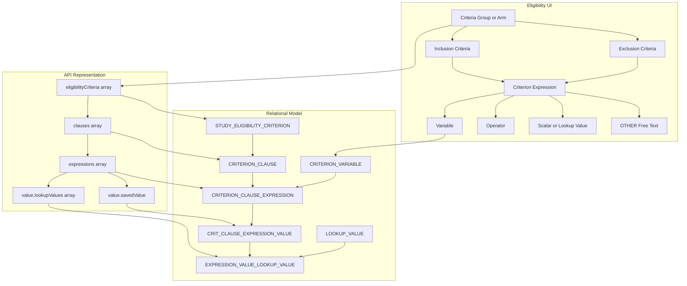

# Criteria Data Model

The application uses a hierarchical relational model for matching criteria.

The same clause, expression, variable, and value structures support:

1. Study eligibility criteria
2. Participant study-interest criteria

The criterion-root table differs between those use cases.

## Root entities

### Study eligibility criteria

Study eligibility groups are stored in:

```text
STUDY_ELIGIBILITY_CRITERION
```

They are used to match participants against study inclusion and exclusion requirements.

### Participant study-interest criteria

Participant study-interest criteria are stored in:

```text
FIND_STUDIES_CRITERION
```

They are used to match study properties against participant preferences.

## Shared hierarchy

```text
Criterion root
    → Clause
        → Expression
            → Expression value
                → Lookup values
```

## Core tables

| Table | Purpose |
|---|---|
| `STUDY` | Root operational study |
| `STUDY_ELIGIBILITY_CRITERION` | Study criteria group or arm |
| `FIND_STUDIES_CRITERION` | Participant study-interest criterion root |
| `CRITERION_CLAUSE` | Logical clause under either criterion-root type |
| `CRITERION_CLAUSE_EXPRESSION` | One variable/operator/value expression |
| `CRITERION_VARIABLE` | Allowed matching variable |
| `CRIT_CLAUSE_EXPRESSION_VALUE` | Scalar, range, or free-text value |
| `EXPRESSION_VALUE_LOOKUP_VALUE` | Join from an expression value to lookup values |
| `LOOKUP_VALUE` | Controlled vocabulary value |

## UI-to-relational mapping



## `STUDY_ELIGIBILITY_CRITERION`

Represents one criteria group or arm.

Relevant fields include:

```text
ID
STUDY_ID
NAME
LANGUAGE
ORDER_NUM
```

One study may have multiple groups.

Groups are conceptually alternatives.

## `CRITERION_CLAUSE`

Represents a logical clause under a criterion root.

Relevant fields include:

```text
ID
CRITERION_ID
EXPRESSION_LOGICAL_CONNECTOR
CLAUSE_LOGICAL_CONNECTOR
ORDER_NUM
```

For data authored through the current eligibility UI:

```text
One clause per group
EXPRESSION_LOGICAL_CONNECTOR = AND
CLAUSE_LOGICAL_CONNECTOR = TERMINAL
```

## Application-managed polymorphic parent

`CRITERION_CLAUSE.CRITERION_ID` may identify a row in either:

```text
STUDY_ELIGIBILITY_CRITERION
```

or:

```text
FIND_STUDIES_CRITERION
```

One ordinary relational foreign key cannot reference two possible parent tables.

The parent relationship is therefore governed by application logic rather than by one conventional database foreign-key constraint.

Consequences include:

- Queries must begin from the correct criterion-root table.
- Analytics must not combine the two root types accidentally.
- Criterion IDs may require root-type context.
- Orphan detection requires application-aware validation.

## `CRITERION_CLAUSE_EXPRESSION`

Represents one structured expression.

Relevant fields include:

```text
ID
CLAUSE_ID
CRITERION_VARIABLE_ID
RELATIONAL_OPERATOR
ORDER_NUM
```

Conceptually:

```text
Expression =
    Criterion variable
    + Relational operator
    + Expression value or values
```

## `CRITERION_VARIABLE`

Defines the matching variable.

Examples include:

```text
AGE
GENDER
RACE
HEIGHT
WEIGHT
BMI
PRESENT_MEDICAL_CONDITION
PAST_MEDICAL_CONDITION
SMOKING_STATUS
HAS_METAL_IMPLANTS
PARENT_OR_GUARDIAN_OF_A_CHILD
FLUENCY_IN_ENGLISH
OTHER
```

The actual vocabulary should be retrieved from reference data.

## `CRIT_CLAUSE_EXPRESSION_VALUE`

Stores scalar or free-text values.

Relevant fields include:

```text
ID
CRITERION_CLAUSE_EXPRESSION_ID
SAVED_VALUE
LANGUAGE
```

Examples include:

- Numeric value
- Encoded range
- OTHER inclusion text
- OTHER exclusion text

## `EXPRESSION_VALUE_LOOKUP_VALUE`

Associates an expression value with one or more controlled vocabulary values.

Relevant fields include:

```text
CRIT_CLAUSE_EXPR_VALUE_ID
LOOKUP_VALUE_ID
```

It is used for values such as:

- Medical conditions
- Gender
- Race
- Smoking status
- Boolean choices
- Other controlled vocabularies

## Inclusion and exclusion representation

Structured exclusions may use negating operators such as:

```text
NOT_EQUAL
NOT_ANY_OF
NOT_ALL_OF
NOT_BETWEEN
```

OTHER free-text exclusions use:

```text
$#exclusion#$
```

Example:

```text
$#exclusion#$Prior chemotherapy
```

The prefix is an application encoding and should not be shown to participants.

## OTHER criteria

OTHER expressions:

- Are displayed to participants
- Are not directly evaluated by the matching engine
- May represent inclusion or exclusion text
- Contribute authoring and participant-facing complexity
- Do not contribute a structured participant-profile predicate

## Relational model

```mermaid
erDiagram
    STUDY {
        NUMBER ID PK
        VARCHAR2 STUDY_NUM
    }

    STUDY_ELIGIBILITY_CRITERION {
        NUMBER ID PK
        NUMBER STUDY_ID FK
        VARCHAR2 NAME
        VARCHAR2 LANGUAGE
        NUMBER ORDER_NUM
    }

    FIND_STUDIES_CRITERION {
        NUMBER ID PK
        NUMBER PARTICIPANT_ID
        VARCHAR2 NAME
        NUMBER ORDER_NUM
    }

    CRITERION_CLAUSE {
        NUMBER ID PK
        NUMBER CRITERION_ID
        VARCHAR2 EXPRESSION_LOGICAL_CONNECTOR
        VARCHAR2 CLAUSE_LOGICAL_CONNECTOR
        NUMBER ORDER_NUM
    }

    CRITERION_CLAUSE_EXPRESSION {
        NUMBER ID PK
        NUMBER CLAUSE_ID FK
        NUMBER CRITERION_VARIABLE_ID FK
        VARCHAR2 RELATIONAL_OPERATOR
        NUMBER ORDER_NUM
    }

    CRITERION_VARIABLE {
        NUMBER ID PK
        VARCHAR2 NAME
    }

    CRIT_CLAUSE_EXPRESSION_VALUE {
        NUMBER ID PK
        NUMBER CRITERION_CLAUSE_EXPRESSION_ID FK
        VARCHAR2 SAVED_VALUE
        VARCHAR2 LANGUAGE
    }

    EXPRESSION_VALUE_LOOKUP_VALUE {
        NUMBER CRIT_CLAUSE_EXPR_VALUE_ID FK
        NUMBER LOOKUP_VALUE_ID FK
    }

    LOOKUP_VALUE {
        NUMBER ID PK
        VARCHAR2 DISPLAY_TEXT
        VARCHAR2 NAME
        VARCHAR2 TYPE
        VARCHAR2 LANGUAGE
        NUMBER VISIBLE
    }

    STUDY ||--o{ STUDY_ELIGIBILITY_CRITERION : has
    STUDY_ELIGIBILITY_CRITERION -.-> CRITERION_CLAUSE : application_parent
    FIND_STUDIES_CRITERION -.-> CRITERION_CLAUSE : application_parent
    CRITERION_CLAUSE ||--o{ CRITERION_CLAUSE_EXPRESSION : contains
    CRITERION_VARIABLE ||--o{ CRITERION_CLAUSE_EXPRESSION : classifies
    CRITERION_CLAUSE_EXPRESSION ||--o{ CRIT_CLAUSE_EXPRESSION_VALUE : has
    CRIT_CLAUSE_EXPRESSION_VALUE ||--o{ EXPRESSION_VALUE_LOOKUP_VALUE : selects
    LOOKUP_VALUE ||--o{ EXPRESSION_VALUE_LOOKUP_VALUE : referenced_by
```

The dotted lines represent the application-managed polymorphic parent relationship.

## Flattened eligibility query

```sql
SELECT
    s.study_num,
    sec.id AS criterion_id,
    sec.name AS criterion_group_name,
    sec.order_num AS criterion_order_num,
    cc.id AS clause_id,
    cc.expression_logical_connector,
    cc.clause_logical_connector,
    cc.order_num AS clause_order_num,
    cce.id AS expression_id,
    cce.order_num AS expression_order_num,
    cv.name AS criterion_variable,
    cce.relational_operator,
    ccev.id AS expression_value_id,
    ccev.saved_value,
    LISTAGG(lv.display_text, '; ')
        WITHIN GROUP (ORDER BY lv.display_text) AS lookup_values
FROM study s
JOIN study_eligibility_criterion sec
    ON sec.study_id = s.id
JOIN criterion_clause cc
    ON cc.criterion_id = sec.id
JOIN criterion_clause_expression cce
    ON cce.clause_id = cc.id
LEFT JOIN criterion_variable cv
    ON cv.id = cce.criterion_variable_id
LEFT JOIN crit_clause_expression_value ccev
    ON ccev.criterion_clause_expression_id = cce.id
LEFT JOIN expression_value_lookup_value evlv
    ON evlv.crit_clause_expr_value_id = ccev.id
LEFT JOIN lookup_value lv
    ON lv.id = evlv.lookup_value_id
WHERE (:study_num IS NULL OR s.study_num = :study_num)
GROUP BY
    s.study_num,
    sec.id,
    sec.name,
    sec.order_num,
    cc.id,
    cc.expression_logical_connector,
    cc.clause_logical_connector,
    cc.order_num,
    cce.id,
    cce.order_num,
    cv.name,
    cce.relational_operator,
    ccev.id,
    ccev.saved_value
ORDER BY
    sec.order_num,
    cc.order_num,
    cce.order_num,
    ccev.id;
```

## Safe expression-level aggregation

One expression may have multiple lookup rows.

Counting joined rows directly will overcount expressions.

Aggregate to the expression level first:

```sql
WITH expression_base AS (
    SELECT
        s.study_num,
        sec.id AS criterion_id,
        cc.id AS clause_id,
        cce.id AS expression_id,
        cv.name AS variable_name,
        cce.relational_operator,
        MAX(ccev.saved_value) AS saved_value,
        COUNT(DISTINCT evlv.lookup_value_id) AS lookup_value_count
    FROM study s
    JOIN study_eligibility_criterion sec
        ON sec.study_id = s.id
    JOIN criterion_clause cc
        ON cc.criterion_id = sec.id
    JOIN criterion_clause_expression cce
        ON cce.clause_id = cc.id
    LEFT JOIN criterion_variable cv
        ON cv.id = cce.criterion_variable_id
    LEFT JOIN crit_clause_expression_value ccev
        ON ccev.criterion_clause_expression_id = cce.id
    LEFT JOIN expression_value_lookup_value evlv
        ON evlv.crit_clause_expr_value_id = ccev.id
    GROUP BY
        s.study_num,
        sec.id,
        cc.id,
        cce.id,
        cv.name,
        cce.relational_operator
)
SELECT
    study_num,
    COUNT(DISTINCT criterion_id) AS group_count,
    COUNT(DISTINCT clause_id) AS clause_count,
    COUNT(DISTINCT expression_id) AS expression_count,
    COUNT(DISTINCT variable_name) AS distinct_variable_count,
    SUM(lookup_value_count) AS lookup_selection_count
FROM expression_base
GROUP BY study_num;
```

## Preliminary exclusion detection

```sql
CASE
    WHEN cce.relational_operator LIKE 'NOT%'
        THEN 1
    WHEN ccev.saved_value LIKE '$#exclusion#$%'
        THEN 1
    ELSE 0
END
```

This logic must be validated against the complete production operator vocabulary.

## Data-quality checks

Useful checks include:

- Clause without a valid criterion root
- Expression without a clause
- Expression without a criterion variable
- Unsupported relational operator
- Missing required scalar value
- Missing required lookup selection
- Unexpected scalar and lookup combination
- Invalid range encoding
- Empty OTHER text
- Exclusion prefix without text
- Duplicate lookup selection
- Unexpected expression connector
- More than one clause in data authored by the current UI

## Related pages

- [Eligibility-Criteria Authoring](../06-recruitment/eligibility-criteria-authoring.md)
- [Matching and Visibility](../06-recruitment/matching-and-visibility.md)
- [Authoring Telemetry and Complexity Analysis](../08-operations/authoring-telemetry-and-complexity.md)
- [Operational Schema](operational-schema.md)
- [Authoring and Analytics Open Questions](../09-decisions/authoring-analytics-open-questions.md)