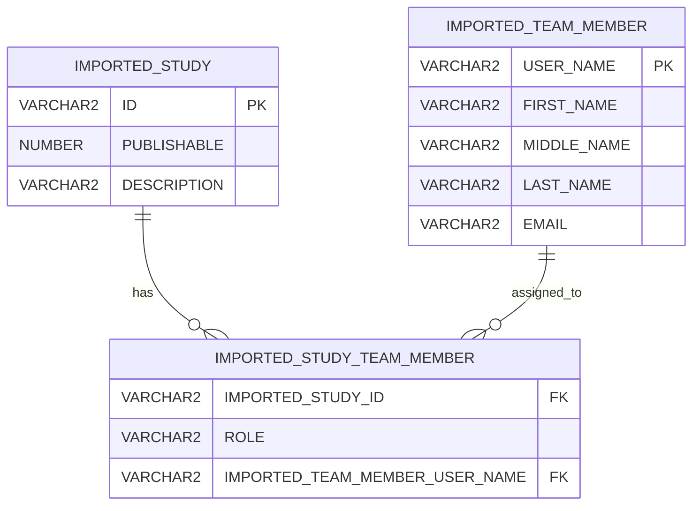

# Imported Schema

The `IMPORTED_*` tables contain institutionally supplied study and personnel data.

Ordinary study team members cannot modify these tables.

## `IMPORTED_STUDY`

| Column | Type | Purpose |
|---|---|---|
| `ID` | `VARCHAR2` | Authoritative `study_num`; uniquely identifies the study within the application instance and may appear in posting URLs. |
| `PUBLISHABLE` | `NUMBER` | Required `0` or `1` flag indicating whether the study may recruit through the application. |
| `DESCRIPTION` | `VARCHAR2` | Describes the study for application and database support personnel. |

## `IMPORTED_STUDY_TEAM_MEMBER`

| Column | Type | Purpose |
|---|---|---|
| `IMPORTED_STUDY_ID` | `VARCHAR2` | References `IMPORTED_STUDY.ID`. |
| `ROLE` | `VARCHAR2` | Institutional study role. The PI designation is used by application reconciliation. |
| `IMPORTED_TEAM_MEMBER_USER_NAME` | `VARCHAR2` | References `IMPORTED_TEAM_MEMBER.USER_NAME`. |

## `IMPORTED_TEAM_MEMBER`

| Column | Type | Purpose |
|---|---|---|
| `USER_NAME` | `VARCHAR2` | Institutional login identifier. For SAML-integrated users, this value must correspond to the value supplied by the institutional IdP in the SAML ePPN attribute. |
| `FIRST_NAME` | `VARCHAR2` | Institutional first name. |
| `MIDDLE_NAME` | `VARCHAR2` | Institutional middle name. |
| `LAST_NAME` | `VARCHAR2` | Institutional last name. |
| `EMAIL` | `VARCHAR2` | Email used by the application to communicate with the PI. |

## SAML identity mapping

`IMPORTED_TEAM_MEMBER.USER_NAME` is the imported institutional identity key.

For an institution using SAML:

```text
IMPORTED_TEAM_MEMBER.USER_NAME
=
SAML ePPN attribute value
```

This mapping allows the application to connect an imported PI record with the same person when that person later authenticates through the institutional identity provider.

Conceptually:

```text
Imported PI USER_NAME
        ↓
APP_USER institutional username
        ↓
SAML ePPN supplied at login
        ↓
Authenticated PI study access
```

The application documentation and domain model do not need to expose a separate ePPN property. ePPN is the under-the-hood SAML attribute whose value must correspond to the imported `USER_NAME`.

Institutions preparing CSV files must populate `USER_NAME` with the identifier that their IdP will return as ePPN.

Email must not be used as a substitute for this identity mapping.

## Imported PI requirements

A valid imported PI must have:

- `USER_NAME`, mapped to the institutional SAML ePPN
- `EMAIL`
- Required name information

Missing required PI identity information is an application error.

## Relationships



## Existing constraints

```text
UNIQUE (IMPORTED_STUDY.ID)

UNIQUE (IMPORTED_TEAM_MEMBER.USER_NAME)

UNIQUE (
    IMPORTED_STUDY_TEAM_MEMBER.IMPORTED_STUDY_ID,
    IMPORTED_STUDY_TEAM_MEMBER.IMPORTED_TEAM_MEMBER_USER_NAME,
    IMPORTED_STUDY_TEAM_MEMBER.ROLE
)
```

## Mutability

Ordinary study team members cannot modify the imported tables.

Corrections must be made through:

- The U-M eResearch-derived import path, or
- An authorized institutional CSV import

## Related pages

- [Imported Institutional Data](../03-institutional-governance/imported-data.md)
- [Import Pipeline](../03-institutional-governance/import-pipeline.md)
- [Governance Reconciliation](../03-institutional-governance/reconciliation.md)
- [Institutional Users](../04-users-and-access/institutional-users.md)
