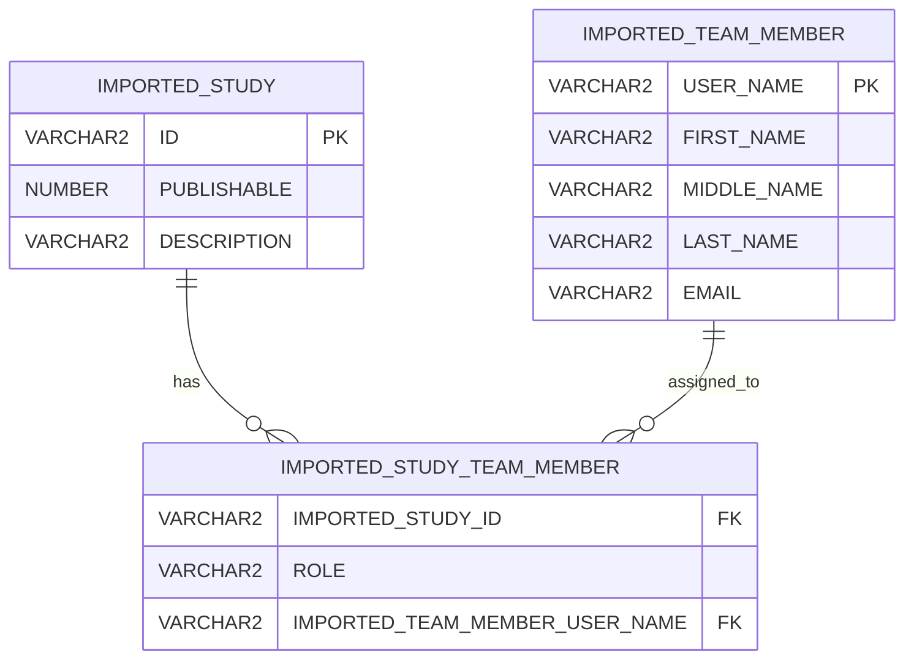

# Imported Schema

## `IMPORTED_STUDY`

| Column | Type | Purpose |
|---|---|---|
| `ID` | `VARCHAR2` | Authoritative `study_num`; uniquely identifies the study and may appear in posting URLs. |
| `PUBLISHABLE` | `NUMBER` | Indicates whether the study may recruit through the application. |
| `DESCRIPTION` | `VARCHAR2` | Describes the study for staff and database support users. |

## `IMPORTED_STUDY_TEAM_MEMBER`

| Column | Type | Purpose |
|---|---|---|
| `IMPORTED_STUDY_ID` | `VARCHAR2` | References `IMPORTED_STUDY.ID`. |
| `ROLE` | `VARCHAR2` | Institutional role. The PI designation is the role used by application reconciliation. |
| `IMPORTED_TEAM_MEMBER_USER_NAME` | `VARCHAR2` | References `IMPORTED_TEAM_MEMBER.USER_NAME`. |

## `IMPORTED_TEAM_MEMBER`

| Column | Type | Purpose |
|---|---|---|
| `USER_NAME` | `VARCHAR2` | Institutional username used to identify the user. |
| `FIRST_NAME` | `VARCHAR2` | Institutional first name. |
| `MIDDLE_NAME` | `VARCHAR2` | Institutional middle name. |
| `LAST_NAME` | `VARCHAR2` | Institutional last name. |
| `EMAIL` | `VARCHAR2` | Email used to communicate with the PI. |



## Recommended constraints

```text
UNIQUE (IMPORTED_STUDY.ID)

UNIQUE (IMPORTED_TEAM_MEMBER.USER_NAME)

UNIQUE (
    IMPORTED_STUDY_TEAM_MEMBER.IMPORTED_STUDY_ID,
    IMPORTED_STUDY_TEAM_MEMBER.IMPORTED_TEAM_MEMBER_USER_NAME,
    IMPORTED_STUDY_TEAM_MEMBER.ROLE
)
```

## Mutability

Ordinary study team members cannot modify these tables.
