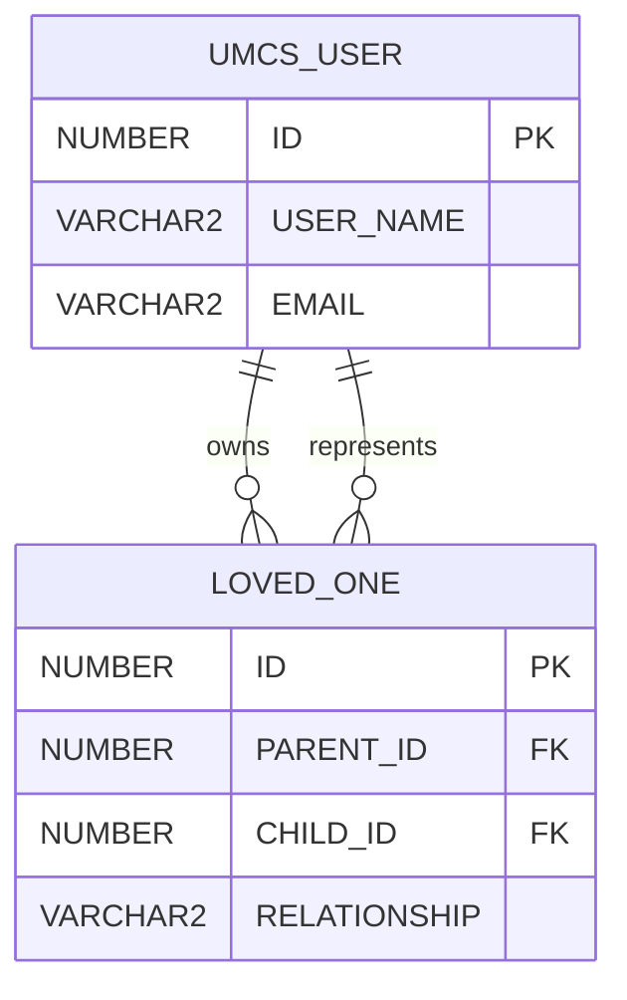
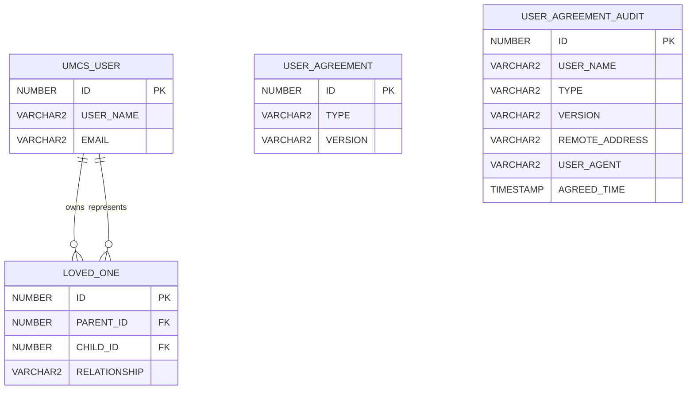

# Participant Account and Agreement Model

## Participant account concepts

Participant accounts are local, database-backed application accounts.

An account may be:

- A self account used by the represented participant
- An owning account that manages one or more loved-one accounts
- A loved-one account managed through an owning account

An owning account is not a separate database account class. Ownership is established through the
`LOVED_ONE` relationship.

## Loved-one ownership

`LOVED_ONE` maps one owning participant account to one represented loved-one account.

| Column         | Type       | Meaning                              |
| -------------- | ---------- | ------------------------------------ |
| `ID`           | `NUMBER`   | Relationship identifier              |
| `PARENT_ID`    | `NUMBER`   | Owning `UMCS_USER.ID`                |
| `CHILD_ID`     | `NUMBER`   | Represented loved-one `UMCS_USER.ID` |
| `RELATIONSHIP` | `VARCHAR2` | Relationship enum value              |

Cardinality:

```text
One parent UMCS_USER
→ many LOVED_ONE rows

One LOVED_ONE row
→ one child UMCS_USER
```



The owning and represented records both reside in `UMCS_USER`; the relationship roles distinguish
them.

The terms `PARENT_ID` and `CHILD_ID` describe relationship direction in the schema. They must not be
interpreted as proving that every owner is the represented participant's legal parent or that every
loved one is a minor.

## Signup-for-a-loved-one account creation

The signup-for-a-loved-one workflow creates:

1. A minimal owning account
1. A complete loved-one participant account
1. A `LOVED_ONE` relationship between them

### Owning-account identity

The owning account uses the owner's real communication email as:

- Username
- Communication email address

The signup flow captures:

- First name
- Last name
- Communication email

Country and ZIP code entered for the loved-one profile are copied to the owning account during
signup.

Other profile fields required for ordinary self participation may remain incomplete.

The owning profile defaults to hidden from study teams.

### Loved-one identity

The loved-one account receives:

- A separate `UMCS_USER` record
- A separate participant profile
- An application-generated GUID-based email-like username
- The owning account's real email as its communication email

Conceptually:

```text
Owning account:
    USER_NAME = owner's real email
    EMAIL = owner's real email

Loved-one account:
    USER_NAME = application-generated GUID-based email-like value
    EMAIL = owner's real email
```

The generated loved-one username is an internal unique identity. It must not be treated as the loved
one's actual email address.

## Add Loved One

Add Loved One creates:

- A new loved-one account
- A new loved-one participant profile
- A new `LOVED_ONE` relationship

It does not recreate the existing owning account.

## Visibility ownership

Visibility belongs to the represented participant profile.

Therefore:

- The owning self profile has its own visibility.
- Each loved-one profile has its own visibility.
- Changing one loved-one's visibility does not redefine the owner's visibility.
- Changing the owner's visibility does not redefine every loved-one's visibility.

An owning account created through signup for a loved one defaults to hidden because its self profile
is incomplete and was created primarily to manage the loved-one account.

The loved-one visibility is selected during the loved-one creation workflow.

## Agreement definition

### `USER_AGREEMENT`

| Column    | Type       | Meaning                         |
| --------- | ---------- | ------------------------------- |
| `ID`      | `NUMBER`   | Agreement-definition identifier |
| `TYPE`    | `VARCHAR2` | Agreement type                  |
| `VERSION` | `VARCHAR2` | Current agreement version       |

Known type values include:

```text
VOL
STM
```

Conceptually:

| Type  | Applies to                         |
| ----- | ---------------------------------- |
| `VOL` | Participant or volunteer agreement |
| `STM` | Study-team-member agreement        |

The values may be represented as configured strings or codes in a particular deployment.

## Self and loved-one agreement treatment

Self and loved-one participant workflows use the same participant agreement type and version for
audit storage.

The body of the participant agreement is shared, but loved-one workflows present additional clauses
that address agreement and responsibility on behalf of the represented loved one.

Conceptually:

```text
USER_AGREEMENT:
    TYPE = VOL
    VERSION = current participant version

Self presentation:
    Shared participant agreement body

Loved-one presentation:
    Shared participant agreement body
    + Loved-one or proxy clauses
```

The additional loved-one clauses do not create separate agreement types or versions in the confirmed
audit model.

The following are presentation contexts, not confirmed `USER_AGREEMENT.TYPE` values:

```text
SELF
LOVED_ONE
CHILD_LOVED_ONE
ADULT_LOVED_ONE
```

## Agreement audit

### `USER_AGREEMENT_AUDIT`

| Column           | Type           | Meaning                             |
| ---------------- | -------------- | ----------------------------------- |
| `ID`             | `NUMBER`       | Agreement-acceptance identifier     |
| `USER_NAME`      | `VARCHAR2`     | Username associated with acceptance |
| `TYPE`           | `VARCHAR2`     | Agreement type                      |
| `VERSION`        | `VARCHAR2`     | Agreement version                   |
| `REMOTE_ADDRESS` | `VARCHAR2`     | Client IP address                   |
| `USER_AGENT`     | `VARCHAR2`     | Browser or client user agent        |
| `AGREED_TIME`    | `TIMESTAMP(6)` | Agreement-acceptance timestamp      |

## Version comparison

At login, the application determines whether a user has accepted the current agreement version.

Conceptually:

```text
Required acceptance exists =
    USER_AGREEMENT_AUDIT.USER_NAME identifies the applicable user
    AND USER_AGREEMENT_AUDIT.TYPE = USER_AGREEMENT.TYPE
    AND USER_AGREEMENT_AUDIT.VERSION = USER_AGREEMENT.VERSION
```

If no corresponding audit row exists, the user must review the current agreement.

Acceptance creates a new audit row for the current type and version.

The previous acceptance is historical evidence of an earlier version; it does not satisfy the
current-version check.

## Loved-one audit interpretation

Because self and loved-one participant agreement acceptance uses the same participant type:

```text
TYPE = VOL
```

the audit type by itself does not identify the presentation context.

An analysis must not infer:

```text
TYPE = VOL
→ self agreement only
```

or:

```text
TYPE = VOL
→ loved-one agreement only
```

The context must instead be determined using other evidence, such as:

- Whether the account participates in a `LOVED_ONE` relationship
- Which workflow created the account
- Whether the account is the owner or represented loved one
- Registration timing
- Application logs or request context, when available

The exact rule identifying which username is stored during initial loved-one signup, Add Loved One,
and later loved-one re-agreement remains to be verified.

## Decline behavior

A declined agreement does not create a successful agreement-acceptance row.

For a participant:

- The application warns that confirmed decline will deactivate the account.
- Confirmed decline causes participant-account deactivation.
- Deactivation of an owning self account cascades to its loved-one accounts.

For a study team member:

- Decline prevents continued application use.
- The institutional SAML identity is not deactivated by the application.

The physical persistence of a decline event, apart from resulting account deactivation, remains to
be documented.

## Relationship model



Agreement audit records are logically associated with agreement definitions through:

```text
TYPE
VERSION
```

and with participant identities through:

```text
USER_NAME
```

This documentation does not assert an undeclared physical foreign key between `USER_AGREEMENT` and
`USER_AGREEMENT_AUDIT`.

## Analytical cautions

1. `TYPE = VOL` does not distinguish self from loved-one presentation.
1. Shared communication email does not mean the owning and loved-one accounts are the same account.
1. The GUID-based loved-one username is not a real communication address.
1. `LOVED_ONE.PARENT_ID` identifies the owning account, not necessarily a legal parent.
1. Country and ZIP copying during signup does not establish ongoing address synchronization.
1. An old agreement acceptance does not satisfy a newer agreement version.
1. The absence of a current-version audit row indicates that re-agreement is required; it does not
   by itself prove that the user declined.

## Related pages

- [Participant Registration, Agreements, and Loved-One Accounts](../04-users-and-access/participant-registration-consent-and-loved-ones.md)
- [Participants](../04-users-and-access/participants.md)
- [Open Questions](../09-decisions/open-questions.md)
