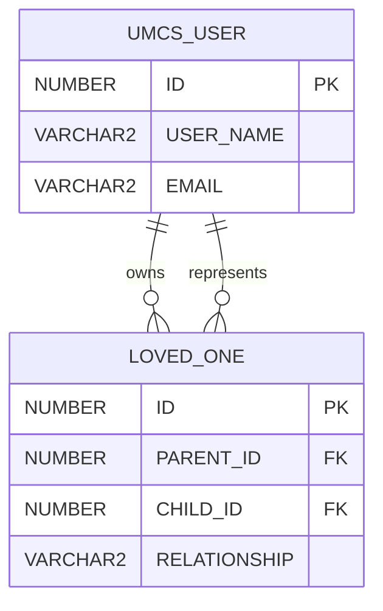
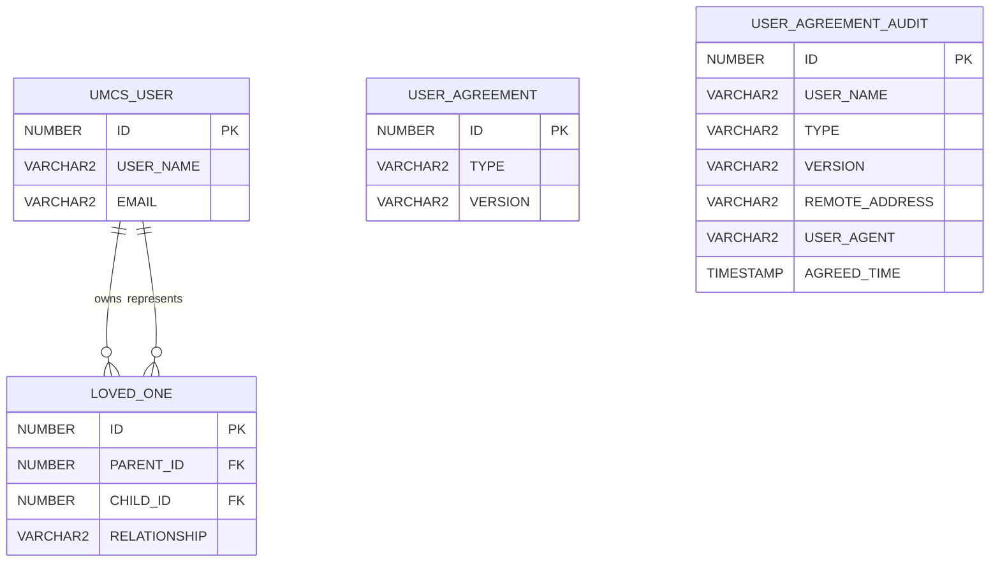

# Participant Account and Agreement Model

## Participant account concepts

Participant accounts are local, database-backed application accounts.

An account may be:

- A self account used by the represented participant
- An owning account that manages one or more loved-one accounts
- A loved-one account managed through an owning account

An owning account is not a separate database account class. Ownership is established through the
`LOVED_ONE` relationship.

## Loved-one ownership

`LOVED_ONE` maps one owning participant account to one represented loved-one account.

| Column         | Type       | Meaning                              |
| -------------- | ---------- | ------------------------------------ |
| `ID`           | `NUMBER`   | Relationship identifier              |
| `PARENT_ID`    | `NUMBER`   | Owning `UMCS_USER.ID`                |
| `CHILD_ID`     | `NUMBER`   | Represented loved-one `UMCS_USER.ID` |
| `RELATIONSHIP` | `VARCHAR2` | Relationship enum value              |

Cardinality:

```text
One parent UMCS_USER
→ many LOVED_ONE rows

One LOVED_ONE row
→ one child UMCS_USER
```



The owning and represented records both reside in `UMCS_USER`; the relationship roles distinguish
them.

The terms `PARENT_ID` and `CHILD_ID` describe relationship direction in the schema. They must not be
interpreted as proving that every owner is the represented participant's legal parent or that every
loved one is a minor.

## Signup-for-a-loved-one account creation

The signup-for-a-loved-one workflow creates:

1. A minimal owning account
1. A complete loved-one participant account
1. A `LOVED_ONE` relationship between them

### Owning-account identity

The owning account uses the owner's real communication email as:

- Username
- Communication email address

The signup flow stores:

- First name
- Last name
- Communication email
- Preferred language
- Restricted visibility
- Explicit no-current-condition and no-past-condition profile values
- Learned-from information, when supplied

Country and ZIP from signup for a loved one are persisted on the represented loved-one's
`CONTACT_INFO`, not the owner's. The current creation path does not copy them.

The owner therefore begins with these required fields missing:

- `CONTACT_INFO.COUNTRY`
- `CONTACT_INFO.ZIP`
- Biological-sex profile property
- Date-of-birth profile property
- Race or other-race profile property
- Parent/guardian-of-a-child profile property

The owner fills them through ordinary account-specific profile updates.

### Loved-one identity

The loved-one account receives:

- A separate `UMCS_USER` record
- A separate participant profile
- An application-generated GUID-based email-like username
- The owning account's real email as its communication email

Conceptually:

```text
Owning account:
    USER_NAME = owner's real email
    EMAIL = owner's real email

Loved-one account:
    USER_NAME = application-generated GUID-based email-like value
    EMAIL = owner's real email
```

The generated loved-one username is an internal unique identity. It must not be treated as the loved
one's actual email address.

## Add Loved One

Add Loved One creates:

- A new loved-one account
- A new loved-one participant profile
- A new `LOVED_ONE` relationship

It does not recreate the existing owning account or copy the new loved one's contact/profile
values into that owner.

## Visibility ownership

Visibility belongs to the represented participant profile.

Therefore:

- The owning self profile has its own visibility.
- Each loved-one profile has its own visibility.
- Changing one loved-one's visibility does not redefine the owner's visibility.
- Changing the owner's visibility does not redefine every loved-one's visibility.

An owning account created through signup for a loved one defaults to hidden because its self profile
is incomplete and was created primarily to manage the loved-one account.

The loved-one visibility is selected during the loved-one creation workflow.

## Profile completeness representation

The relational model has no persisted profile-complete Boolean, percentage, or missing-fields
collection.

`VOLUNTEER_PROFILE` stores profile data, including visibility, notification frequencies, language,
property values, contact information, and an optional study-interest criterion.

The participant frontend derives two separate measures from that data:

1. **Missing required fields**

   - First and last name
   - Country and ZIP
   - Biological sex assigned at birth
   - Date of birth
   - Race or nonblank other-race value
   - Current and past conditions, including explicit no-condition values
   - Parent/guardian-of-a-child response for owning accounts

1. **Percentage completeness**

   - Includes the required data plus optional contact, demographic, gender-identity, health,
     condition, and medication fields
   - Excludes visibility and study interests

These calculations are presentation/workflow logic, not persisted account states.

## Agreement definition

### `USER_AGREEMENT`

| Column    | Type       | Meaning                         |
| --------- | ---------- | ------------------------------- |
| `ID`      | `NUMBER`   | Agreement-definition identifier |
| `TYPE`    | `VARCHAR2` | Agreement type                  |
| `VERSION` | `VARCHAR2` | Current agreement version       |

Known type values include:

```text
VOL
STM
```

Conceptually:

| Type  | Applies to                         |
| ----- | ---------------------------------- |
| `VOL` | Participant or volunteer agreement |
| `STM` | Study-team-member agreement        |

The values may be represented as configured strings or codes in a particular deployment.

## Self and loved-one agreement treatment

Self and loved-one participant workflows use the same participant agreement type and version:

```
TYPE = VOL
VERSION = current participant version
```

The frontend loads one institution- and language-specific volunteer agreement body for `VOL`.
Agreement-body selection does not use:

- `LOVED_ONE.RELATIONSHIP`
- Date of birth
- Derived age
- Child/adult category

When the workflow indicates that the account has loved ones, the popup adds a common
represented-loved-one acknowledgment. That acknowledgment covers adults and children together. It is
not a distinct agreement definition, version, or audit type.

The following are presentation or account contexts, not confirmed `USER_AGREEMENT.TYPE` values:

```
SELF
LOVED_ONE
CHILD_LOVED_ONE
ADULT_LOVED_ONE
```

Child/adult relationship-specific labels and explanatory text exist in the registration forms. They
are used to collect and validate the owner-to-loved-one relationship; they do not choose a separate
agreement body.

## Agreement audit

### `USER_AGREEMENT_AUDIT`

| Column           | Type           | Meaning                             |
| ---------------- | -------------- | ----------------------------------- |
| `ID`             | `NUMBER`       | Agreement-acceptance identifier     |
| `USER_NAME`      | `VARCHAR2`     | Username associated with acceptance |
| `TYPE`           | `VARCHAR2`     | Agreement type                      |
| `VERSION`        | `VARCHAR2`     | Agreement version                   |
| `REMOTE_ADDRESS` | `VARCHAR2`     | Client IP address                   |
| `USER_AGENT`     | `VARCHAR2`     | Browser or client user agent        |
| `AGREED_TIME`    | `TIMESTAMP(6)` | Agreement-acceptance timestamp      |

## Version comparison

At login, the application determines whether a user has accepted the current agreement version.

Conceptually:

```text
Required acceptance exists =
    USER_AGREEMENT_AUDIT.USER_NAME identifies the applicable user
    AND USER_AGREEMENT_AUDIT.TYPE = USER_AGREEMENT.TYPE
    AND USER_AGREEMENT_AUDIT.VERSION = USER_AGREEMENT.VERSION
```

If no corresponding audit row exists, the user must review the current agreement.

Acceptance creates a new audit row for the current type and version.

The previous acceptance is historical evidence of an earlier version; it does not satisfy the
current-version check.

## Loved-one audit interpretation

Because self and loved-one participant agreement acceptance uses the same participant type:

```text
TYPE = VOL
```

the audit type by itself does not identify the presentation context.

An analysis must not infer:

```text
TYPE = VOL
→ self agreement only
```

or:

```text
TYPE = VOL
→ loved-one agreement only
```

The context must instead be determined using other evidence, such as:

- Whether the account participates in a `LOVED_ONE` relationship
- Which workflow created the account
- Whether the account is the owner or represented loved one
- Registration timing
- Application logs or request context, when available

Username attribution is workflow-specific:

| Workflow                                     | `USER_AGREEMENT_AUDIT.USER_NAME`                                   |
| -------------------------------------------- | ------------------------------------------------------------------ |
| Self signup                                  | Self account username                                              |
| Initial signup for a loved one               | Two rows: owning-account username and generated loved-one username |
| Add Loved One                                | Generated username of the newly created loved-one account          |
| Login-time re-agreement in owner context     | Authenticated owner's username                                     |
| Login-time re-agreement in loved-one context | Authenticated loved-one context's generated username               |

Initial creation uses the username on each `User` passed to the agreement-audit service. The
authenticated re-agreement endpoint instead sets the username from the current security principal and
does not trust a client-supplied username.

## Decline behavior

A declined agreement does not create a successful agreement-acceptance row or a distinct
agreement-decline audit row.

For a participant, the frontend receives agreement-interruption arguments for the current
authenticated context. After confirmation it sends:

```
userId = current interrupted account ID
reason = DECLINED_USER_AGREEMENT lookup value supplied by the backend response
```

The confirmation has no account-target chooser.

Backend scope is determined by `userId`:

- Owner ID deactivates the owner and all enabled loved-one accounts.
- Loved-one ID deactivates only that loved-one account.

For a study team member, decline logs the user out or otherwise prevents continued application use.
It does not deactivate the institutional identity.

Resulting participant deactivation is persisted in `USER_DEACTIVATION` with reason
`DECLINED_USER_AGREEMENT`. The record retains the target user ID, deactivation timestamp, and
deactivation-reason lookup reference.

No agreement-decline-specific `PHI_AUDIT` function exists. `ADMIN_DEACTIVATE_USER` is emitted only
when an administrator performs the deactivation, not when a participant declines their own
agreement.

The reviewed path sends the ordinary account-deactivation email. It does not use a separate
agreement-decline notification template.

## Relationship model



Agreement audit records are logically associated with agreement definitions through:

```text
TYPE
VERSION
```

and with participant identities through:

```text
USER_NAME
```

This documentation does not assert an undeclared physical foreign key between `USER_AGREEMENT` and
`USER_AGREEMENT_AUDIT`.

## Participant deactivation persistence

`USER_DEACTIVATION` is the durable participant-deactivation record.

| Column                      | Meaning                          |
| --------------------------- | -------------------------------- |
| `ID`                        | Deactivation-record identifier   |
| `USER_ID`                   | Deactivated participant account  |
| `DEACTIVATION_DATE`         | Time the record was created      |
| `DEACTIVATION_REASON_LV_ID` | Deactivation-reason lookup value |

The common deactivation service also:

1. Sets the database authentication record's enabled flag to false.
1. Removes the participant from the process-local active-participant store.
1. Starts asynchronous recommendation cleanup.
1. Saves `USER_DEACTIVATION`.

Reactivation enables the account, adds it back to the local active-participant store, triggers
rematching, and deletes the account's `USER_DEACTIVATION` record.

Age-out uses this same path with reason `CHILD_TURNED_ADULT`. The prior warning is separately stored
in `CHILD_DEACTIVATION_NOTICE`; warning deduplication uses parent ID, child ID, and the recorded
date-of-birth value.

## Analytical cautions

1. `TYPE = VOL` does not distinguish self from loved-one presentation.
1. The frontend does not select separate child and adult agreement variants.
1. The represented-loved-one acknowledgment is shared by child and adult contexts and is not stored
   in `USER_AGREEMENT_AUDIT`.
1. Shared communication email does not mean the owning and loved-one accounts are the same account.
1. The GUID-based loved-one username is not a real communication address.
1. `LOVED_ONE.PARENT_ID` identifies the owning account, not necessarily a legal parent.
1. Current signup-for-a-loved-one code does not copy country or ZIP to the owner.
1. Related account contact/profile values are not synchronized; preferred language propagation from
   owner to loved ones is the confirmed exception.
1. An old agreement acceptance does not satisfy a newer agreement version.
1. The absence of a current-version audit row indicates that re-agreement is required; it does not
   by itself prove that the user declined.

## Related pages

- [Participant Registration, Agreements, and Loved-One Accounts](../04-users-and-access/participant-registration-consent-and-loved-ones.md)
- [Participants](../04-users-and-access/participants.md)
- [Open Questions](../09-decisions/open-questions.md)
