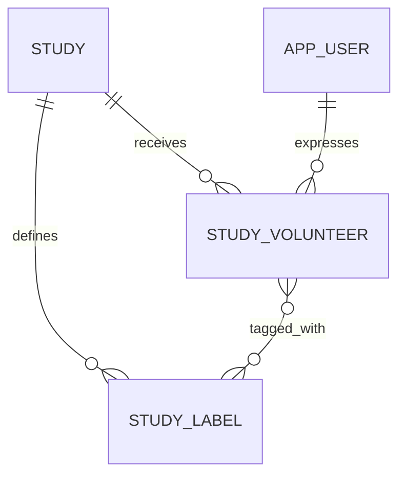

# Recruitment Operations Model

This page records confirmed functional relationships. Exact physical table and column names are
shown only when known.

## Interested participant

`STUDY_VOLUNTEER` associates a participant with a study after successful expression of interest.

Known relationship:

```text
STUDY_VOLUNTEER
→ STUDY
→ APP_USER participant
```

The row also provides the interested-participant relationship used by messaging and workflow
management.

## Workflow list

One `STUDY_VOLUNTEER` belongs to one fixed workflow list at a time:

```text
NEW
ELIGIBLE
INELIGIBLE
PENDING
```

`ALL` is a query view rather than a stored membership.

## Labels

Labels are study-specific, many-to-many tags applied to `STUDY_VOLUNTEER`.

Conceptually:



Exact label-table names must be verified.

## Messages

A conversation is scoped to:

- Study
- Interested participant
- Shared study team

Messages identify:

- Sender
- `STUDY_VOLUNTEER` recipient relationship
- Timestamp
- Content

Attachments and templates are study-specific.

Exact table names must be verified.

## Study notifications

Notification configuration is scoped to:

```text
Study
+ Event
+ Shared frequency
+ Selected recipients
```

Recipients may include:

- Accepted study members
- External email addresses

Exact table names must be verified.

## Active intervals

`STUDY_ACTIVE_INTERVAL` records historical active periods.

Conceptually:

| Value           | Meaning                                 |
| --------------- | --------------------------------------- |
| Study reference | Study whose active period is recorded   |
| Start           | Time the derived status became active   |
| End             | Time the derived status became inactive |

Exact physical columns must be verified.

## Total enrollment and archive date

Both values are stored using the study-property model:

```text
STUDY
→ STUDY_PROPERTY_VALUE
→ ENTITY_PROPERTY
```

Relevant logical properties include:

```text
Enrollment number
Archived date
```

## Related pages

- [Interested-Participant Management](../06-recruitment/interested-participant-management.md)
- [Messaging](../06-recruitment/messaging.md)
- [Study Notifications](../05-study-management/study-notifications.md)
- [Study Lifecycle](../05-study-management/study-lifecycle.md)
- [PHI Audit](../08-operations/phi-audit.md)
