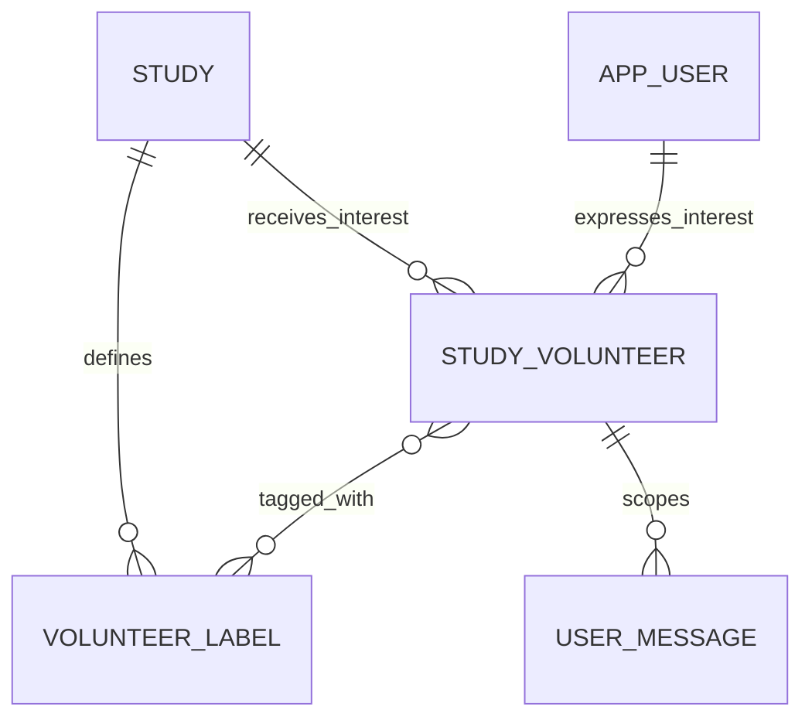
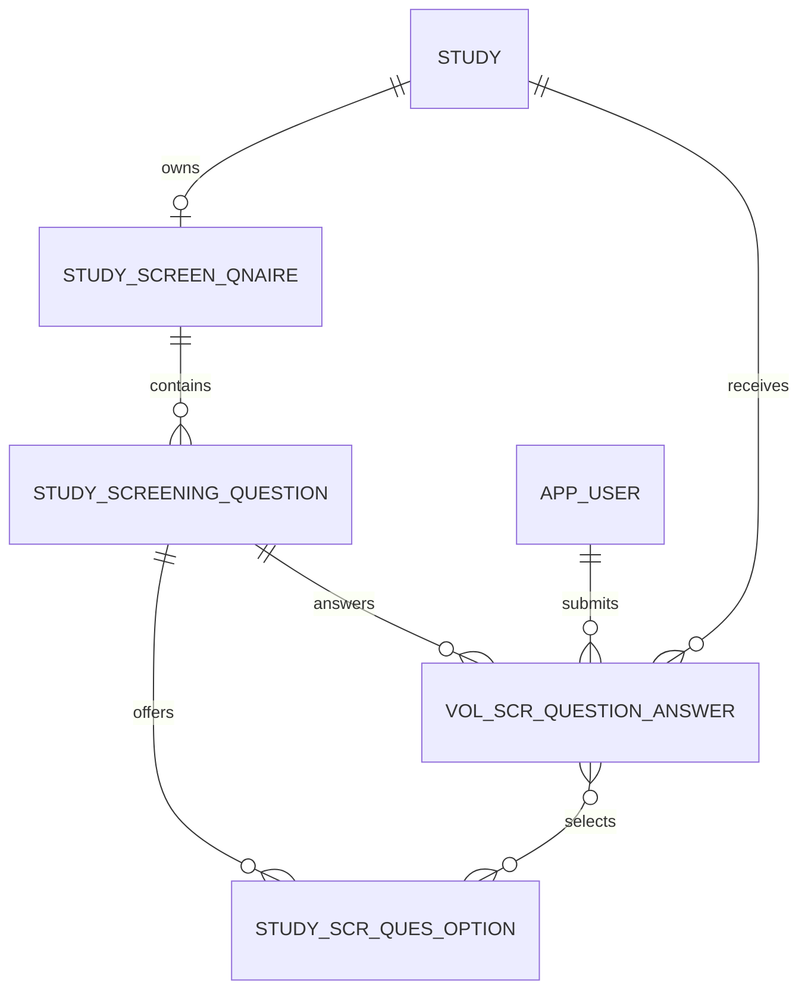
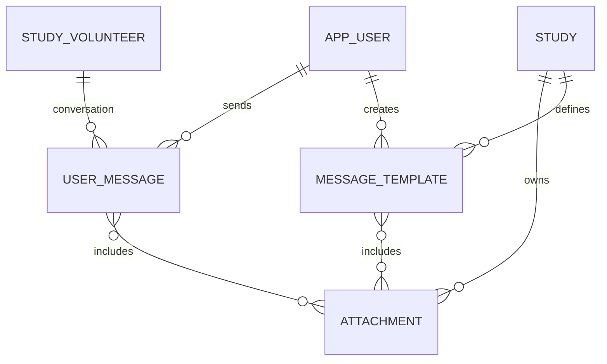

# Recruitment Operations Model

This page maps the recruitment-operation relationships confirmed in the physical schema. Functional
behavior remains on the corresponding recruitment pages.

## Label, notification, promotion, and deactivation records

### Labels

A label definition belongs to one study, while its join rows attach it to zero or more interested-participant relationships. One relationship can have multiple labels. Definition deletion removes assignment joins, and application deletion of an interested-participant relationship removes its assignments before the relationship. Export flattens assignments into one comma-separated label-name column.

The definition and assignment APIs apply same-study ownership checks, but the interested-participant PATCH path still lacks an independent caller-membership and publishability check.

### Notification settings

One setting per study and notification event selects one shared frequency and a recipient set consisting of study-member joins plus an external-recipient string. Update validation checks lookup types and study membership and records notification-update audit activity. Dispatch deduplicates member and external addresses into a set.

This model records configuration and application-level attempt evidence. It does not by itself prove provider acceptance or mailbox delivery. Participant recommendation notification preferences are participant state, not study notification-setting rows.

### Promotion

Ask if interested writes relational promotion-message context and Redis recommendation state, but those stores have different purposes and lifecycles. Redis `USER` score is the promotion timestamp, while `ASKED_IF_INTERESTED` is the study exclusion used for repeat prevention. The relational row has neither timestamp nor active marker and cannot reconstruct those Redis values deterministically.

Participant Not Interested or Enrolled actions delete relational promotion rows for the pair. They must not be described as creating an expression of interest, enrollment, or direct message.

### Deactivation

A user deactivation row records one current reason and date for a retained user reference. Reactivation removes it; hard user deletion nulls the reference while preserving the row. Owner deactivation also disables enabled loved-one accounts through service behavior rather than a database cascade.

Participant deactivation preserves durable recruitment records but hides them through active-profile query paths. It removes current process-local state immediately on the handling server and schedules incomplete Redis cleanup: ordinary recommendations are removed, but exclusions and user promotions are not.

Child age-out first hands off warning email and then saves deduplication evidence. Actual age-out later records `CHILD_TURNED_ADULT`. These are separate operations without a confirmed distinct age-out PHI audit event.

Study deactivation changes the posting and active interval, blocks participant discovery and matched-participant work, preserves management of existing interest, and schedules ordinary-recommendation cleanup. Exclusions and participant-side promotions remain; notification follows in a later daily batch. Archive remains a separate inactivity state.

## Interested-participant relationship

```mermaid
erDiagram
    APP_USER ||--o{ STUDY_VOLUNTEER : expresses_interest
    STUDY ||--o{ STUDY_VOLUNTEER : receives_interest
    STUDY_VOLUNTEER }o--o{ VOLUNTEER_LABEL : tagged_with
    STUDY ||--o{ VOLUNTEER_LABEL : defines
    STUDY_VOLUNTEER ||--o{ USER_MESSAGE : scopes
```

`STUDY_VOLUNTEER` has a sequence primary key and a unique `(USER_ID, STUDY_ID)` constraint. It stores
the interest date, current fixed workflow status, and status-update date.

The fixed values are `NEW`, `ELIGIBLE`, `PENDING`, and `INELIGIBLE`. `ALL` is not stored.

`STUDY_VOLUNTEER_LABEL` has a composite primary key joining `STUDY_VOLUNTEER` and
`VOLUNTEER_LABEL`.

## Questionnaire definition and answers

```mermaid
erDiagram
    STUDY ||--o| STUDY_SCREEN_QNAIRE : owns
    STUDY_SCREEN_QNAIRE ||--o{ STUDY_SCREENING_QUESTION : contains
    STUDY_SCREENING_QUESTION ||--o{ STUDY_SCR_QUES_OPTION : offers
    APP_USER ||--o{ VOL_SCR_QUESTION_ANSWER : submits
    STUDY ||--o{ VOL_SCR_QUESTION_ANSWER : receives
    STUDY_SCREENING_QUESTION ||--o{ VOL_SCR_QUESTION_ANSWER : answers
    VOL_SCR_QUESTION_ANSWER }o--o{ STUDY_SCR_QUES_OPTION : selects
```

The application assumes at most one questionnaire per study, but no database unique constraint on
`STUDY_SCREEN_QNAIRE.STUDY_ID` was found.

`VERSION` is a concurrency counter. No definition-history table exists.

Profile-backed fixed questions write ordinary participant profile properties. User-defined screening
answers write `VOL_SCR_QUESTION_ANSWER`; selected choices use
`VOL_QSTN_ANSWR_SLCTD_OPTNS`.

Question and option deletion cascades can destroy the definition links needed to interpret historical
answers. Current definitions, not submission-time snapshots, supply question and option text.

## Messages and derived conversations

```mermaid
erDiagram
    STUDY_VOLUNTEER ||--o{ USER_MESSAGE : conversation
    APP_USER ||--o{ USER_MESSAGE : sends
    USER_MESSAGE }o--o{ ATTACHMENT : includes
    STUDY ||--o{ ATTACHMENT : owns
    STUDY ||--o{ MESSAGE_TEMPLATE : defines
    APP_USER ||--o{ MESSAGE_TEMPLATE : creates
    MESSAGE_TEMPLATE }o--o{ ATTACHMENT : includes
```

There is no physical conversation table. One conversation is all `USER_MESSAGE` rows sharing a
`STUDY_VOLUNTEER_ID`.

`USER_MESSAGE.STATUS` is `READ` or `UNREAD`. It is one shared directional status, not a per-reader
receipt.

`MESSAGE_ATTACHMENT` and `MESSAGE_TEMPLATE_ATTACHMENT` are composite-key joins. Attachment metadata
is relational; bytes are stored in the application filesystem.

## Query views

- `V_CONVERSATION_FOR_STUDY_TEAM` derives one row per interested-participant conversation and includes
  participant-to-study unread count and most recent received date.
- `V_CONVERSATION_FOR_VOLUNTEER` derives participant inbox rows and staff-to-participant unread count.
- Study synopsis views count enabled `NEW` interested participants and enabled-sender unread messages.

These views depend on active-user state. Deactivated participants are hidden without deleting durable
relationships or messages.

## Ownership and deletion

| Parent or action           | Confirmed effect                                                                                                    |
| -------------------------- | ------------------------------------------------------------------------------------------------------------------- |
| Delete participant account | Cascade answers; application deletes messages, label joins, and `STUDY_VOLUNTEER` before user deletion              |
| Delete study               | Cascade questionnaire definitions and interested-participant rows; restrictive dependents require deletion ordering |
| Delete questionnaire       | Cascade questions, options, answers, and selected-option joins                                                      |
| Delete question            | Explicitly delete answers, then cascade options                                                                     |
| Delete option              | Cascade selected-option joins; answer row may remain                                                                |
| Delete label               | Cascade label assignments                                                                                           |
| Delete attachment          | Cascade message/template attachment joins and delete external file                                                  |
| Deactivate participant     | Retain relational data but hide it from active-profile query paths                                                  |

## Transaction boundaries

- Show interest uses one relational transaction for profile, answers, and interest creation, but
  process-local memory, Redis, and email are not one atomic resource transaction.
- Single message persistence and email notification execute in one Spring transaction, but external
  email or queue side effects cannot be rolled back.
- Bulk messages use one new transaction per participant.
- Attachment database changes and filesystem operations are not atomic together.

## Audit and historical limits

Interested-participant list and profile reads create PHI audit rows. Workflow transitions, labels,
questionnaire definition changes, answer history, message reads, and template changes have no complete
dedicated audit established in this model.

No historical questionnaire snapshots, workflow-transition history, per-reader message receipts,
message edit history, or attachment-file reconciliation history exists.

## Related pages

- [Expressions of Interest](../06-recruitment/expressions-of-interest.md)
- [Questionnaires and Exports](../06-recruitment/questionnaires-and-exports.md)
- [Interested-Participant Management](../06-recruitment/interested-participant-management.md)
- [Messaging](../06-recruitment/messaging.md)
- [Operational Schema](operational-schema.md)
