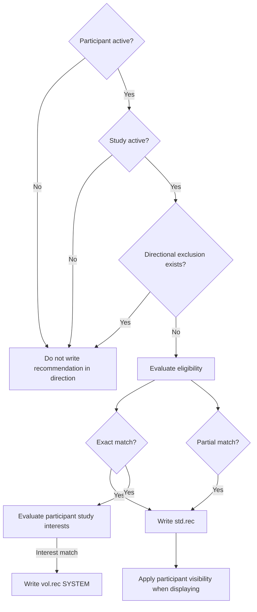

# Redis Match and Exclusion Model

Current participant-study recommendations and directional exclusions are stored in Redis sorted sets.

## Naming conventions

```text
vol = participant-facing direction
std = study-facing direction
rec = recommendation
exc = exclusion
```

Identifiers are:

```text
Participant identifier = APP_USER.ID
Study identifier       = STUDY.ID
```

Sorted-set scores are timestamps represented as Java long millisecond values.

## Key summary

| Direction | Key pattern | Member | Score |
|---|---|---|---|
| Studies recommended to participant | `vol.rec:<APP_USER.ID>:<MATCH_SOURCE>` | `STUDY.ID` | Match or promotion timestamp |
| Participants recommended to study | `std.rec:<STUDY.ID>:<MATCH_RESULT>` | `APP_USER.ID` | Match-computation timestamp |
| Participants excluded from study-side recommendations | `std.exc:<STUDY.ID>` | `<APP_USER.ID>:<REASON>` | Exclusion timestamp |
| Studies excluded from participant-facing recommendations | `vol.exc:<APP_USER.ID>` | `<STUDY.ID>:<REASON>` | Exclusion timestamp |

## Participant-facing recommendations

### Key pattern

```text
vol.rec:<APP_USER.ID>:<MATCH_SOURCE>
```

Members are:

```text
STUDY.ID
```

### System-generated recommendations

A system-generated participant-facing recommendation is stored when:

- The participant is active.
- The study is active.
- The study matches the participant's study interests.
- The participant has an exact (`TRUE`) eligibility match.
- No participant-side exclusion suppresses the pair.

Partial (`MAYBE`) matches are not shown in participant-facing matched-study lists and are not ordinary system-generated participant recommendations.

The known source token for a system-generated recommendation is:

```text
SYSTEM
```

Example:

```text
ZRANGE vol.rec:<APP_USER.ID>:SYSTEM 0 -1 WITHSCORES
```

Result shape:

```text
<STUDY.ID>
<RECOMMENDATION_TIMESTAMP>
```

### Study-team-promoted recommendations

Ask if interested places the study in a participant-facing recommendation set whose `<MATCH_SOURCE>` distinguishes the promotion from `SYSTEM`.

The exact serialized promotion-source token remains an implementation constant that must be documented from source code.

Ask if interested:

- Does not create participant interest.
- Presents the study in the study-team-promoted participant bucket.
- Creates the study-side exclusion reason `ASKED_IF_INTERESTED` to remove the participant from the ordinary study-side recommendation flow.

## Study-facing participant recommendations

### Key pattern

```text
std.rec:<STUDY.ID>:<MATCH_RESULT>
```

Members are:

```text
APP_USER.ID
```

The match-result suffix distinguishes:

- Exact (`TRUE`) matches
- Partial (`MAYBE`) matches

An observed partial-match suffix is:

```text
0
```

The exact serialized suffix for each result category must be documented from implementation constants before assigning semantic names to all possible suffixes.

A participant is stored when:

- The participant is active.
- The study is active.
- Eligibility evaluates to exact or partial.
- No study-side exclusion suppresses the pair.

The participant may be stored regardless of profile visibility.

Visibility is applied separately when study-team results are displayed.

Example:

```text
ZRANGE std.rec:<STUDY.ID>:<MATCH_RESULT> 0 -1 WITHSCORES
```

Result shape:

```text
<APP_USER.ID>
<MATCH_COMPUTATION_TIMESTAMP>
```

## Directional exclusions

An exclusion tells match computation to skip a participant-study pair in one direction.

Exclusions do not necessarily delete historical business relationships.

### Study-side exclusions

Key:

```text
std.exc:<STUDY.ID>
```

Member:

```text
<APP_USER.ID>:<REASON>
```

Reasons:

```text
ALREADY_SHOWN_INTEREST
ASKED_IF_INTERESTED
DISMISSED
```

| Reason | Effect |
|---|---|
| `ALREADY_SHOWN_INTEREST` | The participant already expressed interest and should not remain in the ordinary study recommendation flow. |
| `ASKED_IF_INTERESTED` | The study team promoted the study to the participant. |
| `DISMISSED` | The study team dismissed the participant from its recommendation flow. |

### Participant-side exclusions

Key:

```text
vol.exc:<APP_USER.ID>
```

Member:

```text
<STUDY.ID>:<REASON>
```

Reasons:

```text
ALREADY_SHOWN_INTEREST
ENROLLED_IN_STUDY
NOT_INTERESTED
```

| Reason | Effect |
|---|---|
| `ALREADY_SHOWN_INTEREST` | The participant already expressed interest. |
| `ENROLLED_IN_STUDY` | The participant is enrolled and the study should not be recommended again. |
| `NOT_INTERESTED` | The participant indicated that they are not interested. |

## Multiple exclusion reasons

The reason is part of the sorted-set member.

The same participant-study pair can therefore have more than one member:

```text
<STUDY.ID>:ENROLLED_IN_STUDY
<STUDY.ID>:ALREADY_SHOWN_INTEREST
```

## Recommendation flow



Direction-specific behavior:

- Exact and partial eligibility can produce study-facing recommendations.
- Exact eligibility plus participant-interest matching can produce a system-generated participant-facing recommendation.
- Ask if interested can produce a participant-facing promoted recommendation independently of the ordinary system-interest match.
- Directional exclusions suppress future recommendation computation in the applicable direction.
- Participant visibility affects display and authorization rather than all underlying study-facing storage.

## Match freshness

Scores record timestamps associated with:

- Match computation
- Study-team promotion
- Exclusion action

They support ordering and troubleshooting but do not prove that source data remains current.

## Recalculation behavior

Relevant changes trigger asynchronous recomputation.

Failed recomputations are not automatically retried.

Operators can manually trigger:

- All study-match recomputation
- All participant-match recomputation
- Both categories

## Related pages

- [Matching and Visibility](../06-recruitment/matching-and-visibility.md)
- [Ask If Interested](../06-recruitment/ask-if-interested.md)
- [Expressions of Interest](../06-recruitment/expressions-of-interest.md)
- [Operational Schema](operational-schema.md)
- [Troubleshooting](../08-operations/troubleshooting.md)
