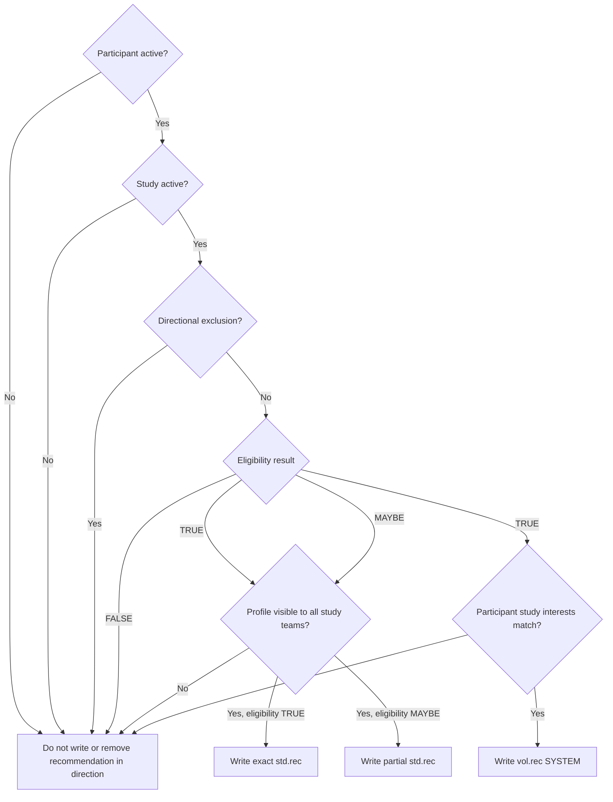

# Redis Match and Exclusion Model

Current participant-study recommendations and directional exclusions are stored in Redis sorted
sets.

## Promotion and deactivation recovery limits

Ask if interested creates Redis state that is not fully represented in the relational promotion table:

- the participant-side `USER` recommendation score records the promotion timestamp; and
- the study-side `ASKED_IF_INTERESTED` exclusion prevents repeat promotion.

`RECOMMENDED_STUDY_MESSAGE` preserves the participant, study, recommending user, reason, and note, but it has no promotion timestamp, active marker, or Redis score. Multiple relational rows may exist for the same pair. Relational data therefore cannot deterministically recreate the current promotion or its original score.

Participant deactivation asynchronously removes ordinary recommendations, but current cleanup does not remove exclusions or participant-side `USER` promotions. Study deactivation also removes ordinary recommendations asynchronously while preserving exclusions and `USER` promotions. Hard account deletion can leave orphaned exclusion or promotion members.

A full ordinary-recommendation recomputation is not a complete Redis restore. Promotion reconstruction, exclusion retention, orphan reconciliation, asynchronous-failure recovery, and acceptable retention remain separate operational or policy decisions.

## Naming conventions

```text
vol = participant-facing direction
std = study-facing direction
rec = recommendation
exc = exclusion
```

Current application key prefixes are exactly:

```text
vol.rec:
std.rec:
vol.exc:
std.exc:
```

A colon separates key and member components. Current source and tests
read and write only the formats documented here.

Repository history records removal of an older `UNDO_DISMISS` cache
prefix in 2018. Current code has no compatibility reader, migration,
or cleanup path for it. Whether old keys remain in a deployed Redis
instance is deployment-specific.

Identifiers are:

```text
Participant identifier = APP_USER.ID
Study identifier       = STUDY.ID
```

Sorted-set scores are timestamps represented as Java long millisecond values.

## Key summary

| Direction                                                | Key pattern                            | Member                   | Score                        |
| -------------------------------------------------------- | -------------------------------------- | ------------------------ | ---------------------------- |
| Studies recommended to participant                       | `vol.rec:<APP_USER.ID>:<MATCH_SOURCE>` | `STUDY.ID`               | Match or promotion timestamp |
| Participants recommended to study                        | `std.rec:<STUDY.ID>:<MATCH_RESULT>`    | `APP_USER.ID`            | Match-computation timestamp  |
| Participants excluded from study-side recommendations    | `std.exc:<STUDY.ID>`                   | `<APP_USER.ID>:<REASON>` | Exclusion timestamp          |
| Studies excluded from participant-facing recommendations | `vol.exc:<APP_USER.ID>`                | `<STUDY.ID>:<REASON>`    | Exclusion timestamp          |

## Participant-facing recommendations

### Key pattern

```text
vol.rec:<APP_USER.ID>:<MATCH_SOURCE>
```

Members are:

```text
STUDY.ID
```

### System-generated recommendations

A system-generated participant-facing recommendation is stored when:

- The participant is active.
- The study is active.
- The study matches the participant's study interests.
- The participant has an exact (`TRUE`) eligibility match.
- No participant-side exclusion suppresses the pair.

Partial (`MAYBE`) matches are not shown in participant-facing matched-study lists and are not
ordinary system-generated participant recommendations.

The known source token for a system-generated recommendation is:

```text
SYSTEM
```

Example:

```text
ZRANGE vol.rec:<APP_USER.ID>:SYSTEM 0 -1 WITHSCORES
```

Result shape:

```text
<STUDY.ID>
<RECOMMENDATION_TIMESTAMP>
```

### Study-team-promoted recommendations

Ask if interested uses the participant-facing recommendation source token
`USER`. The complete current source tokens are:

- `SYSTEM` — ordinary system-generated recommendation
- `USER` — study-team-promoted recommendation

The corresponding keys are `vol.rec:<APP_USER.ID>:SYSTEM` and
`vol.rec:<APP_USER.ID>:USER`.

Ask if interested:

- Does not create participant interest.
- Presents the study in the study-team-promoted participant bucket.
- Creates the study-side exclusion reason `ASKED_IF_INTERESTED` to remove the participant from the
  ordinary study-side recommendation flow.

## Study-facing participant recommendations

### Key pattern

```text
std.rec:<STUDY.ID>:<MATCH_RESULT>
```

Members are:

```text
APP_USER.ID
```

The match-result suffix distinguishes:

- Exact (`TRUE`) matches
- Partial (`MAYBE`) matches

An observed partial-match suffix is:

```text
0
```

The current serialized study-facing suffixes are:

- `1` — exact match
- `0` — partial match

The resulting keys are `std.rec:<STUDY.ID>:1` and
`std.rec:<STUDY.ID>:0`. `ALL` is not stored as a Redis set.

A participant is stored when:

- The participant is active.
- The study is active.
- Eligibility evaluates to exact or partial.
- No study-side exclusion suppresses the pair.

The participant may be stored regardless of profile visibility.

Visibility is applied separately when study-team results are displayed.

Example:

```text
ZRANGE std.rec:<STUDY.ID>:<MATCH_RESULT> 0 -1 WITHSCORES
```

Result shape:

```text
<APP_USER.ID>
<MATCH_COMPUTATION_TIMESTAMP>
```

## Directional exclusions

An exclusion tells match computation to skip a participant-study pair in one direction.

Exclusions do not necessarily delete historical business relationships.

### Study-side exclusions

Key:

```text
std.exc:<STUDY.ID>
```

Member:

```text
<APP_USER.ID>:<REASON>
```

Reasons:

```text
ALREADY_SHOWN_INTEREST
ASKED_IF_INTERESTED
DISMISSED
```

| Reason                   | Effect                                                                                                      |
| ------------------------ | ----------------------------------------------------------------------------------------------------------- |
| `ALREADY_SHOWN_INTEREST` | The participant already expressed interest and should not remain in the ordinary study recommendation flow. |
| `ASKED_IF_INTERESTED`    | The study team promoted the study to the participant.                                                       |
| `DISMISSED`              | The study team dismissed the participant from its recommendation flow.                                      |

### Participant-side exclusions

Key:

```text
vol.exc:<APP_USER.ID>
```

Member:

```text
<STUDY.ID>:<REASON>
```

Reasons:

```text
ALREADY_SHOWN_INTEREST
ENROLLED_IN_STUDY
NOT_INTERESTED
```

| Reason                   | Effect                                                                     |
| ------------------------ | -------------------------------------------------------------------------- |
| `ALREADY_SHOWN_INTEREST` | The participant already expressed interest.                                |
| `ENROLLED_IN_STUDY`      | The participant is enrolled and the study should not be recommended again. |
| `NOT_INTERESTED`         | The participant indicated that they are not interested.                    |

## Multiple exclusion reasons

The reason is part of the sorted-set member.

The same participant-study pair can therefore have more than one member:

```text
<STUDY.ID>:ENROLLED_IN_STUDY
<STUDY.ID>:ALREADY_SHOWN_INTEREST
```

## Recommendation flow


```mermaid
flowchart TD
    PA{Participant active?}
    SA{Study active?}
    EXC{Directional exclusion?}
    ELIG{Eligibility result}
    VISIBLE{Profile visible to all study teams?}
    INTEREST{Participant study interests match?}
    EXACT[Write exact std.rec]
    PARTIAL[Write partial std.rec]
    VOLSIDE[Write vol.rec SYSTEM]
    HIDE[Do not write or remove recommendation in direction]

    PA -->|No| HIDE
    PA -->|Yes| SA
    SA -->|No| HIDE
    SA -->|Yes| EXC
    EXC -->|Yes| HIDE
    EXC -->|No| ELIG

    ELIG -->|TRUE| VISIBLE
    ELIG -->|MAYBE| VISIBLE
    ELIG -->|FALSE| HIDE

    VISIBLE -->|No| HIDE
    VISIBLE -->|Yes, eligibility TRUE| EXACT
    VISIBLE -->|Yes, eligibility MAYBE| PARTIAL

    ELIG -->|TRUE| INTEREST
    INTEREST -->|Yes| VOLSIDE
    INTEREST -->|No| HIDE
```

Direction-specific behavior:

- Exact and partial eligibility can produce study-facing recommendations.
- Exact eligibility plus participant-interest matching can produce a system-generated
  participant-facing recommendation.
- Ask if interested can produce a participant-facing promoted recommendation independently of the
  ordinary system-interest match.
- Directional exclusions suppress future recommendation computation in the applicable direction.
- Participant visibility affects study-facing recommendation computation and storage. Restricted participants do not retain exact or partial study-facing recommendations in `std.rec`.
- Restricted visibility does not prevent participant-facing recommendation computation.

## Exclusion and promotion retention

Recommendation, promotion, and exclusion sorted sets have no
application-assigned expiration or time-to-live. They remain until Redis loses
or evicts them or an explicit application path removes their members or keys.

Ordinary matching treats exclusions as retained business-action state:

- Participant-side exclusions suppress participant-facing system
  recommendations.
- Study-side exclusions suppress study-facing exact and partial
  recommendations.
- Changed profile data, study properties, eligibility, or interests can add,
  remove, or move ordinary recommendations without deleting exclusions.
- Full recommendation recomputation consults retained exclusions and leaves
  them in place.

### Deactivation and reactivation

Participant deactivation asynchronously removes:

- The participant from study-facing exact and partial recommendations
- The participant's `SYSTEM` participant-facing recommendation key

It does not remove:

- Participant-side exclusions
- Study-side exclusions
- The participant's study-team `USER` promotions

Study deactivation asynchronously removes:

- The study's exact and partial study-facing recommendation keys
- The study from participant-facing `SYSTEM` recommendations

It does not remove either exclusion direction or participant-facing `USER`
promotions.

Reactivation adds the participant or study back to the relevant process-local
active store and triggers ordinary matching. Reactivation does not explicitly
delete retained exclusions or promotions. Those entries continue to suppress
or present the participant-study pair according to their direction.

### Explicit exclusion transitions

The confirmed business-action transitions are:

- A participant-side exclusion action writes `NOT_INTERESTED` or
  `ENROLLED_IN_STUDY`, removes the participant-facing recommendation for the
  pair, and deletes relational promotion-message rows for that pair.
- A successful interest action removes existing participant-side
  `ALREADY_SHOWN_INTEREST` and `NOT_INTERESTED` members and study-side
  `ALREADY_SHOWN_INTEREST` and `DISMISSED` members. It then writes fresh
  `ALREADY_SHOWN_INTEREST` exclusions in both directions and removes both
  recommendation directions.
- A successful questionnaire/interest submission explicitly removes the
  participant-side `NOT_INTERESTED` member after recording interest.
- Ask if interested removes a study-side `DISMISSED` member when present, then
  writes `ASKED_IF_INTERESTED` and a participant-facing `USER` promotion.
- A repeated Ask if interested attempt is rejected while the
  `ASKED_IF_INTERESTED` exclusion remains.
- The generic participant-side undismiss operation removes only the specified
  participant-side reason.

The general exclusion-removal helper does not include
`ENROLLED_IN_STUDY` or `ASKED_IF_INTERESTED`. No general reverse transition was
found for those reasons outside the specific business workflows above.

### Study archive

An active study cannot be archived. Archiving is represented by a study
property update after the study is inactive.

The archive update path does not perform additional Redis exclusion or
promotion cleanup. Redis behavior therefore depends on the preceding
deactivation cleanup, which removes ordinary recommendations but preserves
exclusions and `USER` promotions.

### Hard participant deletion

Hard deletion first invokes account deactivation and then deletes relational
participant data. Deactivation submits Redis recommendation cleanup
asynchronously; the hard-delete transaction does not wait for that cleanup to
finish.

The relational deletion removes, among other participant-owned records:

- `STUDY_VOLUNTEER` interest records
- `RECOMMENDED_STUDY_MESSAGE` promotion-message records
- Participant messages and matching-interest criteria

The asynchronous Redis deactivation task removes ordinary recommendations only.
It does not remove participant-side exclusions, study-side exclusions, or
participant-facing `USER` promotions. Those members can therefore remain
orphaned after hard deletion even when ordinary recommendation cleanup
succeeds. Failure or interruption can additionally leave ordinary
recommendations.

No application-wide garbage collector, whole-key exclusion cleanup, or
referential-integrity sweep was found for orphaned Redis members.

### Operational consequence

Before hard deletion or destructive Redis maintenance, operators must not
assume that relational deletion cleans all Redis state. After deletion, inspect
and remove orphaned keys or members according to a deployment-approved
procedure.

Product and operations policy remains to be established for:

- Whether exclusions and promotions should survive temporary account or study
  inactivity
- How long dismissal, enrollment, interest, and promotion state should remain
  after its relational context changes
- Who may authorize removal of orphaned or obsolete Redis state
- Whether automated referential-integrity and retention cleanup should be
  added

## Full recommendation recomputation

The full recommendation job is a recomputation operation, not a complete Redis
restore operation.

### Source data used

`updateAllRecommendationsJob` iterates the active studies held by the executing
application process. For each study, the matching task compares that study with
the active participants held by the same process.

The recomputation path therefore reads:

- The executing process's `ActiveStudiesStore`
- The executing process's `ActiveUsersStore`
- Existing Redis exclusions and recommendations needed by pair-level matching

The job does not directly query the relational participant, profile, study, or
active-interval tables while recomputing. Those database-backed sources are
used when process-local stores are populated or explicitly refreshed.

Before recomputation, operators must verify that the executing process has
current and complete active stores. A stale or incomplete process-local store
produces correspondingly stale or incomplete Redis output.

### State that recomputation can reconstruct

For each active study-participant pair, current matching can create or update:

- Participant-facing `SYSTEM` recommendations when the study has an exact
  eligibility match, matches the participant's interests, and is not excluded
- Study-facing exact recommendations
- Study-facing partial recommendations

The sorted-set score is the matching task's current clock time for the pair. It
is a new computation timestamp, not restoration of a prior Redis timestamp.

Pair-level matching also removes obsolete ordinary recommendations when current
matching no longer supports them. It does not clear Redis globally before the
run.

### State that recomputation does not reconstruct

Full recomputation does not recreate:

- Participant-facing `USER` recommendations created by study-team promotion
- Study-side `ASKED_IF_INTERESTED`, `DISMISSED`, or
  `ALREADY_SHOWN_INTEREST` exclusions
- Participant-side `NOT_INTERESTED`, `ENROLLED_IN_STUDY`, or
  `ALREADY_SHOWN_INTEREST` exclusions
- Original promotion or exclusion timestamps

Existing exclusions are consulted by matching and suppress reconstruction in
their respective directions. If exclusions survive, the full job leaves them
effective rather than replacing them.

### Relational evidence and its reconstruction limit

`RECOMMENDED_STUDY_MESSAGE` is a relational table associated with study-team
promotion workflows. A row preserves:

- Participant ID
- Study ID
- Recommending user ID
- Message
- Reason: `ASKED_IF_INTERESTED` or `RECOMMENDED_ANOTHER_STUDY`

The table and persistence entity do not contain a promotion-event timestamp or
a current/active marker. Multiple message rows can exist for the same
participant-study pair. The application has no general rebuild routine that
uses these rows to reconstruct `vol.rec:<participant>:USER`, the paired
study-side exclusion, or their original Redis scores.

A message row is therefore evidence that a promotion-related message occurred,
but it is not by itself a complete or deterministic source for the current
Redis promotion state.

Relational `STUDY_VOLUNTEER` records preserve expressions of interest and their
timestamps, but the reviewed application likewise has no cold-rebuild routine
that converts all such rows into both directional Redis exclusions.

### Expiration behavior

The reviewed recommendation data-access and matching paths create Redis sorted
sets with `ZADD` and remove members or keys explicitly. They do not assign a
Redis expiration or time-to-live to recommendation, promotion, or exclusion
keys.

This establishes application behavior only. Effective Redis persistence,
append-only-file or snapshot policy, eviction policy, memory limit, replication,
backup, restoration, and retention are deployment-specific.

### Cold-loss procedure and boundary

The application does not:

- Detect an empty Redis instance automatically
- Clear Redis before full recomputation
- Trigger an automatic cold rebuild after a flush, server replacement,
  deployment, or key-format change
- Implement a complete Redis backup or restore workflow
- Implement complete exclusion or study-team-promotion reconstruction

After complete Redis loss:

1. Stop or control application writes according to the deployment runbook.
1. Restore Redis from an infrastructure backup when promotions, exclusions, and
   their timestamps must be retained.
1. Verify the replacement Redis instance and key format before resuming writes.
1. Verify every application process whose stores may drive matching, especially
   the process selected for full recomputation.
1. Run `updateAllRecommendationsJob` only to reconstruct ordinary
   recommendations.
1. Validate representative `SYSTEM`, exact, partial, `USER`, and exclusion
   state before returning the system to ordinary operation.

If no valid Redis backup exists, ordinary recommendations can be recomputed,
but the reviewed application cannot guarantee complete restoration of
promotion and exclusion state. Manual reconstruction would require a
deployment-approved procedure and explicit decisions about ambiguous relational
evidence; no such general application procedure was found.

## Redis-loss recovery boundary

Ordinary recommendations can be recalculated from the executing application
process's active in-memory study and participant entities. Full recomputation
can reconstruct:

- Participant-facing `SYSTEM` recommendations
- Study-facing exact recommendations
- Study-facing partial recommendations

Full recomputation cannot by itself reconstruct:

- Participant-facing study-team `USER` promotions
- Participant-side directional exclusions
- Study-side directional exclusions
- Original promotion or exclusion timestamps

Directional exclusions are stored in Redis and are inputs to recomputation.
When they are lost, recomputation proceeds without those suppression facts.
Relational expressions of interest, enrollment records, and
`RecommendedStudyMessage` rows may corroborate selected business events, but
the reviewed application contains no general routine that converts them into a
complete reconstruction of every Redis direction, reason, member, and
timestamp.

The application does not:

- Detect an empty Redis instance automatically
- Clear Redis before full recomputation
- Trigger an automatic cold rebuild after a flush, server replacement,
  deployment, or key-format change
- Implement a complete Redis backup or restore workflow
- Implement complete exclusion or study-team-promotion reconstruction

Recovery after complete Redis loss therefore depends first on deployment-level
Redis backup and restore when user actions must be preserved. Operators must
also verify that the application process used for recomputation has current,
complete local stores. Only after restoring retained business state should
`updateAllRecommendationsJob` be used to rebuild ordinary recommendations.

## Match freshness

Redis sorted-set scores record timestamps associated with:

- Match computation
- Study-team promotion
- Exclusion action

These timestamps support ordering and entity-specific troubleshooting. They do
not establish that the relational source data or process-local matching inputs
were current when the Redis member was written.

### Available application signals

The reviewed application provides:

- Entity-specific recommendation and exclusion retrieval
- Selected per-study exact and partial recommendation counts
- Process-local matching-task status
- Application-error records for matching and scheduler failures
- Optional configured error notifications
- Local Quartz trigger state, running-instance count, previous trigger fire
  time, and future execution previews
- Informational or debug logs for store loading, synchronization, matching, and
  full recommendation recomputation

These signals have important boundaries:

- Matching-task status is process-local, not cluster-wide.
- Selected recommendation counts do not inventory all recommendations,
  promotions, and exclusions.
- A previous Quartz trigger fire time shows scheduler activity, not durable
  successful completion.
- A Redis score is a member timestamp, not a database-to-memory-to-Redis
  consistency result.
- Informational success logs are not durable success records and may not be
  retained under the checked-in production `WARN` logging level.

### Monitoring not implemented by the application

No reviewed application implementation provides:

- A global Redis key inventory
- Expected-versus-actual recommendation or exclusion key counts
- Database-active-view versus process-local store comparison
- Database-to-memory-to-Redis consistency checking
- Cross-server in-memory divergence detection
- Last successful full-recomputation tracking
- Complete processed-entity, failure, or duration statistics
- Freshness thresholds
- A dedicated matching/store health, readiness, liveness, metrics, or
  Prometheus endpoint

Production centralized logging, dashboards, alerts, health probes, server
attribution, retention, traffic gating, and operational thresholds remain
deployment-specific.

See [Audit and Monitoring](../08-operations/audit-and-monitoring.md#matching-and-memory-observability)
for the canonical operational-observability description and
[Troubleshooting](../08-operations/troubleshooting.md) for investigation and
recovery steps.

## Recalculation behavior

Relevant changes trigger asynchronous recomputation.

Failed recomputations are not automatically retried.

Operators can manually trigger:

- All study-match recomputation
- All participant-match recomputation
- Both categories

## Related pages

- [Matching and Visibility](../06-recruitment/matching-and-visibility.md)
- [Ask If Interested](../06-recruitment/ask-if-interested.md)
- [Expressions of Interest](../06-recruitment/expressions-of-interest.md)
- [Operational Schema](operational-schema.md)
- [Troubleshooting](../08-operations/troubleshooting.md)
