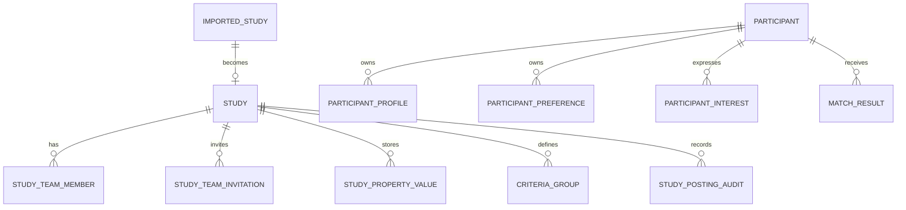

# Relationship Model

The data model is centered on the operational `STUDY` record.

Imported governance data, study-team membership, participant activity, recruitment, and audits all hang off that study-centric core.

## Core relationships

The diagram is conceptual. Exact physical table names and foreign-key details must be confirmed from implementation.

## Imported-to-operational flow

An imported study becomes the basis for an operational study posting.

That operational posting then connects to:

- Creator and PI memberships
- Study-property values
- Eligibility criteria
- Audit records

## Participant-side relationships

A participant typically owns:

- Profile values used by matching
- Study-interest preferences
- Expressions of interest

Those relationships influence visibility and matching but do not change the imported source data.

## Recruitment relationships

Eligibility criteria and study-property values are read by the matching engine.

The system may store calculated match results separately from the source entities that produced them.

This separation allows the application to:

- Recompute matches asynchronously
- Preserve historical interests
- Distinguish current visibility from underlying source data

## Audit relationships

Audit records capture workflow activity rather than the business data itself.

They are useful for answering questions such as:

- Who created or modified a study posting?
- How long did authoring take?
- Was AI assistance used?
- Which suggestions were selected?

## Related pages

- [Data Model Overview](index.md)
- [Study Property Model](study-property-model.md)
- [Criteria Data Model](criteria-data-model.md)
- [AI-Assisted Study Posting Authoring](../05-study-management/ai-assisted-posting-authoring.md)
- [Matching and Visibility](../06-recruitment/matching-and-visibility.md)
