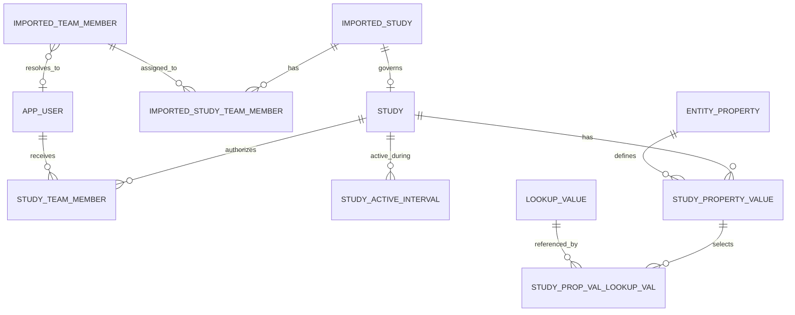
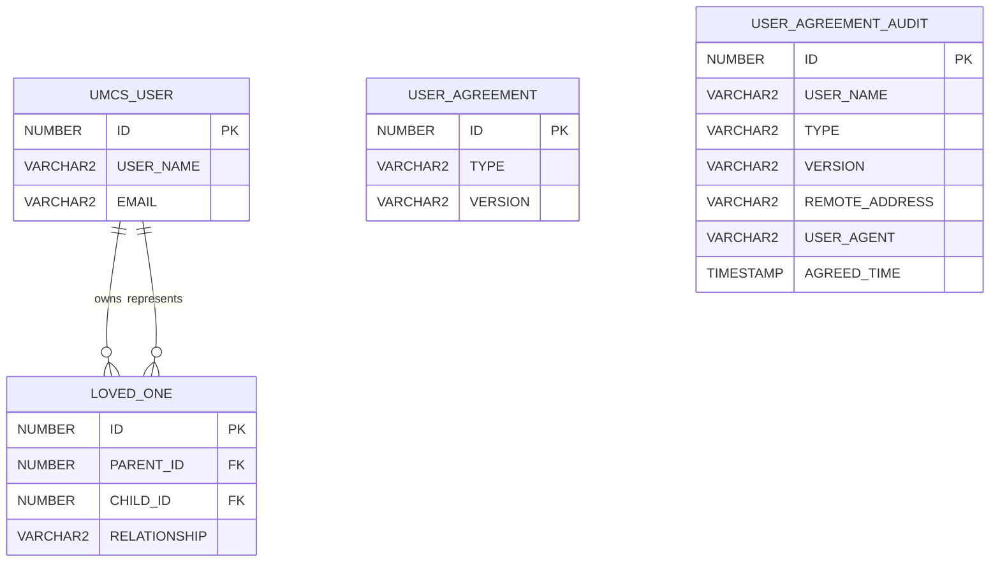
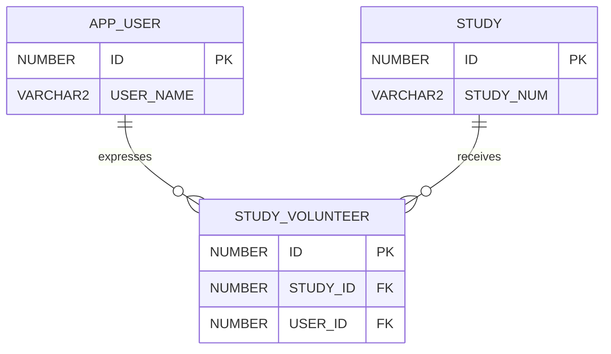
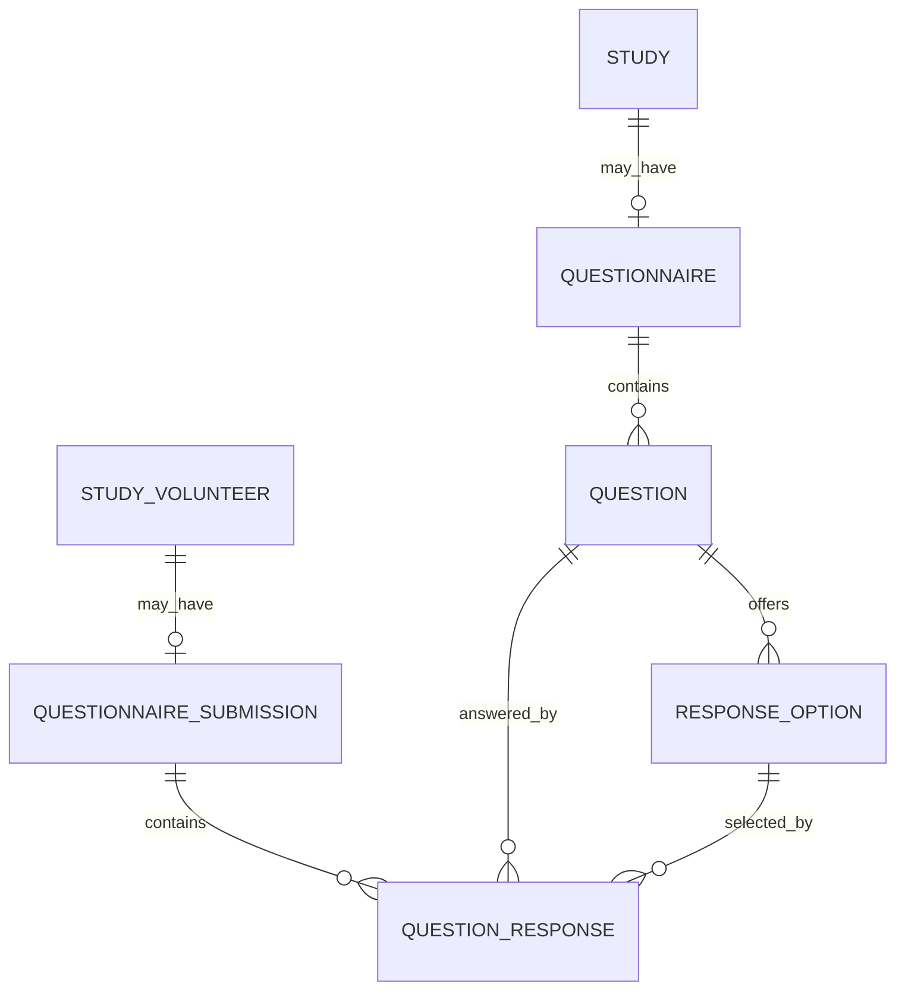
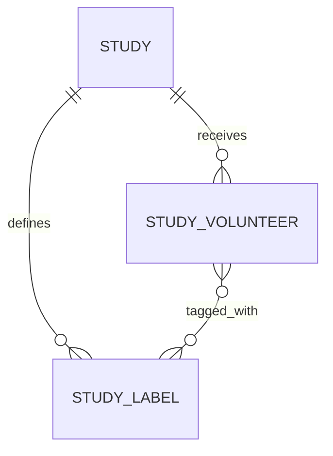
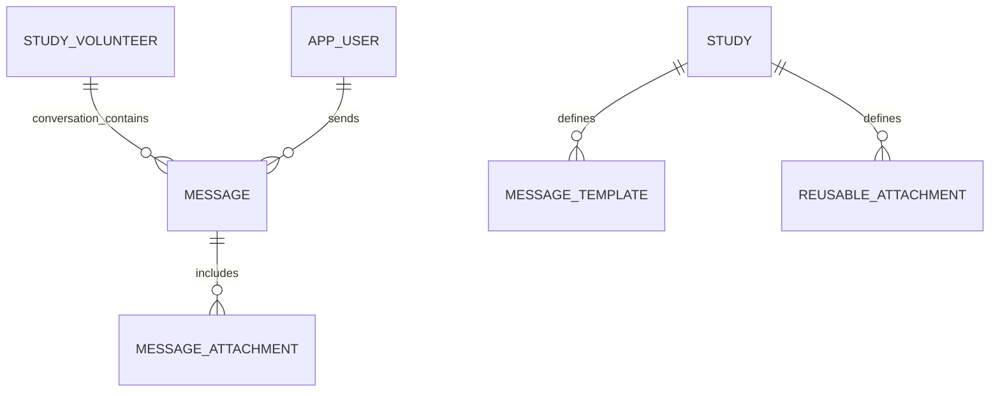
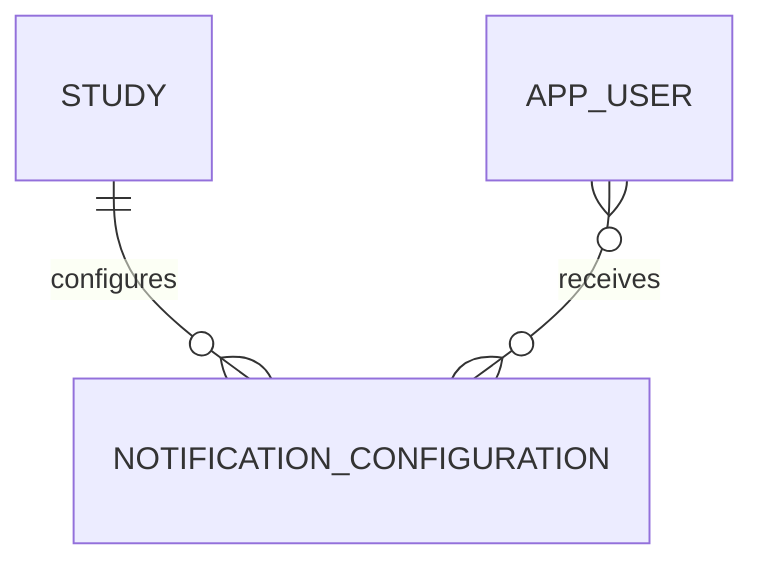
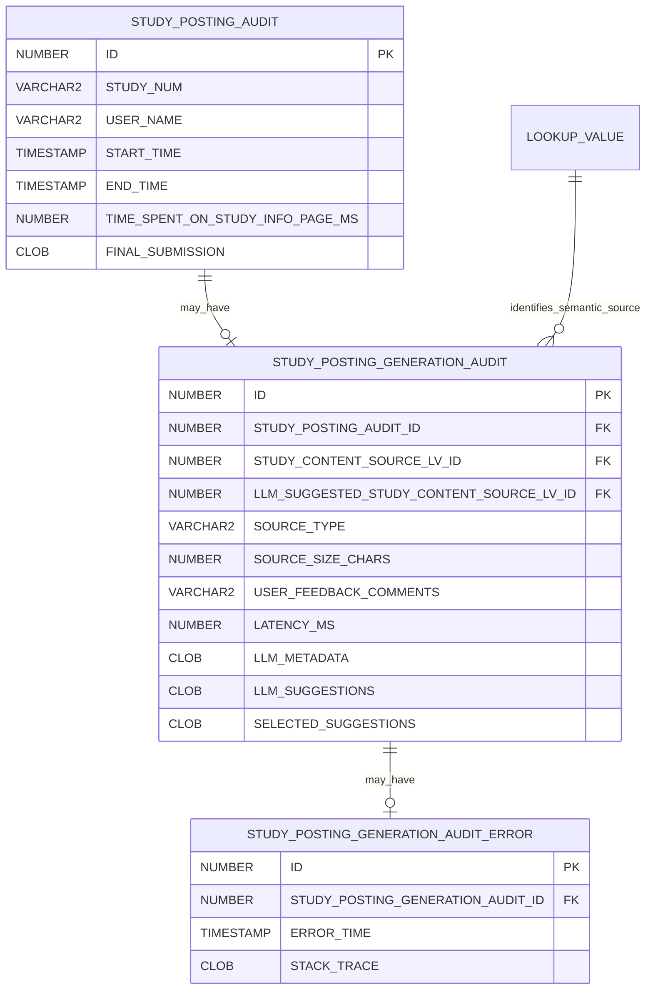
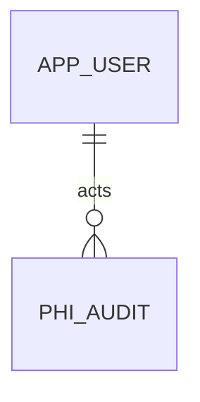

# Relationship Model

This page provides a high-level map across the application's data domains.

It intentionally avoids repeating field-level definitions maintained by specialized schema pages.

## Interpretation

The diagrams distinguish:

- Confirmed physical entities and relationships
- Application-managed polymorphic relationships
- Conceptual entities whose exact physical table names are not yet documented
- Redis data stored outside the relational database

## Imported governance and operational studies



Imported governance data determines:

- Whether an institutional study exists
- Whether a posting may be created
- Whether the study is publishable
- Who the current institutional PI is

Operational study data stores:

- Posting lifecycle dates
- Study membership
- Participant-facing properties
- Eligibility criteria
- Recruitment relationships
- Active-period history

## Institutional authentication and application users

An institutional user may authenticate through SAML before an `APP_USER` exists.

A successful login without a corresponding application user may be represented by:

```text
LOGIN_AUDIT.USER_NAME = authenticated institutional username
LOGIN_AUDIT.USER_ID = 0
```

`LOGIN_AUDIT.USER_ID = 0` does not identify an `APP_USER` row.

When a first-time institutional author successfully creates a study posting:

1. The application creates the author's `APP_USER`.
2. The application creates the operational study.
3. The application creates the creator's study membership.
4. A non-PI creator receives `STUDY_TEAM_MEMBER`.
5. A creator who is the current imported PI receives `PRINCIPAL_INVESTIGATOR`.

Current existence in `APP_USER` must not be interpreted as proof that the application user existed when an earlier posting attempt began.

See:

- [Institutional Users](../04-users-and-access/institutional-users.md)
- [Study Posting Creation](../05-study-management/posting-creation.md)
- [Study Posting Authoring Analysis Dataset](../08-operations/study-posting-authoring-analysis-dataset.md)

## Criteria relationships

```mermaid
erDiagram
    STUDY ||--o{ STUDY_ELIGIBILITY_CRITERION : defines

    STUDY_ELIGIBILITY_CRITERION -.-> CRITERION_CLAUSE : application_parent
    FIND_STUDIES_CRITERION -.-> CRITERION_CLAUSE : application_parent

    CRITERION_CLAUSE ||--o{ CRITERION_CLAUSE_EXPRESSION : contains
    CRITERION_VARIABLE ||--o{ CRITERION_CLAUSE_EXPRESSION : classifies

    CRITERION_CLAUSE_EXPRESSION ||--o{ CRIT_CLAUSE_EXPRESSION_VALUE : has
    CRIT_CLAUSE_EXPRESSION_VALUE ||--o{ EXPRESSION_VALUE_LOOKUP_VALUE : selects
    LOOKUP_VALUE ||--o{ EXPRESSION_VALUE_LOOKUP_VALUE : referenced_by
```

The dotted relationships are application-managed because:

```text
CRITERION_CLAUSE.CRITERION_ID
```

may refer to either:

```text
STUDY_ELIGIBILITY_CRITERION.ID
```

or:

```text
FIND_STUDIES_CRITERION.ID
```

One ordinary relational foreign key cannot reference both root tables.

The criterion-root type must therefore be known when interpreting or querying a clause.

For eligibility analysis, queries must begin from:

```text
STUDY_ELIGIBILITY_CRITERION
```

This prevents participant study-interest criteria from being mixed into study eligibility results.

## Participant ownership and consent



`LOVED_ONE` links:

- An owning participant account
- A represented loved-one participant account

Both records are participant user records.

Consent audit records are logically associated with consent definitions through:

```text
TYPE
VERSION
```

and with participant identities through:

```text
USER_NAME
```

The documentation does not assert an undeclared physical foreign key between `USER_AGREEMENT` and `USER_AGREEMENT_AUDIT`.

See [Participant Account and Consent Model](participant-account-consent-model.md).

## Expression of interest



A successful show-interest transaction creates one `STUDY_VOLUNTEER` relationship for the participant-study pair.

The relationship supports:

- Interested-participant profile access
- Workflow-list membership
- Screening-questionnaire responses
- Labels
- Messaging
- Export

The exact additional physical columns on `STUDY_VOLUNTEER` must be documented from the implemented schema.

## Questionnaire relationships

The following model is conceptual until the exact physical questionnaire table names and columns are documented.



Confirmed cardinality and behavior include:

- A study may have zero or one screening questionnaire.
- A questionnaire may contain multiple questions.
- A question may contain response options when required by its type.
- One participant may submit the questionnaire once for one study-interest relationship.
- Questionnaire answers are associated with the interested participant.
- Deleting a response option deletes answers selecting that option.
- Deleting a question deletes answers associated with that question.

Exact physical names must not be inferred from the conceptual diagram.

## Workflow lists and labels

The following label entities are conceptual until physical table names are verified.



Confirmed behavior includes:

- One `STUDY_VOLUNTEER` belongs to one fixed workflow list at a time.
- Fixed workflow lists are:
  - `NEW`
  - `ELIGIBLE`
  - `INELIGIBLE`
  - `PENDING`
- `ALL` is an aggregate view rather than a stored list membership.
- One interested participant may have multiple labels.
- Labels are scoped to a study.
- Deleting a label removes its participant assignments.

The exact workflow-list field and label tables must be verified from the physical schema.

## Messaging relationships

The following messaging entities are conceptual until their physical table names are documented.



Confirmed functional relationships include:

- Messaging is available only for an interested participant.
- A study team member initiates the conversation.
- The participant may reply after study-team initiation.
- The conversation is shared by all study members.
- Messages identify sender, recipient relationship, study, and timestamp.
- Templates are study-specific.
- Reusable attachments are study-specific.
- Attachments are stored by the application.

The exact physical table names and columns must be verified before using them in SQL.

## Notification relationships

The following notification entity is conceptual until the physical schema is documented.



Notification configuration is logically scoped to:

```text
Study
+ Event
+ Shared frequency
+ Selected recipients
```

Recipients may include:

- Accepted study members
- External email addresses

The exact physical representation of event frequency, recipients, and external addresses remains to be documented.

## Study-posting authoring audit



The confirmed cardinality is:

```text
One STUDY_POSTING_AUDIT
→ zero or one STUDY_POSTING_GENERATION_AUDIT

One STUDY_POSTING_GENERATION_AUDIT
→ zero or one STUDY_POSTING_GENERATION_AUDIT_ERROR
```

A manual posting attempt has no generation row.

An AI-assisted attempt has one generation row.

If AI generation fails:

- One generation-error row is created.
- The Study Information page is displayed without suggestions.
- The user may continue authoring manually in the same posting attempt.
- The posting attempt may still complete successfully.

Returning to Add Study and trying again creates a new posting-attempt audit row.

Study Information submission captures, for an AI-assisted attempt:

- Selected suggestions
- Optional feedback
- Study Information page duration

The authoring-audit value chain is:

```text
STUDY_POSTING_GENERATION_AUDIT.LLM_SUGGESTIONS
→ STUDY_POSTING_GENERATION_AUDIT.SELECTED_SUGGESTIONS
→ STUDY_POSTING_AUDIT.FINAL_SUBMISSION
```

The operational study is created only after successful final eligibility submission.

A current join from a posting attempt to an operational study with the same `study_num` does not by itself prove that the attempt created the study. An earlier incomplete attempt may join to a study created by a later successful attempt.

See:

- [Study Posting Creation](../05-study-management/posting-creation.md)
- [AI-Assisted Study Posting Authoring](../05-study-management/ai-assisted-posting-authoring.md)
- [Study-Posting Authoring Audit Model](study-posting-authoring-audit-model.md)
- [Study Posting Authoring Analysis Dataset](../08-operations/study-posting-authoring-analysis-dataset.md)

## PHI audit



`PHI_AUDIT` records participant-data access, including:

- Administrator participant searches
- Matched-participant list views
- Interested-participant list views
- Matched-participant profile views
- Interested-participant profile views
- Supported administrator actions

A list-view event may identify multiple participant IDs in one target value.

See [PHI Audit](../08-operations/phi-audit.md).

## Redis recommendation data

Current recommendations and directional exclusions are stored in Redis rather than in the relational model.

Key families are:

```text
vol.rec:<APP_USER.ID>:<MATCH_SOURCE>
std.rec:<STUDY.ID>:<MATCH_RESULT>
std.exc:<STUDY.ID>
vol.exc:<APP_USER.ID>
```

See [Redis Match and Exclusion Model](redis-match-model.md).

## Generated exports

Participant-data exports are generated in memory and streamed to the browser.

They are not represented as:

- Relational export-job entities
- Retained server-side files
- Dedicated export audit records

## Conceptual entity warning

The following names are conceptual unless a specialized page documents their physical schema:

```text
QUESTIONNAIRE
QUESTION
RESPONSE_OPTION
QUESTIONNAIRE_SUBMISSION
QUESTION_RESPONSE
STUDY_LABEL
MESSAGE
MESSAGE_ATTACHMENT
MESSAGE_TEMPLATE
REUSABLE_ATTACHMENT
NOTIFICATION_CONFIGURATION
```

Do not use conceptual names in production SQL without confirming their implemented table names.

## Canonical detail pages

- [Imported Schema](imported-schema.md)
- [Operational Schema](operational-schema.md)
- [Participant Account and Consent Model](participant-account-consent-model.md)
- [Study Property Model](study-property-model.md)
- [Criteria Data Model](criteria-data-model.md)
- [Redis Match and Exclusion Model](redis-match-model.md)
- [Recruitment Operations Model](recruitment-operations-model.md)
- [Study-Posting Authoring Audit Model](study-posting-authoring-audit-model.md)
- [PHI Audit](../08-operations/phi-audit.md)
