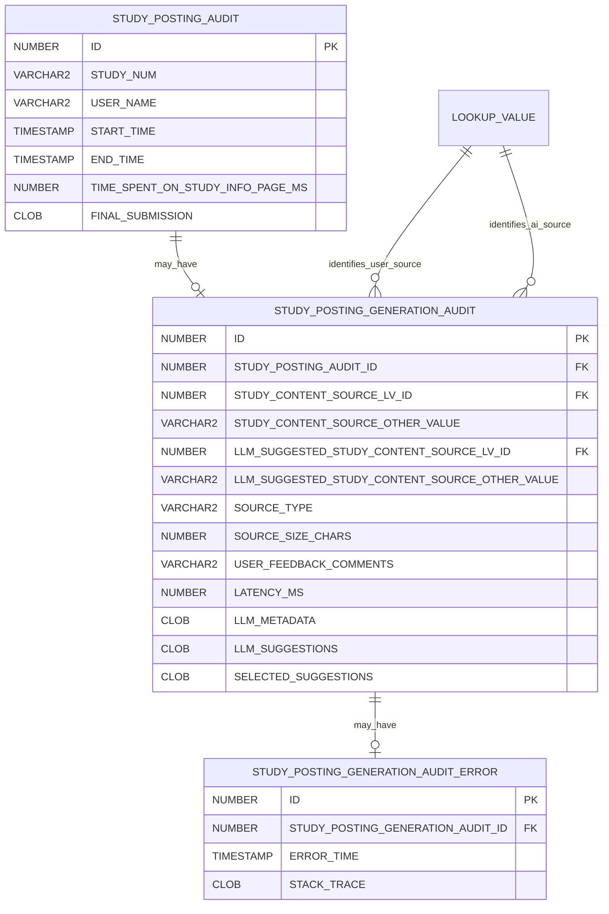

# Study-Posting Authoring Audit Model

The application records study-posting attempts separately from optional AI-generation activity.

## Model overview



## Confirmed cardinality

For one posting attempt:

```text
STUDY_POSTING_AUDIT
→ zero or one STUDY_POSTING_GENERATION_AUDIT
→ zero or one STUDY_POSTING_GENERATION_AUDIT_ERROR
```

A manual attempt has no generation row.

An AI-assisted attempt has one generation row.

A failed generation has one associated error row.

Returning to Add Study and trying again creates a new `STUDY_POSTING_AUDIT`.

It does not create another generation row for the original posting attempt.

Analytical queries should join these tables directly.

They should not use row ranking to select one generation or error row because duplicate rows would
represent a violated data invariant rather than normal workflow behavior.

## `APPLICATION_SETTING`

`APPLICATION_SETTING` contains configurable application behavior, including the AI prompt.

| Column        | Type       | Meaning              |
| ------------- | ---------- | -------------------- |
| `ID`          | `NUMBER`   | Setting identifier   |
| `NAME`        | `VARCHAR2` | Unique setting name  |
| `GROUP_NAME`  | `VARCHAR2` | UI grouping          |
| `DESCRIPTION` | `VARCHAR2` | Behavior description |
| `VALUE_TYPE`  | `VARCHAR2` | Validation type      |
| `VALUE`       | `CLOB`     | Setting value        |

The prompt used for Study Information generation is stored in this table.

The prompt may change in response to product requirements.

Prompt changes can affect:

- Requested suggestion counts
- Suggestion structure
- Wording
- Lookup recommendations
- Compensation behavior
- Semantic-source inference

If the prompt version is not copied to each generation row, an analysis may need application-setting
history, deployment history, or another timestamped source to identify the prompt in effect.

## Prompt-requested versus observed output

The configured prompt may request a specific number of alternatives for a field.

A requested cardinality is not a persisted database constraint.

The following must remain distinct:

```text
Prompt-requested suggestion count
AI-returned suggestion count
Successfully parsed suggestion count
Stored suggestion count
Displayed suggestion count
User-selected suggestion count
```

Analytical code must count the actual JSON arrays stored in `LLM_SUGGESTIONS`.

It must not assume that every generation row contains exactly the number requested by the prompt.

A difference between requested and stored cardinality does not by itself establish whether the cause
was:

- AI-service behavior
- Prompt changes
- Parsing
- Validation
- Filtering
- An application defect

## `STUDY_POSTING_AUDIT`

One row represents one attempt to create a study posting.

| Column                             | Type           | Meaning                                    |
| ---------------------------------- | -------------- | ------------------------------------------ |
| `ID`                               | `NUMBER`       | Attempt identifier                         |
| `STUDY_NUM`                        | `VARCHAR2`     | Institutional study number                 |
| `USER_NAME`                        | `VARCHAR2`     | Authenticated posting author               |
| `START_TIME`                       | `TIMESTAMP(6)` | Attempt start                              |
| `END_TIME`                         | `TIMESTAMP(6)` | Successful final submission time           |
| `TIME_SPENT_ON_STUDY_INFO_PAGE_MS` | `NUMBER`       | Client-reported Study Information duration |
| `FINAL_SUBMISSION`                 | `CLOB`         | Final submitted Study Information JSON     |

A posting attempt may exist even when the posting is never completed.

`END_TIME IS NULL` identifies an incomplete attempt unless another confirmed rule explains the row.

The posting-attempt username may exist before an `APP_USER` exists because an institutional user can
authenticate through SAML before receiving an application user.

A successful posting creation by a first-time institutional author creates or reuses the creator's
`APP_USER` and creates the creator's study membership.

## `STUDY_POSTING_GENERATION_AUDIT`

One row records optional AI generation associated with a posting attempt.

| Column                                           | Type       | Meaning                                     |
| ------------------------------------------------ | ---------- | ------------------------------------------- |
| `ID`                                             | `NUMBER`   | Generation identifier                       |
| `STUDY_POSTING_AUDIT_ID`                         | `NUMBER`   | Parent posting attempt                      |
| `STUDY_CONTENT_SOURCE_LV_ID`                     | `NUMBER`   | User-selected semantic source lookup        |
| `STUDY_CONTENT_SOURCE_OTHER_VALUE`               | `VARCHAR2` | User-entered Other source                   |
| `LLM_SUGGESTED_STUDY_CONTENT_SOURCE_LV_ID`       | `NUMBER`   | AI-inferred semantic source lookup          |
| `LLM_SUGGESTED_STUDY_CONTENT_SOURCE_OTHER_VALUE` | `VARCHAR2` | AI-inferred Other source text               |
| `SOURCE_TYPE`                                    | `VARCHAR2` | Input method                                |
| `SOURCE_SIZE_CHARS`                              | `NUMBER`   | Prompt-context character count              |
| `USER_FEEDBACK_COMMENTS`                         | `VARCHAR2` | Optional user feedback                      |
| `LATENCY_MS`                                     | `NUMBER`   | AI request latency                          |
| `LLM_METADATA`                                   | `CLOB`     | Raw response metadata excluding suggestions |
| `LLM_SUGGESTIONS`                                | `CLOB`     | Generated suggestions JSON                  |
| `SELECTED_SUGGESTIONS`                           | `CLOB`     | Suggestions selected by the user            |

The generation row is created during the AI suggestion request before the Study Information page is
displayed.

When generation succeeds, it stores the returned suggestions and response metadata.

When generation fails, it remains associated with one generation-error row.

## Source-input types

Current production values are:

```text
PDF_FILE
DOCX_FILE
RAW_TXT
```

| Value       | Meaning                                               |
| ----------- | ----------------------------------------------------- |
| `PDF_FILE`  | Source content originated from a PDF upload           |
| `DOCX_FILE` | Source content originated from a Word document upload |
| `RAW_TXT`   | Source content was supplied to generation as raw text |

The source-input type describes how content was supplied to generation.

It is separate from semantic source type, such as:

```text
Study Protocol
Informed Consent
Other
```

## Semantic source comparison

User-selected source:

```text
STUDY_CONTENT_SOURCE_LV_ID
STUDY_CONTENT_SOURCE_OTHER_VALUE
```

AI-inferred source:

```text
LLM_SUGGESTED_STUDY_CONTENT_SOURCE_LV_ID
LLM_SUGGESTED_STUDY_CONTENT_SOURCE_OTHER_VALUE
```

Both lookup identifiers join to `LOOKUP_VALUE`.

Recommended analytical classifications include:

```text
MATCH
MISMATCH
USER_OTHER
AI_OTHER
MISSING
```

The user's selection must not automatically be treated as ground truth without validation.

## Suggestions, feedback, and final values

The analysis chain is:

```text
LLM_SUGGESTIONS
→ SELECTED_SUGGESTIONS
→ FINAL_SUBMISSION
```

The lifecycle is:

1. Generation stores `LLM_SUGGESTIONS`.
1. The Study Information page displays suggestions.
1. The user selects, ignores, or edits suggested values.
1. Study Information submission stores:
   - `SELECTED_SUGGESTIONS`
   - Optional `USER_FEEDBACK_COMMENTS`
1. Final eligibility submission stores the authoritative final Study Information values in
   `STUDY_POSTING_AUDIT.FINAL_SUBMISSION`.

Possible analytical outcomes include:

```text
Generated but not selected
Selected and retained unchanged
Selected and edited
Final value matches another unselected suggestion
Final value differs from all suggestions
Manually populated without a suggestion
```

These are analytical classifications rather than persisted application statuses.

## Selected-suggestion timing

Selected suggestions are captured when the Study Information form is submitted.

They are not inferred later from `FINAL_SUBMISSION`.

Selection and final value can differ because the user may edit a field after selecting a suggestion.

## Final-submission ownership

Final values are stored in:

```text
STUDY_POSTING_AUDIT.FINAL_SUBMISSION
```

They are not stored in `STUDY_POSTING_GENERATION_AUDIT`.

The comparison chain is therefore:

```text
STUDY_POSTING_GENERATION_AUDIT.LLM_SUGGESTIONS
STUDY_POSTING_GENERATION_AUDIT.SELECTED_SUGGESTIONS
STUDY_POSTING_AUDIT.FINAL_SUBMISSION
```

## `STUDY_POSTING_GENERATION_AUDIT_ERROR`

This table records AI-generation errors.

| Column                              | Type           | Meaning              |
| ----------------------------------- | -------------- | -------------------- |
| `ID`                                | `NUMBER`       | Error identifier     |
| `STUDY_POSTING_GENERATION_AUDIT_ID` | `NUMBER`       | Generation attempt   |
| `ERROR_TIME`                        | `TIMESTAMP(6)` | Error time           |
| `STACK_TRACE`                       | `CLOB`         | Captured stack trace |

When generation fails:

- One error row is associated with the generation row.
- The Study Information page is displayed without suggestions.
- The user sees an error message.
- The user may continue manual Study Information authoring within the same attempt.
- The attempt may still complete successfully.

A new AI attempt requires returning to Add Study, which creates a new posting-attempt row.

## Attempt classification guidance

AI/manual classification should use generation-row existence:

```text
No generation row → MANUAL
Generation row    → AI
```

Do not classify an attempt as manual only because `SOURCE_TYPE` is null.

Generation and completion should be represented by separate facts:

```text
ai_requested_flag
generation_success_flag
generation_error_flag
attempt_completed_flag
study_created_flag
```

A generation error does not imply that the posting attempt was abandoned.

For example:

```text
generation_error_flag = 1
attempt_completed_flag = 1
```

means that AI generation failed but the user later completed the posting attempt manually.

`LATENCY_MS = 0` must not be treated as definitive proof of an AI error unless that rule is
separately validated.

## First-time institutional-user implication

A current join from historical posting attempts to `APP_USER` is not a historical existence test.

Once a user successfully creates a posting or otherwise receives an `APP_USER`, later extracts find
that user for earlier attempts.

A current-state field may be labeled:

```text
current_app_user_exists
```

It must not be labeled:

```text
app_user_existed_at_attempt_start
```

without effective-time evidence.

## Cardinality validation

The following validation should return no rows:

```sql
SELECT
    study_posting_audit_id,
    COUNT(*) AS generation_count
FROM study_posting_generation_audit
GROUP BY study_posting_audit_id
HAVING COUNT(*) > 1;
```

The following validation should also return no rows:

```sql
SELECT
    study_posting_generation_audit_id,
    COUNT(*) AS error_count
FROM study_posting_generation_audit_error
GROUP BY study_posting_generation_audit_id
HAVING COUNT(*) > 1;
```

A returned row represents a violated data invariant.

The analytical query should not silently resolve such a violation with `ROW_NUMBER()`.

## Sensitive-data considerations

Audit and analytical extracts may contain:

- Staff usernames
- Study numbers
- Public and nonpublic posting text
- Contact names
- Contact email addresses
- Contact phone numbers
- URLs
- AI metadata
- Stack traces
- HR appointment data

Publication datasets should be deidentified or aggregated.

Raw stack traces, contact information, user identifiers, and nonpublic study text should not appear
in publications.

## Related pages

- [AI-Assisted Study Posting Authoring](../05-study-management/ai-assisted-posting-authoring.md)
- [Study Posting Creation](../05-study-management/posting-creation.md)
- [Institutional Users](../04-users-and-access/institutional-users.md)
- [Study Posting Authoring Telemetry](../08-operations/study-posting-authoring-telemetry.md)
- [Study Posting Authoring Analysis Dataset](../08-operations/study-posting-authoring-analysis-dataset.md)
- [AI-Assisted Study Posting Authoring Effectiveness](../08-operations/ai-assisted-study-posting-authoring-effectiveness.md)
- [Study Posting Authoring and Analytics Open Questions](../09-decisions/study-posting-authoring-analytics-open-questions.md)
