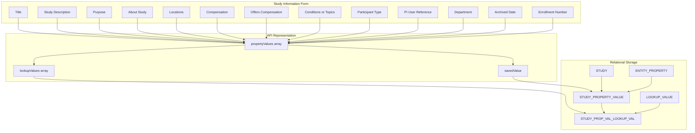
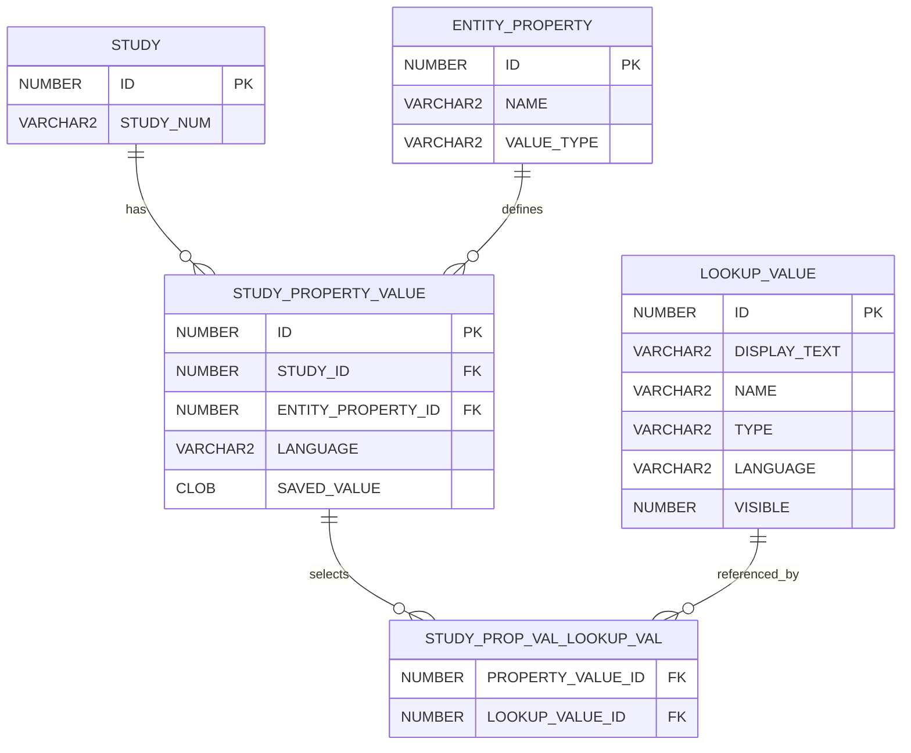

# Study Property Model

The Study Information form uses a generic property-value model.

This model provides the final saved values that can be compared with:

- LLM suggestions
- User-selected suggestions
- Audit records

## Core entities

| Entity | Purpose |
|---|---|
| `STUDY` | Root operational study posting |
| `ENTITY_PROPERTY` | Defines a supported study property |
| `STUDY_PROPERTY_VALUE` | Stores one study's value for one property |
| `STUDY_PROP_VAL_LOOKUP_VAL` | Connects a property value to selected lookup values |
| `LOOKUP_VALUE` | Defines selectable vocabulary values |

## UI-to-database mapping



## `ENTITY_PROPERTY`

`ENTITY_PROPERTY` identifies a supported property.

Relevant fields include:

```text
ID
NAME
VALUE_TYPE
```

Possible value types include:

```text
STRING
DATE
LOOKUP
```

Examples of property names include:

```text
title
studyDescription
purpose
aboutStudy
locations
conditions
offersCompensation
participantType
department
```

The actual property names should be obtained from application reference data.

## Scalar property values

Scalar fields are stored in:

```text
STUDY_PROPERTY_VALUE.SAVED_VALUE
```

Examples include:

- Title
- Study description
- Purpose
- About the study
- Compensation text
- Enrollment number
- Dates
- PI user identifier, when represented as a scalar property

## Lookup property values

Lookup selections are stored through:

```text
STUDY_PROP_VAL_LOOKUP_VAL
```

This table associates a `STUDY_PROPERTY_VALUE` with one or more `LOOKUP_VALUE` rows.

Examples include:

- Locations
- Conditions or topics
- Participant type
- Offers compensation
- Department

## Scalar-versus-lookup invariant

For one logical study property value, the current model expects either:

- A scalar `saved_value`, or
- One or more associated lookup values

It is an application-data error for the same property-value record to contain both:

- A non-null `saved_value`
- Associated lookup selections

Analytics should validate this invariant before comparing final values with AI suggestions.

## Common storage patterns

| Property kind | Storage pattern |
|---|---|
| Text | `saved_value` |
| Long text | `saved_value` |
| Date | `saved_value` |
| Single lookup | One lookup join |
| Multiple lookup | Multiple lookup joins |
| Boolean | Lookup value such as `TRUE` or `FALSE` |

## Example lookup types

Possible lookup types include:

```text
STUDY_LOCATION
MEDICAL_CONDITION
BOOLEAN
STUDY_DEPARTMENT
PARTICIPANT_TYPE
```

The values should be verified against deployment reference data.

## Conceptual relationships



## AI-assisted comparison

For AI-effectiveness analysis, compare values at the normalized property level.

### Scalar normalization

Possible normalization includes:

- Trimming whitespace
- Normalizing line endings
- Normalizing dates
- Preserving original text for audit
- Measuring exact and semantic similarity separately

### Lookup normalization

Lookup comparisons should use stable lookup identifiers instead of display text when possible.

Possible measures include:

- Exact set equality
- Suggestion-to-final overlap
- Added values
- Removed values
- Selected suggestion retained unchanged
- Selected suggestion edited before save

## Proposed comparison categories

The following are proposed analytical categories, not current database statuses:

```text
SUGGESTION_NOT_GENERATED
SUGGESTION_GENERATED_NOT_SELECTED
SUGGESTION_SELECTED_UNCHANGED
SUGGESTION_SELECTED_THEN_EDITED
FINAL_VALUE_MATCHES_UNSELECTED_SUGGESTION
FINAL_VALUE_DIFFERS_FROM_ALL_SUGGESTIONS
```

## Query examples

Tested Oracle SQL for reconstructing one logical row per study property is documented in [Study Property Query Cookbook](study-property-query-cookbook.md).

The cookbook includes:

- Scalar and lookup property extraction
- Lookup aggregation
- Storage-shape classification
- Scalar-versus-lookup validation
- Property-specific queries
- AI-suggestion comparison guidance

## Related pages

- [AI-Assisted Study Posting Authoring](../05-study-management/ai-assisted-posting-authoring.md)
- [Operational Schema](operational-schema.md)
- [AI-Assisted Study Posting Authoring Effectiveness](../08-operations/ai-assisted-study-posting-authoring-effectiveness.md)
- [Study Property Query Cookbook](study-property-query-cookbook.md)
- [Criterion Variable Reference](criterion-variable-reference.md)
