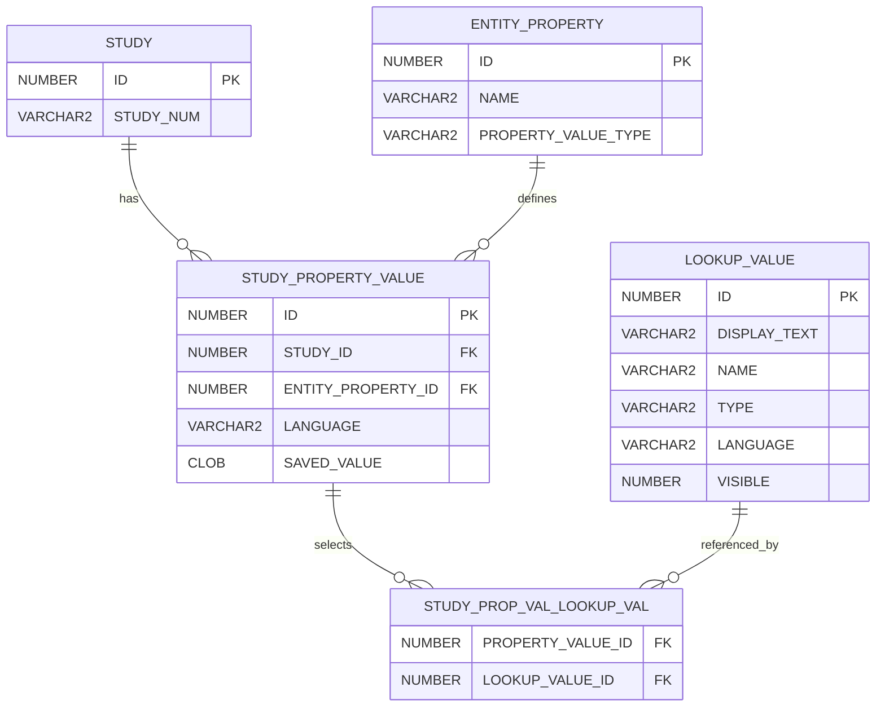

# Study Property Model

Study-level values use a flexible property-value model.

## Core entities

| Entity                      | Purpose                                             |
| --------------------------- | --------------------------------------------------- |
| `STUDY`                     | Root operational study posting                      |
| `ENTITY_PROPERTY`           | Defines a supported study property                  |
| `STUDY_PROPERTY_VALUE`      | Stores one study's value for one property           |
| `STUDY_PROP_VAL_LOOKUP_VAL` | Connects a property value to selected lookup values |
| `LOOKUP_VALUE`              | Defines controlled vocabulary values                |

## Storage hierarchy



## Property definitions

`ENTITY_PROPERTY` identifies a supported study property.

Relevant values include:

```text
ID
NAME
PROPERTY_VALUE_TYPE
```

Value types include:

```text
STRING
DATE
LOOKUP
```

## Scalar properties

Scalar values are stored in:

```text
STUDY_PROPERTY_VALUE.SAVED_VALUE
```

Examples include:

- Title
- Purpose
- What is involved
- Additional information
- Compensation text
- Contact information
- Enrollment number
- Dates

## Lookup properties

Lookup-backed values are stored through:

```text
STUDY_PROP_VAL_LOOKUP_VAL
```

Examples include:

- Topics and conditions
- Locations
- Offers compensation
- Department
- Participant type

## Scalar-versus-lookup invariant

One logical property-value record uses either:

- A non-null scalar `SAVED_VALUE`
- One or more lookup relationships

It is an application-data error for one property-value record to contain both.

## Study Information mapping

The Study Information workflow uses properties such as:

- Title
- Topics or conditions
- Purpose
- What is involved
- Locations
- Compensation
- PI display
- Department
- Study contact
- Additional information

See [Study Information Authoring](../05-study-management/study-information-authoring.md).

## Properties authored outside Study Information

Some values use the same property model but are authored in other workflows.

### Participant type

Participant type is selected during eligibility authoring and stored as a study property.

Values may include:

```text
HEALTHY
CONDITION
```

Both values may be selected.

### Archived date

Archive and unarchive operations manage the archived-date property.

### Enrollment number

Manual deactivation may capture total enrollment through a study property.

## AI comparison ownership

The persisted study-property rows represent operational study data.

AI telemetry comparison uses:

```text
STUDY_POSTING_GENERATION_AUDIT.LLM_SUGGESTIONS
STUDY_POSTING_GENERATION_AUDIT.SELECTED_SUGGESTIONS
STUDY_POSTING_AUDIT.FINAL_SUBMISSION
```

The authoritative final-submission comparison is documented in
[Study-Posting Authoring Audit Model](study-posting-authoring-audit-model.md).

## Query examples

See [Study Property Query Cookbook](study-property-query-cookbook.md) for:

- One-row-per-property extraction
- Lookup aggregation
- Storage-shape validation
- Property-specific querying

## Related pages

- [Study Information Authoring](../05-study-management/study-information-authoring.md)
- [Study Property Query Cookbook](study-property-query-cookbook.md)
- [Study-Posting Authoring Audit Model](study-posting-authoring-audit-model.md)
- [Study Lifecycle](../05-study-management/study-lifecycle.md)
- [Study Archiving](../05-study-management/study-archiving.md)
