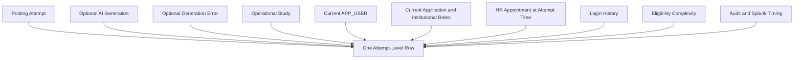

# Study Posting Authoring Analysis Dataset

The recommended analytical grain is:

```text
One row per STUDY_POSTING_AUDIT attempt
```

This preserves:

- Repeated attempts for one study
- User abandonment
- AI errors
- AI retries
- Manual retries
- Attempts by different users for the same study
- Later successful creation after earlier failed attempts

## Dataset domains



## Confirmed authoring-audit cardinality

For each posting attempt:

```text
STUDY_POSTING_AUDIT
→ zero or one STUDY_POSTING_GENERATION_AUDIT
→ zero or one STUDY_POSTING_GENERATION_AUDIT_ERROR
```

A manual attempt has no generation row.

An AI-assisted attempt has one generation row.

A failed generation has one associated error row.

If a user returns to Add Study and tries again, the application creates a new `STUDY_POSTING_AUDIT`.

The analytical query should join the generation and error tables directly.

It should not use `ROW_NUMBER()` to choose one generation or error row because duplicate rows would represent a violated application invariant.

## Attempt identity

Recommended fields include:

```text
study_posting_audit_id
study_num
author_user_name
start_time
end_time
attempt_number_for_study
attempt_number_for_user_study
previous_attempt_id
next_attempt_id
```

## First-time institutional-user behavior

An institutional user may authenticate through SAML before an `APP_USER` exists.

When no `APP_USER` exists, a successful login may be recorded with:

```text
LOGIN_AUDIT.USER_NAME = authenticated username
LOGIN_AUDIT.USER_ID = 0
```

`USER_ID = 0` does not identify an `APP_USER` row.

When a first-time institutional author successfully creates a posting:

1. The application creates the author's `APP_USER`.
2. The application creates the operational study.
3. The application creates the creator's study membership.
4. A non-PI creator receives `STUDY_TEAM_MEMBER`.
5. A creator who is the current imported PI receives `PRINCIPAL_INVESTIGATOR`.

An abandoned or failed attempt does not by itself prove that an `APP_USER` was created.

## `USER_TYPE` as a current-state sanity check

The analytical report may include a `USER_TYPE` field indicating whether the attempt username currently appears in `APP_USER`.

The correct current-state derivation is:

```sql
CASE
    WHEN current_app_user.id IS NULL THEN 'NON_EXISTENT'
    ELSE 'EXISTED'
END
```

The join must be directly from:

```text
STUDY_POSTING_AUDIT.USER_NAME
```

to:

```text
APP_USER.USER_NAME
```

It must not depend on membership in the attempted study.

| Value | Meaning at report execution |
|---|---|
| `EXISTED` | The username currently has an `APP_USER` |
| `NON_EXISTENT` | The username currently has no matching `APP_USER` |

This field is only a current-state sanity check.

It is not historically stable.

Example:

1. A new user makes two unsuccessful attempts.
2. No `APP_USER` exists.
3. A report executed at that time returns `NON_EXISTENT`.
4. The same user later successfully creates a study.
5. The application creates the user's `APP_USER`.
6. A later report returns `EXISTED` for all earlier attempts by that username.

The field must not be interpreted as:

```text
APP_USER existed at attempt start
```

It must not be used as a stable first-time-user predictor in longitudinal models.

## Sanity checks involving `USER_TYPE`

The following combination should be investigated:

```text
attempt_completed_flag = 1
AND attempt_created_study_flag = 1
AND USER_TYPE = NON_EXISTENT
```

A successful creator should have an `APP_USER` after successful creation.

Possible explanations include:

- Incorrect username normalization
- Incorrect study-attribution logic
- Delayed or failed application-user persistence
- Extract timing during an incomplete transaction
- Data corruption
- An unsupported backend path

The report must not automatically assign one of those explanations.

## Attempt type

Classify attempts using generation-row existence:

```text
No generation row → MANUAL
Generation row    → AI
```

Recommended SQL:

```sql
CASE
    WHEN spga.id IS NULL THEN 'MANUAL'
    ELSE 'AI'
END
```

Do not classify from `SOURCE_TYPE` alone.

## Generation failure and completion are independent

When AI generation fails:

- The error row is stored.
- The Study Information page is displayed without suggestions.
- The user sees an AI error message.
- The user may continue authoring manually within the same attempt.
- The attempt may still complete successfully.

Therefore, preserve separate facts:

```text
ai_requested_flag
generation_success_flag
generation_error_flag
attempt_completed_flag
study_created_flag
```

Examples:

```text
AI generation succeeded and attempt completed:
ai_requested_flag = 1
generation_success_flag = 1
generation_error_flag = 0
attempt_completed_flag = 1
```

```text
AI generation failed and user completed manually:
ai_requested_flag = 1
generation_success_flag = 0
generation_error_flag = 1
attempt_completed_flag = 1
```

```text
AI generation failed and user abandoned:
ai_requested_flag = 1
generation_success_flag = 0
generation_error_flag = 1
attempt_completed_flag = 0
```

## Recommended reporting categories

A reporting category may be derived as:

```text
MANUAL_COMPLETE
MANUAL_DROPPED
AI_COMPLETE
AI_DROPPED
AI_ERROR_THEN_MANUAL_COMPLETE
AI_ERROR_THEN_DROPPED
```

These categories must be derived from separate facts rather than used as the only analytical representation.

Do not treat `LATENCY_MS = 0` as definitive proof of an AI error unless that rule is validated.

The authoritative error indicator is the associated generation-error row.

## Generation and error cardinality validation

These validations should return no rows:

```sql
SELECT
    study_posting_audit_id,
    COUNT(*) AS generation_count
FROM study_posting_generation_audit
GROUP BY study_posting_audit_id
HAVING COUNT(*) > 1;
```

```sql
SELECT
    study_posting_generation_audit_id,
    COUNT(*) AS error_count
FROM study_posting_generation_audit_error
GROUP BY study_posting_generation_audit_id
HAVING COUNT(*) > 1;
```

If either query returns data, investigate the invariant violation.

Do not silently collapse it with row ranking.

## Study Information feedback and timing

For an AI-assisted attempt:

1. The generation request creates the generation row.
2. Successful generation stores suggestions and metadata.
3. The Study Information page displays suggestions.
4. Study Information submission captures:
   - Selected suggestions
   - Optional feedback
   - Study Information page duration

The analysis chain is:

```text
LLM_SUGGESTIONS
→ SELECTED_SUGGESTIONS
→ FINAL_SUBMISSION
```

`SELECTED_SUGGESTIONS` records what the user selected when submitting Study Information.

`FINAL_SUBMISSION` records authoritative final Study Information values after final eligibility submission.

The user may edit a populated value after selecting a suggestion, so these values are not necessarily equal.

## Study linkage

A simple join from:

```text
STUDY_POSTING_AUDIT.STUDY_NUM
```

to:

```text
STUDY.STUDY_NUM
```

describes whether an operational study exists at extract time.

It does not prove that a particular attempt created the study.

An incomplete attempt may join to a study created by a later attempt.

Recommended fields include:

```text
study_currently_exists_flag
attempt_created_study_flag
later_created_study_linkage_flag
current_study_created_date
current_study_created_by_id
```

A conservative attempt-to-study attribution should require:

- The attempt completed.
- The study has the same `study_num`.
- The study creator is the attempt author.
- The study creation time is within the attempt interval or a validated persistence tolerance after `END_TIME`.

Any timing tolerance must be empirically validated.

## Current versus attempt-time metadata

The following are usually current-state fields unless effective-dated history is available:

```text
current_app_user_id
current_author_study_team_role
current_author_eresearch_role
current_pi_user_name
current_study_publishable
current_study_department
current_study_participant_type
```

Do not label these as attempt-time facts unless the source and join are effective-dated.

HR appointment data should be joined using the appointment segment effective at:

```text
STUDY_POSTING_AUDIT.START_TIME
```

## Login history

Current and backup login tables should first be filtered by a distinct author list.

Do not join every login row directly to every posting attempt before aggregation because that multiplies login records for users with multiple attempts.

Recommended attempt-time login fields include:

```text
first_login_before_attempt
last_login_before_attempt
login_days_before_attempt
has_zero_user_id_login_before_attempt
```

Lifetime extract-time fields should remain separate:

```text
first_login_ever_observed
last_login_ever_observed
lifetime_login_days_at_extract
has_zero_user_id_login_ever
```

A zero login-audit user ID is evidence that a login occurred without a matching application user at that time.

## Author experience

Recommended attempt-time experience fields include:

```text
prior_created_count
member_of_other_studies_before_attempt
login_days_before_attempt
days_since_first_login
```

Use:

```text
event time < STUDY_POSTING_AUDIT.START_TIME
```

Do not use `END_TIME` as the cutoff for prior experience.

Keep lifetime extract-time fields separately:

```text
lifetime_created_count_at_extract
member_of_other_studies_at_extract
lifetime_login_days_at_extract
```

Lifetime values may contain information from after earlier attempts and must not be used as pre-attempt predictors without adjustment.

## Attempt sequence

Recommended retry fields include:

```text
attempt_number_for_study
attempt_number_for_user_study
previous_attempt_id
previous_attempt_start_time
next_attempt_id
next_attempt_start_time
minutes_since_previous_attempt
eventual_study_creation_flag
```

These support analysis of sequences such as:

```text
AI error
→ user returns to Add Study
→ new AI attempt
→ successful creation
```

and:

```text
several incomplete manual attempts
→ later successful manual attempt
```

A later attempt is a separate `STUDY_POSTING_AUDIT`.

## AI source-input method

Current production values include:

```text
PDF_FILE
DOCX_FILE
RAW_TXT
```

Recommended normalized values are:

```text
PDF_FILE  → PDF
DOCX_FILE → DOCX
RAW_TXT   → RAW_TEXT
```

Input method is different from semantic source type.

Semantic source examples include:

```text
Study Protocol
Informed Consent
Other
```

## Prompt-requested suggestion cardinality

The AI prompt is stored in `APPLICATION_SETTING` and may change.

It may request a particular number of suggestions, but that requested count is not a database constraint.

Analyses must distinguish:

```text
Prompt-requested count
Stored generated count
Selected count
Final retained count
```

Use actual stored JSON arrays when calculating observed cardinality.

Do not assume a fixed count across attempts or prompt versions.

## AI input and response fields

Recommended fields include:

```text
source_type
normalized_source_type
source_size_chars
user_selected_content_source
ai_inferred_content_source
semantic_source_agreement
latency_ms
ai_model
prompt_tokens
completion_tokens
total_tokens
llm_suggestions
selected_suggestions
final_submission
user_feedback_comments
generation_error_flag
generation_error_category
```

Structured metadata may be extracted from `LLM_METADATA`.

Prompt and model versions should be retained when available.

## Field-level suggestion dataset

In addition to the attempt-level dataset, create a child dataset with one row per:

```text
attempt
+ field
+ suggestion
```

Recommended fields include:

```text
attempt_id
field_name
suggestion_index
suggestion_value
suggestion_category
selected_flag
selected_order
final_value
retained_unchanged_flag
edited_after_selection_flag
similarity_to_final
duplicate_lookup_flag
```

For lookup fields:

- Compare stable lookup IDs.
- Preserve returned order when rank matters.
- Detect duplicate IDs.
- Use deduplicated sets for set-similarity measures when appropriate.

For text fields, possible measures include:

- Exact equality
- Normalized equality
- Character edit distance
- Token similarity
- Semantic similarity, when approved

Semantic similarity is not proof of factual correctness.

## Compensation-specific fields

Because compensation may contain generic and specific alternatives, preserve:

```text
generic_compensation_suggestion
specific_compensation_suggestion
selected_generic_flag
selected_specific_flag
final_compensation_mentions_amount
```

Count actual stored alternatives.

Do not assume the returned count always equals the number requested by the prompt.

## Timing fields

Potential timing fields include:

```text
audit_study_info_time_ms
audit_total_attempt_time_ms
splunk_study_info_time_ms
splunk_eligibility_time_ms
splunk_total_time_ms
llm_latency_ms
```

These values measure different intervals.

See [Study Posting Authoring Timing Analysis](study-posting-authoring-timing-analysis.md).

## Eligibility-complexity fields

Join study-level complexity features such as:

```text
eligibility_complexity_version
eligibility_complexity_score
group_count
clause_count
expression_count
inclusion_expression_count
exclusion_expression_count
lookup_selection_count
numeric_endpoint_count
range_expression_count
medical_condition_selection_count
negated_expression_count
all_of_expression_count
other_expression_count
other_text_units
structured_expression_fraction
eligibility_authoring_era
eligibility_data_quality_flag
```

Retain component features in addition to a composite score.

The current AI feature assists Study Information only.

It does not generate eligibility criteria.

Eligibility complexity may therefore be:

- A confounder for total posting-creation time
- A moderator of workflow outcomes
- A measure of remaining manual authoring burden

It is not a measure of content generated by the current AI feature.

## Complexity and incomplete attempts

Final eligibility criteria generally exist only after successful posting creation.

Do not attach criteria from a later successful attempt to an earlier incomplete attempt as though the earlier attempt authored those criteria.

Recommended fields include:

```text
complexity_observed_for_attempt
complexity_source_attempt_id
complexity_source_study_id
later_successful_study_complexity_flag
```

Using later study complexity for an earlier incomplete attempt is a sensitivity analysis rather than a direct attempt-time observation.

## HR enrichment

HR appointment enrichment should select the appointment segment effective at:

```text
STUDY_POSTING_AUDIT.START_TIME
```

Possible fields include:

```text
emplid
empl_rcd
job_effective_date
job_end_date
jobcode
title
department
school
campus
regular_or_temporary
fte
primary_appointment
```

A person may have multiple simultaneous appointments.

Recommended handling:

- Preserve an appointment-level child dataset, or
- Aggregate appointments into ordered structured data

Concatenated strings are convenient for inspection but difficult for modeling.

HR segment comparisons must be null-safe.

## One-row-per-attempt validation

After constructing the dataset, run:

```sql
SELECT
    study_posting_audit_id,
    COUNT(*) AS row_count
FROM analysis_result
GROUP BY study_posting_audit_id
HAVING COUNT(*) > 1;
```

A valid attempt-level result returns no rows.

Potential multiplication sources include:

- Multiple current PI rows
- Multiple institutional roles
- Multiple study memberships
- Multiple HR appointments
- Multiple department property values
- Multiple participant-type property values
- Violations of generation or error cardinality

Aggregate legitimate one-to-many sources before joining to the attempt grain.

Treat generation or error duplicates as invariant violations rather than normal one-to-many data.

## Suggested dataset layers

Use separate layers:

```text
Raw protected extract
→ Validated normalized tables
→ Attempt-level analytical dataset
→ Field-level suggestion dataset
→ Appointment-level child dataset
→ Eligibility-complexity dataset
→ Publication-safe aggregate dataset
```

## Privacy

The raw dataset may contain:

- Staff usernames
- Staff roles
- HR appointments
- Study identifiers
- Study text
- Contact information
- AI metadata
- Stack traces

Do not include raw:

- Usernames
- Email addresses
- Phone numbers
- Contact information
- Stack traces
- Small identifiable organizational cells

in publication datasets.

Use pseudonymous identifiers and approved protected analytical workspaces.

## Related pages

- [Institutional Users](../04-users-and-access/institutional-users.md)
- [Study Posting Creation](../05-study-management/posting-creation.md)
- [AI-Assisted Study Posting Authoring](../05-study-management/ai-assisted-posting-authoring.md)
- [Study-Posting Authoring Audit Model](../07-data-model/study-posting-authoring-audit-model.md)
- [Study Posting Authoring Telemetry](study-posting-authoring-telemetry.md)
- [Study Posting Authoring Timing Analysis](study-posting-authoring-timing-analysis.md)
- [Eligibility-Criteria Authoring Complexity](eligibility-criteria-authoring-complexity.md)
- [AI-Assisted Study Posting Authoring Effectiveness](ai-assisted-study-posting-authoring-effectiveness.md)
- [Study Posting Authoring and Analytics Open Questions](../09-decisions/study-posting-authoring-analytics-open-questions.md)
