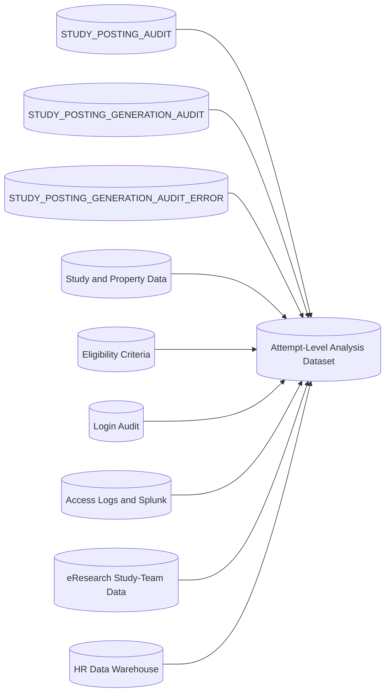

# Study Posting Authoring Telemetry

Study-posting authoring telemetry combines application, log, institutional, eligibility, and HR data.

This page separates confirmed source behavior from recommended analytical variables and classifications.

## Analytical goals

Telemetry supports analysis of:

- AI-feature adoption
- AI-generation reliability
- Recovery after AI-generation failure
- Suggestion usefulness
- Study Information completion time
- Total posting-creation time
- User abandonment
- Repeated attempts
- Posting-author experience
- Study characteristics
- Eligibility-criteria complexity
- Differences by institutional role, department, school, or appointment
- Remaining workflow bottlenecks
- Opportunities to improve authoring assistance

## Data sources



## Confirmed authoring-audit cardinality

For one posting attempt:

```text
STUDY_POSTING_AUDIT
→ zero or one STUDY_POSTING_GENERATION_AUDIT
→ zero or one STUDY_POSTING_GENERATION_AUDIT_ERROR
```

A manual posting attempt has no generation row.

An AI-assisted attempt has one generation row.

A failed AI generation has one associated generation-error row.

If a user returns to Add Study and tries again, the application creates a new `STUDY_POSTING_AUDIT`.

The application does not add another generation row to the original posting attempt.

Analytical queries should join the generation and error tables directly.

They should not use row-ranking logic to select one generation or error row. Duplicate rows would represent a violated data invariant that should be investigated separately.

## Posting-attempt audit

`STUDY_POSTING_AUDIT` supplies:

- Attempt ID
- Study number
- Author username
- Attempt start
- Attempt end
- Client-reported Study Information duration
- Final Study Information values

A posting-attempt row exists before the operational study is created.

A posting attempt may remain incomplete.

An incomplete attempt may share its `study_num` with a later attempt that successfully creates the operational study.

## AI-generation audit

`STUDY_POSTING_GENERATION_AUDIT` supplies:

- AI-use indicator
- Source-input method
- Source length
- User-selected semantic source
- AI-inferred semantic source
- AI latency
- Generated suggestions
- Selected suggestions
- Optional user feedback
- AI response metadata

The generation row is created during the AI suggestion request before the Study Information page is displayed.

Current production source-input values include:

```text
PDF_FILE
DOCX_FILE
RAW_TXT
```

Input method is distinct from semantic source type, such as:

```text
Study Protocol
Informed Consent
Other
```

## Prompt-requested suggestion cardinality

The AI prompt is stored in `APPLICATION_SETTING` and may change over time.

The prompt may request a particular number of suggestions for a field.

That requested count is not a persisted database cardinality constraint.

Analytics must distinguish:

```text
Prompt-requested suggestion count
AI-returned suggestion count
Stored suggestion count
Selected suggestion count
Final retained value
```

Observed suggestion counts must be calculated from the stored JSON rather than assumed from the prompt.

Prompt version should be included in analysis when it can be reconstructed.

## Study Information selection and feedback telemetry

For an AI-assisted attempt:

1. Generation stores `LLM_SUGGESTIONS`.
2. The Study Information page displays suggestions when generation succeeds.
3. The user may select, ignore, or edit suggestions.
4. Study Information submission stores:
   - `SELECTED_SUGGESTIONS`
   - Optional `USER_FEEDBACK_COMMENTS`
5. The posting attempt stores the client-reported Study Information page duration.
6. Successful final eligibility submission stores final Study Information values in `FINAL_SUBMISSION`.

The analytical value chain is:

```text
LLM_SUGGESTIONS
→ SELECTED_SUGGESTIONS
→ FINAL_SUBMISSION
```

Selected suggestions and final values may differ because a user may edit a field after selecting a suggestion.

## AI-generation error telemetry

`STUDY_POSTING_GENERATION_AUDIT_ERROR` supplies:

- Error timestamp
- Stack trace
- Association with the generation attempt

When AI generation fails:

- The generation-error row is stored.
- The Study Information page is displayed without suggestions.
- The user sees an error message.
- The user may continue authoring Study Information manually within the same attempt.
- The posting attempt may later complete successfully.

AI-generation failure and posting-attempt completion are therefore independent facts.

Recommended fields include:

```text
ai_requested_flag
generation_success_flag
generation_error_flag
attempt_completed_flag
attempt_created_study_flag
```

For example:

```text
generation_error_flag = 1
attempt_completed_flag = 1
```

means that AI generation failed and the user later completed the posting attempt manually.

The associated generation-error row is the authoritative indicator of a recorded generation error.

`LATENCY_MS = 0` must not be treated as definitive proof of an error unless separately validated.

## Recommended attempt categories

Recommended mutually exclusive reporting categories are:

```text
MANUAL_COMPLETE
MANUAL_DROPPED
AI_COMPLETE
AI_DROPPED
AI_ERROR_THEN_MANUAL_COMPLETE
AI_ERROR_THEN_DROPPED
```

These are recommended analytical classifications rather than persisted application statuses.

They should be derived from separate facts.

Conceptually:

```text
MANUAL_COMPLETE =
    no generation row
    AND END_TIME is not null

MANUAL_DROPPED =
    no generation row
    AND END_TIME is null

AI_COMPLETE =
    generation row exists
    AND no generation-error row exists
    AND END_TIME is not null

AI_DROPPED =
    generation row exists
    AND no generation-error row exists
    AND END_TIME is null

AI_ERROR_THEN_MANUAL_COMPLETE =
    generation-error row exists
    AND END_TIME is not null

AI_ERROR_THEN_DROPPED =
    generation-error row exists
    AND END_TIME is null
```

Analyses of AI adoption should state whether an attempt with an AI-generation error counts as AI exposure.

## Cardinality validation

The following validation should return no rows:

```sql
SELECT
    study_posting_audit_id,
    COUNT(*) AS generation_count
FROM study_posting_generation_audit
GROUP BY study_posting_audit_id
HAVING COUNT(*) > 1;
```

The following validation should also return no rows:

```sql
SELECT
    study_posting_generation_audit_id,
    COUNT(*) AS error_count
FROM study_posting_generation_audit_error
GROUP BY study_posting_generation_audit_id
HAVING COUNT(*) > 1;
```

A returned row represents a violated application-data invariant.

It should not be silently collapsed in the attempt-level analysis.

## Study metadata

Study and property data supply:

- Study creation date
- Creator
- Publishability
- Department
- Participant type
- Final operational posting values
- Eligibility criteria
- Eligibility-complexity features

A direct join from a posting attempt to `STUDY` by `study_num` establishes only whether an operational study currently exists for that number.

It does not prove that the attempt created the study.

## Attempt-to-study attribution

An incomplete attempt may join to a study created later by another attempt.

Recommended fields include:

```text
study_currently_exists_flag
attempt_created_study_flag
later_created_study_linkage_flag
current_study_created_date
current_study_created_by_id
```

A conservative attempt-to-study attribution should consider:

- Matching `study_num`
- Completed posting attempt
- Matching creator identity
- Study creation time near the attempt's `END_TIME`

Any accepted timestamp tolerance should be empirically validated before use.

## Application-user and membership metadata

Application data may identify:

- Current application user
- Current study membership
- Other current study memberships
- Prior posting creations
- Total posting creations
- Login history

Current state must not be mislabeled as state at the time of an earlier attempt.

### First-time institutional users

An institutional user may authenticate through SAML before an `APP_USER` exists.

A login without a corresponding application user may be recorded as:

```text
LOGIN_AUDIT.USER_NAME = authenticated username
LOGIN_AUDIT.USER_ID = 0
```

When a first-time institutional author successfully creates a study posting:

- The application creates the author's `APP_USER`.
- The application creates the operational study.
- The application creates the creator's study membership.

Current existence in `APP_USER` is therefore only an extract-time sanity check.

After a user later receives an `APP_USER`, a current-state join will find that user for earlier attempts as well.

A field based on current `APP_USER` existence must not be interpreted as:

```text
APP_USER existed at attempt start
```

## Institutional study-team metadata

The eResearch-derived study-team view may identify:

- Current PI
- Posting author's current institutional study role
- Other current institutional study-team roles

Application study role and institutional study role must remain separate variables.

Unless effective-dated history is available, current institutional and application roles must not be labeled as role at attempt time.

Former PI operational memberships must not be used to identify the current institutional PI.

## HR data

The U-M HR warehouse may provide time-varying appointment information for:

- Posting author
- Current PI

Possible enrichment includes:

- Job code
- Job title
- Department
- School
- Campus
- Regular or temporary status
- FTE
- Primary appointment
- Appointment effective period

The appointment should be selected as of:

```text
STUDY_POSTING_AUDIT.START_TIME
```

A person may have multiple simultaneous appointments.

Recommended handling includes:

- An appointment-level child dataset, or
- An ordered structured aggregation

Concatenated appointment strings may be useful for inspection but are difficult to use reliably in statistical models.

## Login history

Login-audit data may support experience measures such as:

- First observed login
- Most recent login before the attempt
- Distinct login days before the attempt
- Tenure in the application before the attempt
- Presence of an earlier login with `USER_ID = 0`

Login days are a proxy for application familiarity rather than a direct measure of recruitment or research expertise.

Current and backup login tables should first be filtered by a distinct author list.

Do not join every login row directly to every posting attempt before aggregation because doing so multiplies login rows for users with multiple attempts.

Attempt-time experience should use only events before:

```text
STUDY_POSTING_AUDIT.START_TIME
```

Lifetime extract-time fields should remain separate from pre-attempt predictors.

## Repeated attempts

The primary analytical grain remains one posting attempt.

Recommended sequence fields include:

```text
attempt_number_for_study
attempt_number_for_user_study
previous_attempt_id
previous_attempt_start_time
next_attempt_id
next_attempt_start_time
minutes_since_previous_attempt
eventual_study_creation_flag
```

These fields support sequences such as:

```text
AI generation error
→ return to Add Study
→ new AI attempt
→ successful posting creation
```

and:

```text
incomplete manual attempt
→ later manual completion
```

A later attempt is a separate posting-attempt audit record.

## Splunk access-log timing

Historical access logs may reconstruct:

- Attempt start
- Study Information completion
- Eligibility-criteria completion
- Total posting-creation time

See [Study Posting Authoring Timing Analysis](study-posting-authoring-timing-analysis.md).

## Recommended analytical unit

The primary analytical unit should be:

```text
One STUDY_POSTING_AUDIT attempt
```

This avoids collapsing:

- Repeated attempts for one study
- AI failures followed by later attempts
- Manual completion after an AI failure within the same attempt
- User abandonment followed by later completion
- Multiple users attempting the same study

A separate study-level or sequence-level dataset may be derived for questions about eventual study creation.

## Timing values

Potential timing fields include:

```text
TIME_SPENT_ON_STUDY_INFO_PAGE_MS
END_TIME - START_TIME
Splunk study_information_time_mins
Splunk study_eligibility_criterion_time_mins
Splunk study_creation_time_mins
STUDY_POSTING_GENERATION_AUDIT.LATENCY_MS
```

These values measure different intervals and must not be treated as interchangeable without validation.

Open timing questions include whether frontend Study Information timing includes:

- AI-generation wait time
- Browser idle time
- Time while the browser tab is inactive
- Feedback-submission time
- Revisited Study Information sessions

## Eligibility-complexity telemetry

Study eligibility criteria can supply a multidimensional complexity profile.

Potential study-level features include:

```text
group_count
clause_count
expression_count
inclusion_expression_count
exclusion_expression_count
distinct_variable_count
lookup_selection_count
medical_condition_selection_count
numeric_endpoint_count
range_expression_count
negated_expression_count
all_of_expression_count
other_expression_count
other_text_units
structured_expression_fraction
```

A composite complexity score is a proposed analytical method rather than implemented application behavior.

Any composite score should include:

```text
complexity_specification_version
```

Component features should be retained even when a composite score is calculated.

The current AI feature assists Study Information only.

It does not generate eligibility criteria.

Eligibility complexity may therefore be analyzed as:

- A potential confounder for total posting-creation time
- A potential moderator of the relationship between AI use and workflow outcomes
- A measure of remaining manual authoring burden
- A possible indicator of studies that could benefit from future eligibility-authoring assistance

Eligibility complexity is not an output of the current AI feature.

## Eligibility complexity and incomplete attempts

Final eligibility criteria ordinarily exist only after successful operational study creation.

Do not assign criteria from a later successful study to an earlier incomplete attempt as though the earlier attempt authored them.

Recommended provenance fields include:

```text
complexity_specification_version
complexity_observed_for_attempt
complexity_source_study_id
complexity_source_attempt_id
later_successful_study_complexity_flag
```

Using the eventual study's complexity for an earlier incomplete attempt may be useful in a separately labeled sensitivity analysis.

It is not a direct attempt-time observation.

## Recommended dataset layers

Use separate analytical layers:

```text
Raw protected extract
→ Validated normalized source tables
→ Attempt-level analytical dataset
→ Attempt-sequence dataset
→ Field-level suggestion dataset
→ Appointment-level child dataset
→ Study-level eligibility-complexity dataset
→ Publication-safe aggregate dataset
```

## Data-quality concerns

Potential issues include:

- Negative durations
- Extremely long idle sessions
- Missing end times
- Repeated attempts
- Parallel browser tabs
- AI failures followed by manual completion
- AI failures followed by new attempts
- Later-created-study leakage
- Current-state role leakage
- Current `APP_USER` existence used as historical existence
- Future information in lifetime experience variables
- Multiple HR appointments
- Missing HR matches
- Former PI memberships
- Legacy and current eligibility-authoring UIs
- Historical login data split across current and backup tables
- Duplicate records across current and backup login tables
- Multiple institutional roles for one user and study
- Unexpected study-property multiplicity
- Personally identifiable information
- Raw stack traces containing restricted infrastructure details

More than one generation row per posting attempt or more than one error row per generation is a violated invariant rather than an expected multiplicity condition.

## Privacy

Analytical extracts may contain staff, study, and operational information.

Use:

- Stable pseudonymous person identifiers
- Coarsened organizational groupings where appropriate
- Suppression of small cells
- Removal of raw contact values
- Removal of raw stack traces
- Removal or protection of nonpublic study text
- Publication-level aggregation

Raw usernames, email addresses, phone numbers, contact information, and stack traces should not appear in publication datasets.

## Related pages

- [AI-Assisted Study Posting Authoring](../05-study-management/ai-assisted-posting-authoring.md)
- [Study Posting Creation](../05-study-management/posting-creation.md)
- [Study-Posting Authoring Audit Model](../07-data-model/study-posting-authoring-audit-model.md)
- [Study Posting Authoring Timing Analysis](study-posting-authoring-timing-analysis.md)
- [Study Posting Authoring Analysis Dataset](study-posting-authoring-analysis-dataset.md)
- [AI-Assisted Study Posting Authoring Effectiveness](ai-assisted-study-posting-authoring-effectiveness.md)
- [Eligibility-Criteria Authoring Complexity](eligibility-criteria-authoring-complexity.md)
- [Study Posting Authoring and Analytics Open Questions](../09-decisions/study-posting-authoring-analytics-open-questions.md)
